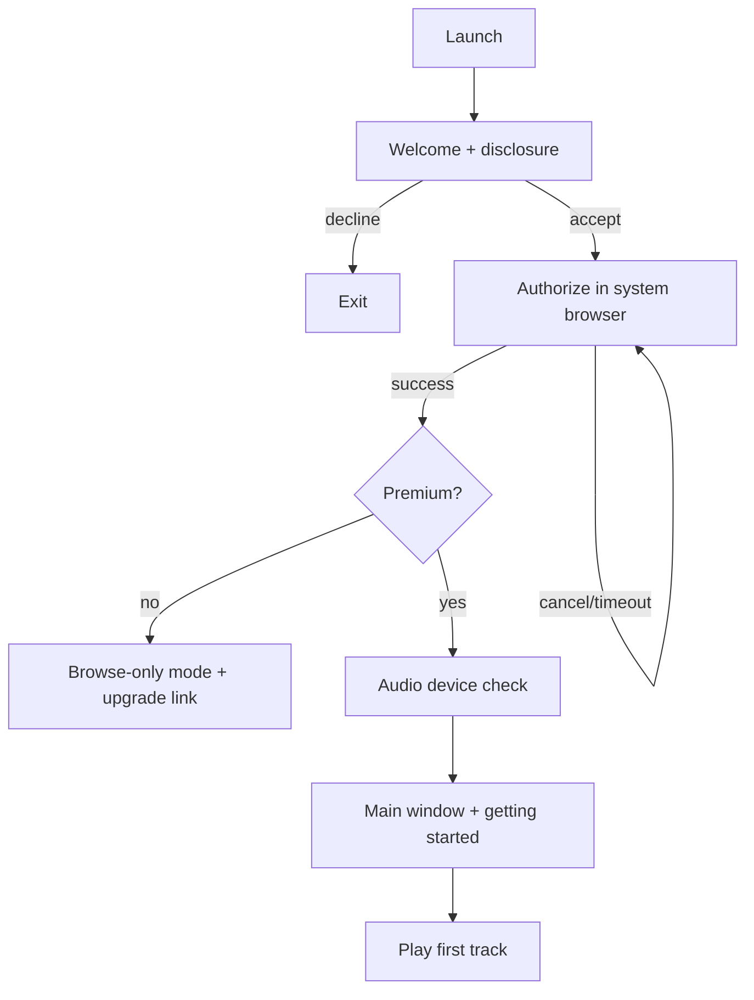
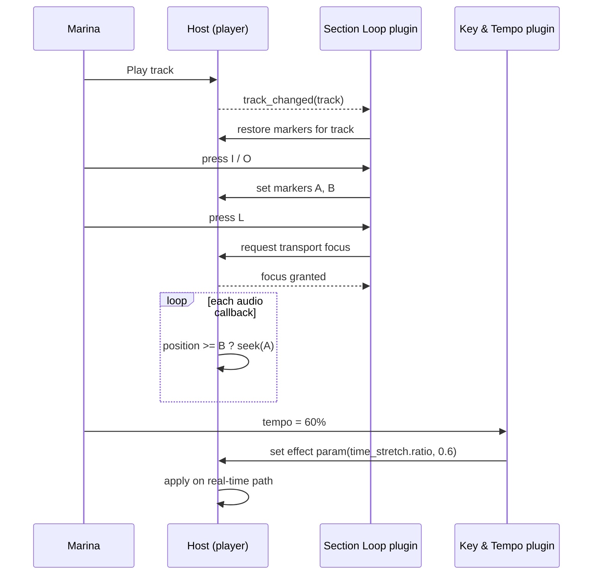
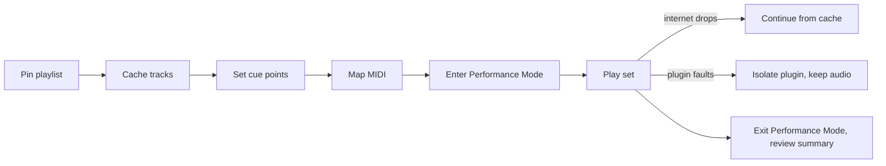
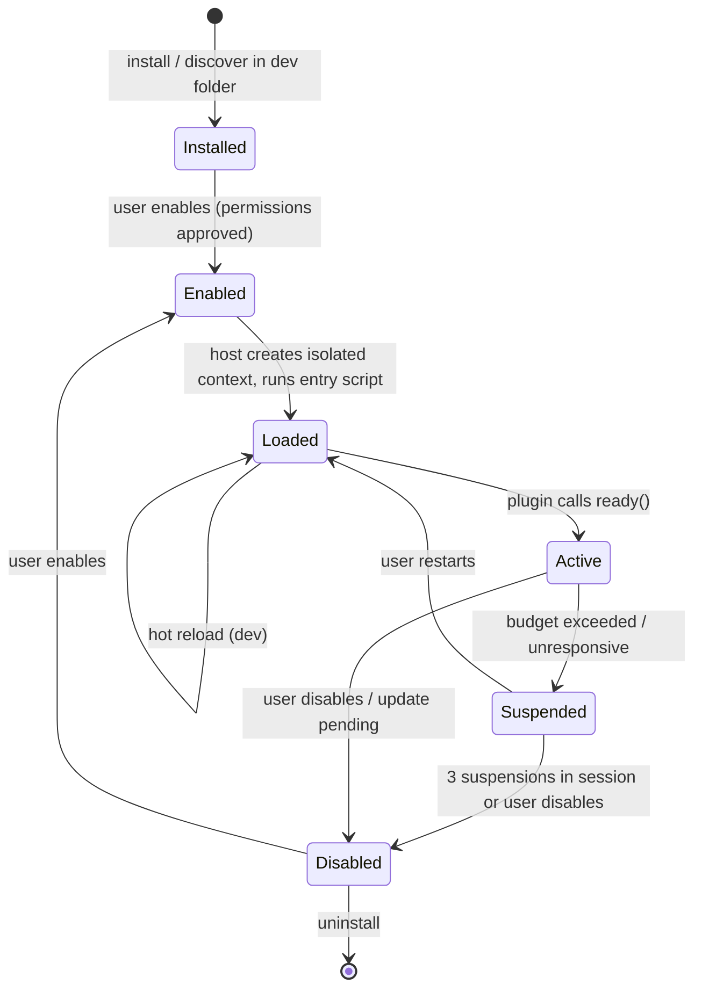
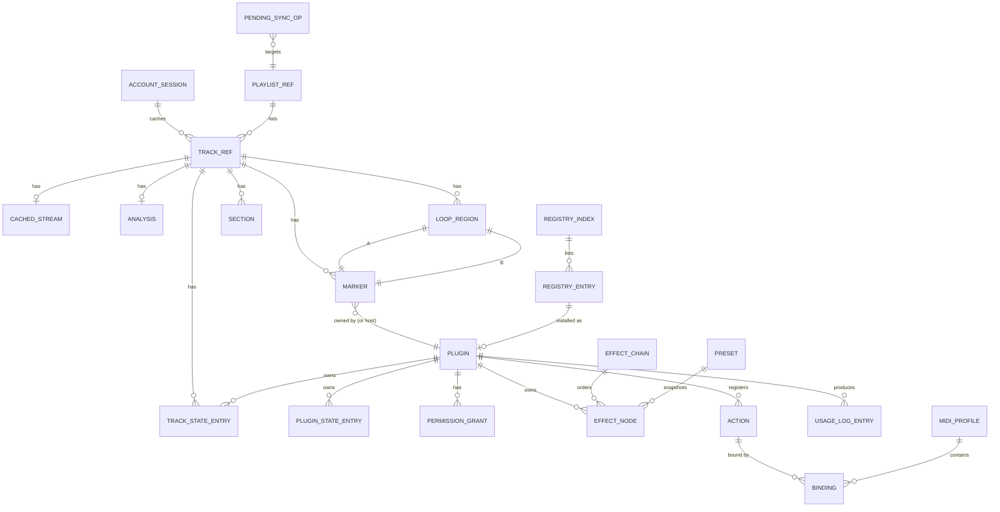
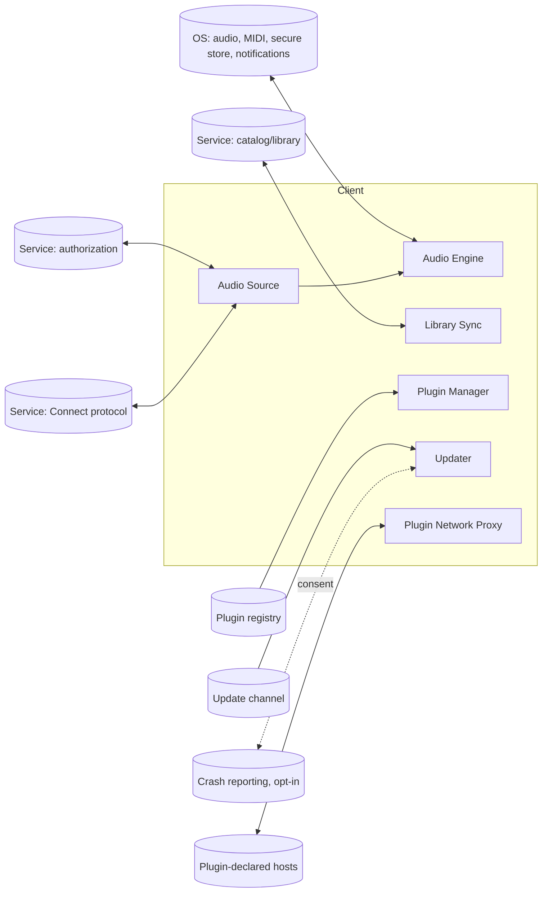
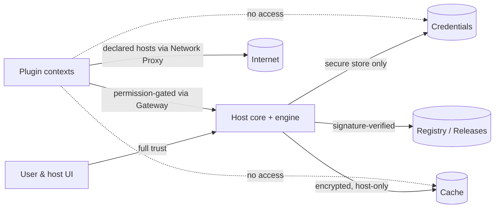

# ModPlayer — Software Specification

**Product:** ModPlayer — a pluggable desktop music client for the Spotify catalog
**Specification version:** 0.1 (draft, consolidated edition)
**Date:** 2026-09-15
**Status:** For review

---

## About this document

This is the consolidated, single-file edition of the ModPlayer macro specification. It merges the thirteen documents of the multi-file specification into one continuous document, in reading order, with cross-references rewritten to point at parts of this document. Content is otherwise identical to the multi-file edition.

The specification is deliberately technology-agnostic: it describes what the product does, for whom, and why; its logical data model; its integration points; its non-functional requirements; and a light logical architecture. It does not choose languages, frameworks, storage engines, or deployment topology. Those belong in a downstream design document.

Requirement identifiers are stable and unique across the document so they can be referenced from design documents, tickets, and tests:

| Prefix | Meaning | Defined in |
|---|---|---|
| `C-n` | Hard constraint | Part 1 |
| `JTBD-n` | Job-to-be-done | Part 2 |
| `J-n` | User journey | Part 3 |
| `FR-a.b.c` | Functional requirement | Part 4 |
| `PL-a.b` | Plugin contract requirement | Part 5 |
| `DM-n` | Data model entity | Part 6 |
| `INT-a.b` | Integration requirement | Part 7 |
| `NFR-a.b` | Non-functional requirement | Part 8 |
| `AR-n` | Architecture component | Part 9 |
| `EC-a.b` | Edge case | Part 10 |
| `GOV-a.b` | Governance requirement | Part 11 |
| `A-n` / `Q-n` | Assumption / open question | Part 12 |

Assumptions made while drafting are flagged inline as *[Assumption: …]* and collected in Part 12.

---

## Table of contents

1. [Part 1 — Overview](#part-1--overview)
    - [1. Vision](#1-vision)
    - [2. Problem statement](#2-problem-statement)
    - [3. Why now](#3-why-now)
    - [4. Target users](#4-target-users)
    - [5. Scope](#5-scope)
    - [6. Success metrics](#6-success-metrics)
    - [7. Hard constraints](#7-hard-constraints)
    - [8. Key risks](#8-key-risks)
2. [Part 2 — Personas and Jobs-to-be-Done](#part-2--personas-and-jobs-to-be-done)
    - [1. Primary personas](#1-primary-personas)
    - [2. Secondary personas](#2-secondary-personas)
    - [3. Edge users](#3-edge-users)
    - [4. Jobs-to-be-done](#4-jobs-to-be-done)
    - [5. Key scenarios](#5-key-scenarios)
3. [Part 3 — User Journeys](#part-3--user-journeys)
    - [J-1 — First launch and sign-in](#j-1-first-launch-and-sign-in)
    - [J-2 — Drill a solo with Section Loop (S-1)](#j-2-drill-a-solo-with-section-loop-s-1)
    - [J-3 — Transpose a set (S-2)](#j-3-transpose-a-set-s-2)
    - [J-4 — Prepare and play a bar set (S-3)](#j-4-prepare-and-play-a-bar-set-s-3)
    - [J-5 — Write and publish a plugin (S-4)](#j-5-write-and-publish-a-plugin-s-4)
    - [J-6 — Install a community plugin and manage its permissions (S-5)](#j-6-install-a-community-plugin-and-manage-its-permissions-s-5)
    - [J-7 — A plugin misbehaves during practice (S-6)](#j-7-a-plugin-misbehaves-during-practice-s-6)
    - [J-8 — Reorder and resolve effect chain and transport focus (JTBD-13)](#j-8-reorder-and-resolve-effect-chain-and-transport-focus-jtbd-13)
    - [J-9 — Offline session start](#j-9-offline-session-start)
    - [J-10 — Update the client with a plugin API change](#j-10-update-the-client-with-a-plugin-api-change)
4. [Part 4 — Functional Requirements](#part-4--functional-requirements)
    - [1. Onboarding and account](#1-onboarding-and-account)
    - [2. Catalog, search, library, and playlists](#2-catalog-search-library-and-playlists)
    - [3. Playback and transport](#3-playback-and-transport)
    - [4. Now-playing view and waveform](#4-now-playing-view-and-waveform)
    - [5. Markers, loops, and cue points (host primitives)](#5-markers-loops-and-cue-points-host-primitives)
    - [6. Audio engine and effect chain](#6-audio-engine-and-effect-chain)
    - [7. Plugin management](#7-plugin-management)
    - [8. Offline cache and connectivity](#8-offline-cache-and-connectivity)
    - [9. Controls: keyboard and MIDI](#9-controls-keyboard-and-midi)
    - [10. Performance Mode](#10-performance-mode)
    - [11. Settings, presets, and per-track state](#11-settings-presets-and-per-track-state)
    - [12. Developer Mode and plugin tooling](#12-developer-mode-and-plugin-tooling)
    - [13. Bundled reference plugins](#13-bundled-reference-plugins)
    - [14. Notifications, diagnostics, and updates](#14-notifications-diagnostics-and-updates)
5. [Part 5 — Plugin API and Permissions](#part-5--plugin-api-and-permissions)
    - [1. Design principles](#1-design-principles)
    - [2. Plugin package](#2-plugin-package)
    - [3. Lifecycle](#3-lifecycle)
    - [4. Permission catalog](#4-permission-catalog)
    - [5. Events (host → plugin)](#5-events-host-plugin)
    - [6. Requests (plugin → host)](#6-requests-plugin-host)
    - [7. UI contribution rules](#7-ui-contribution-rules)
    - [8. Sandboxing and budgets](#8-sandboxing-and-budgets)
    - [9. Versioning and compatibility](#9-versioning-and-compatibility)
    - [10. Registry publishing contract](#10-registry-publishing-contract)
6. [Part 6 — Logical Data Model](#part-6--logical-data-model)
    - [1. Entity overview](#1-entity-overview)
    - [2. Account and session](#2-account-and-session)
    - [3. Catalog references](#3-catalog-references)
    - [4. Per-track user state](#4-per-track-user-state)
    - [5. Plugins](#5-plugins)
    - [6. Audio configuration](#6-audio-configuration)
    - [7. Sync and connectivity](#7-sync-and-connectivity)
    - [8. Registry](#8-registry)
    - [9. Diagnostics](#9-diagnostics)
    - [10. Retention summary](#10-retention-summary)
7. [Part 7 — Integrations](#part-7--integrations)
    - [INT-1 Streaming service — authorization](#int-1-streaming-service-authorization)
    - [INT-2 Streaming service — Connect receiver protocol](#int-2-streaming-service-connect-receiver-protocol)
    - [INT-3 Streaming service — catalog and library](#int-3-streaming-service-catalog-and-library)
    - [INT-4 Plugin registry](#int-4-plugin-registry)
    - [INT-5 Update channel](#int-5-update-channel)
    - [INT-6 Operating system services](#int-6-operating-system-services)
    - [INT-7 Plugin-declared network hosts](#int-7-plugin-declared-network-hosts)
    - [INT-8 Crash and diagnostic reporting (optional, opt-in)](#int-8-crash-and-diagnostic-reporting-optional-opt-in)
    - [Data flow summary](#data-flow-summary)
8. [Part 8 — Non-Functional Requirements](#part-8--non-functional-requirements)
    - [1. Performance and latency](#1-performance-and-latency)
    - [2. Reliability and availability](#2-reliability-and-availability)
    - [3. Scalability (local)](#3-scalability-local)
    - [4. Security](#4-security)
    - [5. Privacy](#5-privacy)
    - [6. Accessibility](#6-accessibility)
    - [7. Internationalization and localization](#7-internationalization-and-localization)
    - [8. Observability (local)](#8-observability-local)
    - [9. Compatibility and portability](#9-compatibility-and-portability)
    - [10. Maintainability and quality](#10-maintainability-and-quality)
    - [11. Legal and compliance](#11-legal-and-compliance)
9. [Part 9 — Architecture Overview](#part-9--architecture-overview)
    - [1. Guiding decisions](#1-guiding-decisions)
    - [2. Component diagram](#2-component-diagram)
    - [3. Components and responsibilities](#3-components-and-responsibilities)
    - [4. Communication patterns](#4-communication-patterns)
    - [5. Key flows](#5-key-flows)
    - [6. Trust boundaries](#6-trust-boundaries)
    - [7. Deployment shape (logical)](#7-deployment-shape-logical)
10. [Part 10 — Edge Cases and Error Handling](#part-10--edge-cases-and-error-handling)
    - [1. Account and session](#1-account-and-session)
    - [2. Catalog, library, playlists](#2-catalog-library-playlists)
    - [3. Playback and transport](#3-playback-and-transport-1)
    - [4. Markers, loops, cues](#4-markers-loops-cues)
    - [5. Audio engine and effects](#5-audio-engine-and-effects)
    - [6. Plugins](#6-plugins)
    - [7. Offline cache and connectivity](#7-offline-cache-and-connectivity)
    - [8. Controls](#8-controls)
    - [9. Performance Mode](#9-performance-mode)
    - [10. Settings, presets, per-track state](#10-settings-presets-per-track-state)
    - [11. Updates](#11-updates)
    - [12. Empty, loading, and first-run states](#12-empty-loading-and-first-run-states)
11. [Part 11 — Open Source and Governance](#part-11--open-source-and-governance)
    - [1. Licensing](#1-licensing)
    - [2. Plugin API stability](#2-plugin-api-stability)
    - [3. Contribution process](#3-contribution-process)
    - [4. Registry governance](#4-registry-governance)
    - [5. Security disclosure](#5-security-disclosure)
    - [6. Legal posture and takedown response](#6-legal-posture-and-takedown-response)
    - [7. Community and support](#7-community-and-support)
    - [8. Success signals for governance](#8-success-signals-for-governance)
12. [Part 12 — Assumptions and Open Questions](#part-12--assumptions-and-open-questions)
    - [A. Assumptions](#a-assumptions)
    - [B. Open questions](#b-open-questions)
13. [Part 13 — Glossary](#part-13--glossary)

---

## Part 1 — Overview

### 1. Vision

ModPlayer is an open-source desktop music player that plays a user's Spotify catalog and lets small, easily written plugins act on the music while it plays: loop a bar, transpose a song to a singer's key, slow a solo down without changing pitch, mark cue points, or draw a beat grid over the waveform. It is the player a musician or DJ reaches for when the official client cannot do what they need with the song in front of them.

In one sentence: **a hackable player for the music you already pay for.**

### 2. Problem statement

Streaming services give listeners a vast catalog but a locked, uniform player. Anyone who wants to *work* with a song rather than just hear it — a guitarist looping a difficult passage, a singer transposing a track down two semitones, a DJ nudging tempo to match the next record, a student slowing lyrics to learn a language — has to leave the streaming ecosystem entirely: rip audio (usually illegally), load it into a DAW or practice tool, and lose the catalog, playlists, and convenience they were paying for.

The official client offers no extension surface. Community client-modding projects exist but can only touch the user interface layer; they cannot reach the audio, so effects such as pitch shifting or time stretching remain impossible. Browser-side tricks can change playback rate but nothing else, and break with every client update.

There is a gap for a player that (a) plays the catalog the user already has, (b) decodes the audio itself so real-time effects are possible, and (c) exposes a plugin system with a low enough barrier that a hobbyist can write a useful plugin in an afternoon.

### 3. Why now

Open-source Spotify Connect receiver implementations have matured to the point where a third-party client can reliably stream and decode a Premium user's catalog. Real-time pitch shifting and time stretching are commodity DSP. Scripting runtimes with proper sandboxing are widely available. The missing piece is a product that combines these into a coherent, plugin-first player.

### 4. Target users

**Practicing musicians.** Instrumentalists and singers who use recorded music to learn parts, rehearse, and warm up. They need looping, tempo reduction with pitch preservation, transposition, and quick navigation between song sections. They are usually at home or in a rehearsal room, often with an instrument in hand, so they value keyboard, foot-pedal, and MIDI-controllable operation.

**DJs and live performers.** People who play recorded music for an audience, whether at a bar, a dance class, a wedding, or a stream. They need cue points, tempo and key adjustment, low-latency response to controls, gapless loops, and absolute confidence that the player will not stall mid-set.

**Plugin authors.** Hobbyist developers, often from the two groups above, who want to extend the player for their own needs and share the result. They need a small, well-documented plugin contract, fast reload during development, and a place to publish.

Personas are developed in Part 2 (Personas and Jobs-to-be-Done).

### 5. Scope

#### 5.1 In scope

- A desktop application for the three major desktop operating systems.
- Authentication against the user's existing Spotify Premium account.
- Playback of the user's catalog via the Spotify Connect receiver protocol, with the client decoding the audio stream itself.
- Core player: search, browse the user's library and playlists, play/pause/seek/skip, queue, volume, now-playing view with a waveform.
- Basic library and playlist management (create and edit playlists, save tracks) *[Assumption: the user did not exclude library management from scope]*.
- A plugin system with: a scripted, sandboxed plugin runtime; a plugin manifest with declared permissions; user approval of permissions on install; plugin lifecycle management (install, enable, disable, update, uninstall); a local development folder with hot reload; a community registry for discovery and installation.
- Plugin capabilities: playback control, real-time audio processing in a user-ordered effect chain, UI contributions (panels, overlays, shortcuts, settings), audio analysis and metadata access.
- Built-in effect nodes plugins can compose: pitch shift, time stretch, gain, equalizer, high/low-pass filters, and a generic sample-buffer processing hook for custom DSP.
- Two reference plugins that ship with the client and double as documentation: **Section Loop** (A/B loop with markers) and **Key & Tempo** (pitch shift and time stretch).
- Offline cache: recently played and explicitly pinned tracks remain playable without an internet connection after a successful login, within the constraints of the streaming service's licensing model.
- Keyboard shortcuts and MIDI control mapping for core transport and for plugin-exposed actions.
- Open-source licensing, plugin API versioning, and a contributor process.

#### 5.2 Out of scope

- Social and sharing features: sharing listening activity, collaborative sessions, sharing plugin configurations between users, friend activity feeds.
- Podcasts, audiobooks, and other non-music content.
- Mobile and web versions of the client.
- Any form of audio export, recording, or download to a user-accessible file. The offline cache is opaque to the user and to plugins.
- Being a Spotify Connect *controller* for other devices (the client is a receiver and its own controller only).
- Multi-user or multi-account operation on one installation. *[Assumption: one Spotify account per installation; switching accounts requires logging out.]*
- A hosted marketplace with ratings, payments, or reviews. The registry is a community-maintained index, not a store.
- Acting as an audio plugin host for third-party professional audio plugin formats.
- Server-side infrastructure operated by the project, beyond the static registry index.

#### 5.3 Deferred (not now, but designed for)

- Native/compiled plugin tier for high-performance custom DSP.
- Local files playback (music the user owns on disk).
- Support for streaming services other than Spotify behind the same audio-source abstraction.

### 6. Success metrics

The project is open source and non-commercial, so success is measured by adoption and by whether the plugin system actually gets used.

| Metric | Target (12 months after first stable release) |
|---|---|
| Time from install to first successful playback | Under 3 minutes for a user with an existing Premium account |
| Time for a first-time plugin author to run a "hello loop" plugin | Under 30 minutes, following only the bundled tutorial |
| Third-party plugins published to the registry | 25 or more, from at least 10 distinct authors |
| Loop seam quality | No audible click or gap on loop boundaries in blind listening tests on a reference set of 20 tracks |
| Control-to-audio latency for plugin-driven effect changes | 20 ms or less at the 95th percentile on reference hardware |
| Playback stalls attributable to the client | Fewer than 1 per 10 hours of continuous playback on reference hardware and a stable connection |
| Crash-free sessions | 99.5% or more |
| Plugin-caused crashes propagating to the host | Zero; a misbehaving plugin is isolated and reported, never takes the player down |

### 7. Hard constraints

| ID | Constraint | Implication |
|---|---|---|
| C-1 | Audio is obtained by acting as a Spotify Connect receiver, decoding the stream in-client. This is not an officially supported use of the service and may violate its terms of service. | A Premium account is required. The project must clearly disclose the risk to users at first launch. The audio-source component must be isolated so it can be replaced or disabled if the protocol changes or access is revoked. |
| C-2 | No audio may be exported, recorded, or exposed to the user or to plugins as a file. | Plugins receive audio only as transient sample buffers inside the real-time processing path, with no file or network permission active in that path. The offline cache is encrypted and opaque. |
| C-3 | Desktop only: the three major desktop operating systems must be supported from the first stable release. | Audio output, MIDI input, file paths, and keyboard handling must be abstracted per platform. |
| C-4 | Plugins must be writable by non-expert developers in a sandboxed scripting language. | Heavy DSP is provided by the host as built-in effect nodes; the scripting tier composes and parameterizes them. |
| C-5 | Live-performance latency and reliability bar (see Part 8 (Non-Functional Requirements)). | Audio processing runs on a dedicated real-time path that plugin scripts cannot block. |
| C-6 | Must keep playing recently played and pinned tracks without internet after a successful login. | Requires a local encrypted cache and a defined re-authentication grace period. |
| C-7 | Open-source license with a public contributor process. | Plugin API must be versioned and its stability guarantees documented. |
| C-8 | The project must not use the streaming service's name or trademarks in its own name, icon, or branding. | The product name is ModPlayer; references to the service are descriptive only. |

### 8. Key risks

1. **Access revocation.** The streaming service could change its protocol or actively block third-party receivers. Mitigation: isolate the audio-source component behind an interface (see Part 9 (Architecture Overview)), keep the rest of the product valuable with local files as a future source.
2. **Legal exposure for the project and its users.** Mitigation: clear disclosures, no audio export, no redistribution of any proprietary component, and a documented takedown response process (see Part 11 (Open Source and Governance)).
3. **Plugin quality and safety.** A permissive plugin ecosystem can ship broken or malicious plugins. Mitigation: sandboxing, declared permissions, per-plugin resource limits, and a registry with a defined moderation process.
4. **Real-time audio on three platforms.** Audio device handling differs substantially per OS. Mitigation: an early spike on each platform before feature work; explicit latency and glitch budgets in NFRs.

---

## Part 2 — Personas and Jobs-to-be-Done

This part describes who uses ModPlayer, what they are trying to accomplish, and which scenarios the rest of the specification must serve. Personas are composites, not real people.

---

### 1. Primary personas

#### 1.1 Marina — the practicing musician

**Who she is.** A 34-year-old amateur jazz pianist who also sings in a covers band. She practices at home three or four evenings a week with a digital piano, a laptop on the music stand, and a Premium streaming subscription she uses for everything.

**Context.** She practices with her hands on the keys. Reaching for a mouse breaks her flow. She often has one earbud in and the piano in the other ear. Her laptop is a few years old and she does not want a heavy application competing with her sheet-music app.

**Goals.**
- Learn a solo by looping four bars at a time, starting at half tempo and speeding up as she gets it.
- Transpose songs to the key her band actually plays them in, or to a key that suits her voice.
- Jump between song sections (intro, verse, chorus, bridge) without scrubbing a timeline.
- Keep a set of loops and markers per song so that tomorrow's practice starts where today's ended.

**Frustrations today.** The official client has no looping and no tempo or pitch control. Her practice app needs audio files, which means either buying tracks she already streams or pirating them. Every workaround costs her ten minutes of setup before she plays a note.

**What she needs from ModPlayer.** Foot-pedal- and keyboard-operable looping; pitch-preserving tempo change; clean transposition in semitones; per-track saved markers; a plugin (Section Loop) that does this out of the box without her writing anything.

**Technical comfort.** Comfortable installing apps and following a tutorial. Has never written code. Would copy-paste a plugin snippet from a forum if it was clearly explained.

#### 1.2 Théo — the working DJ

**Who he is.** A 27-year-old DJ who plays weekend bar sets and weekday dance classes. He uses a streaming subscription for the sheer breadth of requests he gets. He owns a small two-channel controller with MIDI output.

**Context.** He performs in front of people. A stall, a click at a loop seam, or a three-second freeze while a plugin loads is a visible failure. He works fast, by ear, with hands on the controller. He often has no reliable internet at venues.

**Goals.**
- Set cue points and loops on the fly and jump to them instantly.
- Nudge tempo up or down a few percent to match the room's energy or a dance class's pace, without changing pitch.
- Shift key by a semitone or two to blend adjacent tracks.
- Have the next few tracks cached so a venue's flaky connection does not end the set.
- Map every action he uses to a physical control.

**Frustrations today.** Streaming clients cannot be used in a performance context at all. DJ software that integrates with streaming services is expensive and locked; none lets him script his own behaviors.

**What he needs from ModPlayer.** Sub-20 ms response to controls; gapless, click-free loops; a key-and-tempo plugin that works in real time; MIDI mapping; an offline cache that he can trust; a "performance mode" that suppresses anything (updates, dialogs, plugin reloads) that could interrupt playback.

**Technical comfort.** High for hardware and audio routing; low for programming. Will install community plugins readily; will read a plugin's requested permissions before approving.

#### 1.3 Dani — the plugin author

**Who they are.** A 22-year-old computer science student and bedroom guitarist. They found ModPlayer because they wanted a "slow-down-and-loop" tool and were delighted to discover they could script it.

**Context.** They write plugins in evenings and weekends. They test on their own machine and publish to the registry for fun and reputation. They do not want to learn a large framework; they want to see a result in minutes.

**Goals.**
- Write a first plugin from the tutorial in under half an hour.
- Reload a plugin instantly while it is being edited, without restarting the player or losing the current track position.
- Read clear, versioned documentation for what a plugin can and cannot do.
- Publish a plugin to the registry with a manifest, a description, and a screenshot, and have users find it.
- Know that a bug in their plugin will not crash someone's live set.

**Frustrations today.** Existing client-modding ecosystems break with every upstream update, have no audio access, and have no stable contract.

**What they need from ModPlayer.** A small, orthogonal plugin API; a development folder with hot reload; a plugin console with logs and errors; a permission model that makes it obvious what a plugin is allowed to do; a registry publishing flow that is mostly automated.

**Technical comfort.** High. Comfortable with scripting languages, version control, and reading API references.

### 2. Secondary personas

#### 2.1 Registry maintainer

A volunteer from the project's community who reviews plugin submissions to the registry, removes plugins that violate policy, and keeps the index healthy. Needs a submission queue, a way to flag or delist entries, and audit history. Interacts with the registry, not with the client itself.

#### 2.2 Project maintainer

A core contributor who cuts releases, manages the plugin API version, triages issues, and responds to takedown requests. Needs diagnostic bundles from users, plugin-attribution in crash reports, and a clear API deprecation process.

#### 2.3 Occasional listener

Someone who installed ModPlayer because a friend recommended it, uses it as a normal player most of the time, and occasionally enables a plugin. Needs the core player to be at least as easy as the official client for the basics, and to never surprise them with a plugin they forgot was enabled.

### 3. Edge users

| Edge user | Consideration |
|---|---|
| Screen-reader user | The core player and plugin management must be fully operable by keyboard with proper accessible names. Plugin UI contributions inherit the host's accessibility primitives so plugin authors get a baseline for free. |
| Low-bandwidth or intermittent connection | Cache aggressively, degrade gracefully, and never block the UI on network calls. |
| Hearing-protection-conscious user | Effects (especially resonant filters and gain) can produce loud transients; a hard output limiter and a "safe volume on startup" option are required. |
| Multi-monitor performer | Plugin panels must be detachable so a waveform or cue list can live on a second screen. |
| Non-English speaker | The UI must be translatable; Portuguese (Brazil) is the first non-English locale *[Assumption: based on the requester's locale]*. |

### 4. Jobs-to-be-done

Jobs are written in the form "When I..., I want to..., so I can...". Priority: P0 = the product fails without it; P1 = expected in first stable release; P2 = valuable, can follow.

| ID | Job | Persona | Priority |
|---|---|---|---|
| JTBD-1 | When I am learning a passage, I want to loop a precise section and repeat it hands-free, so I can drill it until it is solid. | Marina, Théo | P0 |
| JTBD-2 | When a passage is too fast, I want to slow it down without changing its pitch, so I can hear and copy every note. | Marina | P0 |
| JTBD-3 | When a song is in the wrong key for me, I want to transpose it by semitones without changing its speed, so I can play or sing along. | Marina, Théo | P0 |
| JTBD-4 | When I want to do something the player does not do, I want to write or install a small plugin, so I am not stuck waiting for a feature. | Dani, Marina | P0 |
| JTBD-5 | When I am performing, I want every action I use to be on a physical control and to respond instantly, so I never look at the screen. | Théo | P0 |
| JTBD-6 | When my internet fails, I want the tracks I have recently played or pinned to keep working, so a bad connection does not end my session. | Théo | P0 |
| JTBD-7 | When I come back to a song, I want my markers, loops, and effect settings restored, so I pick up where I left off. | Marina, Théo | P1 |
| JTBD-8 | When I install a plugin, I want to know exactly what it can access and to revoke that later, so I can trust community plugins. | Théo, occasional listener | P1 |
| JTBD-9 | When I write a plugin, I want to see my change in the player within seconds without losing playback state, so iteration is fast. | Dani | P1 |
| JTBD-10 | When I publish a plugin, I want users to find and install it from inside the player, so my work reaches people. | Dani | P1 |
| JTBD-11 | When I am performing, I want the player to suppress anything that could interrupt audio (updates, dialogs, reloads), so nothing surprises me. | Théo | P1 |
| JTBD-12 | When I am practicing, I want to jump to named sections of a song, so I do not scrub a timeline. | Marina | P1 |
| JTBD-13 | When I use several plugins at once, I want to control the order in which they process audio and which one owns the transport, so they do not fight. | Marina, Théo, Dani | P1 |
| JTBD-14 | When I search or browse, I want the experience to be at least as fast and complete as the official client, so I do not need two players. | Occasional listener | P1 |
| JTBD-15 | When a plugin misbehaves, I want to see which one and disable it in one action, so a bad plugin costs me seconds, not a session. | All | P1 |
| JTBD-16 | When I write a plugin, I want to analyze the audio (beats, key, loudness) so I can build smarter behaviors such as beat-snapped loops. | Dani | P2 |
| JTBD-17 | When I use a plugin that needs data from the web (lyrics, chords), I want to allow it network access explicitly and see what it fetches. | Marina | P2 |

### 5. Key scenarios

These scenarios are referenced by the journeys in Part 3 (User Journeys) and by requirements in Part 4 (Functional Requirements).

**S-1 — Drill a solo.** Marina opens a track, drops A and B markers around a four-bar solo, sets tempo to 60%, loops until comfortable, raises tempo in 10% steps, and saves the markers for tomorrow.

**S-2 — Transpose a set.** Marina's band plays three songs a whole step down. She sets Key & Tempo to −2 semitones on each and pins the setting per track.

**S-3 — Bar set with cue points.** Théo prepares a playlist in the afternoon, pins it for offline, sets cue points on a few tracks, maps loop-in/loop-out/cue-jump to his controller, and enters performance mode before the set. Internet drops mid-set; playback continues from cache.

**S-4 — Write and publish a plugin.** Dani reads the tutorial, creates a plugin folder, writes a plugin that auto-loops the last eight beats when a key is pressed, iterates with hot reload, tests permission prompts, and publishes to the registry.

**S-5 — Install a community plugin.** Marina finds a "Chord Chart" plugin in the registry that fetches chords from the web, reads its permission request (network access to one domain), installs it, and later revokes network access to see what breaks.

**S-6 — A plugin misbehaves.** During practice, a plugin enters a tight loop and stops responding. The host detects the stall, isolates the plugin, shows a non-blocking notice naming it, and playback continues unaffected.

---

## Part 3 — User Journeys

Each journey is an end-to-end flow written from the user's point of view, with decision points, alternate paths, and failure paths. Journeys reference the scenarios in Part 2 (Personas and Jobs-to-be-Done) and are the primary source of the requirements in Part 4 (Functional Requirements).

Notation: **DP** = decision point; **ALT** = alternate path; **ERR** = error path.

---

### J-1 — First launch and sign-in

**Actor:** Any new user. **Goal:** Go from a fresh install to hearing music.

1. The user launches ModPlayer for the first time. The system shows a welcome screen with three items: what ModPlayer is, a plain-language disclosure that it connects to the streaming service in an unofficial way and that a Premium account is required, and an "I understand, continue" action.
   - **DP-1.1:** The user declines. The system closes with a short message explaining that the client cannot function without this acknowledgement.
2. The system shows the sign-in step. Sign-in uses the streaming service's own authorization flow in the system browser; ModPlayer never sees the password. *[Assumption: the service supports a browser-based authorization flow that yields a session credential usable by a Connect receiver.]*
3. The user completes authorization in the browser and returns to ModPlayer. The system shows a "checking your account" state.
   - **ERR-1.2:** The account is not Premium. The system explains that playback requires Premium, offers a link to the service's upgrade page, and lets the user stay signed in to browse (but not play).
   - **ERR-1.3:** Authorization is cancelled or times out. The system returns to the sign-in step with a retry action.
4. The system runs a first-time audio check: it lists output devices, selects the system default, plays a short test tone at a safe volume, and asks "Did you hear that?"
   - **ALT-1.4:** The user selects a different device and re-tests.
5. The system shows the main window with the user's library, recently played, and a "Getting started" panel that introduces the two bundled plugins (Section Loop, Key & Tempo) and links to the plugin tutorial.
6. The user picks a track. Audio starts within the latency budget defined in Part 8 (Non-Functional Requirements).

**Success:** Music is playing within three minutes of install.



---

### J-2 — Drill a solo with Section Loop (S-1)

**Actor:** Marina. **Goal:** Loop four bars at reduced tempo and gradually speed up; keep the markers.

1. Marina searches for the track and plays it. The now-playing view shows a waveform with the playhead.
2. She enables the Section Loop plugin from the plugin bar (it is enabled by default after first run *[Assumption]*). The plugin adds a small panel with A, B, Loop On/Off, and a marker list, and registers keyboard shortcuts (default: `I` for A, `O` for B, `L` to toggle loop, `[`/`]` to nudge the active marker).
3. As the solo approaches, she presses `I` at the start and `O` at the end. The plugin places markers A and B on the waveform.
   - **ALT-2.3a:** She drags a marker on the waveform to refine it. The waveform zooms while dragging so a marker can be placed within a few milliseconds.
   - **ALT-2.3b:** The Beat Grid analysis (if the plugin requested the analysis capability) is available; she toggles "snap to beat" and markers jump to the nearest beat.
4. She presses `L`. Playback loops between A and B. The loop seam is gapless and click-free.
5. She opens Key & Tempo and drags tempo to 60%. Pitch is unchanged. The change is audible within the latency budget.
   - **DP-2.5:** Both plugins are active. The effect chain shows Key & Tempo as the only audio effect; Section Loop is a transport plugin and holds transport focus. There is no conflict.
6. After several passes she raises tempo to 70%, 80%, and so on using a mapped shortcut (`+`/`-` by 10%).
7. She presses `L` again to release the loop and plays through. The markers remain visible.
8. She closes the app. On next launch, opening the same track restores markers A and B and the last tempo/key settings for that track, because both plugins persisted state under the track's identity.
   - **ALT-2.8:** She had chosen "don't remember settings per track" in Key & Tempo; tempo resets to 100%, markers remain.

**Success:** She can drill with hands on keys, and tomorrow's practice starts where today's ended.



---

### J-3 — Transpose a set (S-2)

**Actor:** Marina. **Goal:** Play three songs a whole step down, remembered per track.

1. Marina opens the band's rehearsal playlist.
2. She plays the first song, opens Key & Tempo, and sets key to −2 semitones. Tempo is unchanged. The change is audible within the latency budget and free of obvious artifacts on typical mixed music.
3. She toggles "remember for this track". The plugin stores the setting under the track's identity.
4. She skips to the next song. Key resets to 0 because the new track has no stored setting.
   - **DP-3.4:** She could instead toggle "keep current settings across tracks" (a session-wide mode). Then −2 persists until changed.
5. She repeats for songs two and three.
6. Next rehearsal, playing any of the three tracks restores −2 automatically, and the plugin panel shows a small "restored" badge so she knows why the key is shifted.

**Success:** Each song plays in the band's key without any setup at rehearsal.

---

### J-4 — Prepare and play a bar set (S-3)

**Actor:** Théo. **Goal:** Play a two-hour set with cue points, tempo nudges, MIDI control, and an unreliable connection.

#### Preparation (afternoon, on good internet)

1. Théo builds or opens tonight's playlist.
2. He selects the playlist and chooses "Pin for offline". The system shows per-track cache progress and an estimate of storage used.
   - **ERR-4.2:** The cache is full. The system offers to raise the cache limit or evict least-recently-played unpinned tracks; pinned tracks are never evicted automatically.
3. He plays through a few tracks, setting cue points with Section Loop (cue points are single markers with a name and color).
4. He opens Settings → Controls → MIDI, moves a control on his controller, and the system shows "Learn" mode: he maps loop-in, loop-out, loop toggle, cue 1–4, tempo nudge up/down, and key up/down. Mappings are saved as a named profile.
5. He enables Performance Mode. The system confirms what it suppresses: update checks, plugin hot reload, permission prompts, non-critical notifications, and system sleep.

#### Performance (evening, flaky internet)

6. He starts playback. Transport and effect actions from the controller respond within the latency budget.
7. Internet drops. The currently playing track is cached and continues. The system shows a small offline indicator; no dialog.
8. He skips to the next track. It is pinned and cached; playback starts normally.
   - **ERR-4.8:** He searches for a request that is not cached. The system shows the search result from the local index of known tracks *[Assumption: search over cached metadata only while offline]* and marks uncached results as unavailable offline.
9. He nudges tempo +3% on the current track; pitch is preserved. He shifts key −1 for the transition to the next track.
10. At a cue point he taps cue 2; playback jumps instantly with no gap.
11. A plugin he installed last week throws an error. In Performance Mode the system logs it, disables the plugin silently if it stalls, and shows nothing until the mode is exited, unless the plugin held transport focus, in which case focus returns to the host transport and a minimal indicator appears.
12. After the set, he exits Performance Mode. The system shows a summary of suppressed events (one plugin error, one update available).

**Success:** No audible interruption during the set, despite the internet outage and a plugin fault.



---

### J-5 — Write and publish a plugin (S-4)

**Actor:** Dani. **Goal:** Build an "auto-loop last 8 beats" plugin and publish it.

1. Dani opens Settings → Plugins → Developer and enables Developer Mode. The system shows the path of the local development folder and offers "Create plugin from template".
2. They choose the template. The system creates a folder with a manifest (name, version, requested permissions, API version), a main script, and a readme, and lists the new plugin in the plugin bar as "Local · Dev".
3. They edit the manifest to request `transport.control` and `analysis.beats`. On save, the system reloads the plugin and, because the permission set changed, prompts Dani to approve the new permissions once (developer plugins still go through approval so authors see what users will see).
4. They write the logic: on a hotkey, read the beat grid, find the last 8 beats before the current position, set A/B markers, enable loop. On save, the system hot-reloads the plugin in under a second, keeping playback position and the current track.
   - **ERR-5.4:** The script has a syntax error. The plugin console shows the error with a line reference; the previous working version stays loaded.
5. They open the plugin console and see structured logs from their plugin and the host's plugin-lifecycle events.
6. They test on a few tracks. A track has no beat analysis yet; the API returns "analysis pending" and their plugin shows a "Analyzing…" state until the host emits the analysis-ready event.
7. Satisfied, they choose "Package for registry". The system validates the manifest (required fields, API version compatibility, permission justifications present, no forbidden permissions), runs the plugin in a clean sandbox to check it loads, and produces a package plus a registry submission file.
8. They submit to the registry (via the project's public repository flow, see Part 7 (Integrations)). A registry maintainer reviews and merges. The plugin appears in the in-app registry browser within the registry's refresh interval.

**Success:** Under thirty minutes from "Create plugin" to a working hot-reloaded plugin; a published plugin within a day.

---

### J-6 — Install a community plugin and manage its permissions (S-5)

**Actor:** Marina. **Goal:** Install a plugin that needs network access, understand the risk, and revoke it later.

1. Marina opens the plugin bar → "Browse registry". The system shows a searchable list from the registry index with name, author, short description, requested permissions as icons, API version compatibility, and last update.
   - **ALT-6.1:** Offline. The system shows the last cached index with a stale-data notice; install actions are disabled.
2. She finds "Chord Chart" and opens its detail page: long description, screenshots, permission list with the author's justification for each, and the plugin's source link.
3. She chooses Install. The system downloads the package, verifies its integrity against the registry index, and shows a permission approval sheet: `ui.panel`, `playback.observe`, `network: chords.example` (a single declared host). Each permission has a plain-language explanation.
   - **DP-6.3:** She can approve all, or approve with network denied. She approves all.
4. The plugin enables and adds a Chord Chart panel. It fetches chords for the current track.
5. A week later she wonders what it sends. She opens Settings → Plugins → Chord Chart → Permissions and sees a per-permission usage log: network requests (host, time, byte counts; never bodies) and which host each went to.
6. She revokes network access. The plugin receives a permission-changed event; its next fetch fails with a clear "permission denied" error, and its panel shows "Network access is off for this plugin" (the host provides this fallback text if the plugin does not handle it).
7. She later uninstalls the plugin. The system removes it and asks whether to also delete its stored data.

**Success:** She can install with confidence and undo any part of what she granted.

---

### J-7 — A plugin misbehaves during practice (S-6)

**Actor:** Marina. **Goal:** Nothing — the system handles it.

1. Marina is practicing with three plugins active: Section Loop (transport focus), Key & Tempo (effect chain), and a community "Visualizer" plugin (UI + audio analysis).
2. Visualizer enters an infinite loop in its script.
3. The host's plugin scheduler detects that Visualizer has exceeded its per-callback time budget and is not yielding.
4. The host suspends Visualizer's script, removes its UI contributions (leaving a placeholder "Visualizer is not responding — Restart / Disable"), and continues audio and transport without interruption. Because Visualizer had no transport focus and no effect node in the chain, nothing else changes.
5. A non-blocking notice names the plugin and links to its console log.
6. Marina clicks Restart. The plugin reloads. If it stalls three times within a session, the host disables it and asks Marina to report it (an optional report pre-filled with the plugin's console output, no personal data).

**Variant:** The stalled plugin holds transport focus. The host revokes focus, returns transport control to the host, and stops any loop the plugin had armed only if the loop was not persisted as track markers (persisted markers stay; the loop state is the plugin's and ends with it).

**Variant:** The stalled plugin owns an effect node in the chain. Effect nodes are host-implemented and continue running with their last parameters; the host flags the node as "orphaned" and lets the user bypass or remove it.

---

### J-8 — Reorder and resolve effect chain and transport focus (JTBD-13)

**Actor:** Théo. **Goal:** Control how plugins interact.

1. Théo opens the Effect Chain panel. It lists effect nodes in processing order, each labeled with its owning plugin, with bypass toggles and a drag handle.
2. He drags "Equalizer (Tone Shaper)" before "Time Stretch (Key & Tempo)". The reorder applies at the next buffer boundary with no glitch.
3. He opens the Transport panel. It shows which plugin currently holds transport focus and a list of plugins that have requested it. He clicks a different plugin to give it focus; the previous holder is notified and drops to observe-only.
   - **DP-8.3:** He enables "auto-focus on interaction": when he uses a plugin's transport control, that plugin takes focus automatically.
4. He saves the whole configuration (chain order, focus, per-plugin settings) as a named preset "Bar set".

---

### J-9 — Offline session start

**Actor:** Théo. **Goal:** Start the app at a venue with no internet.

1. Théo launches ModPlayer with no connection.
2. The system detects offline, validates the stored session credential locally, and confirms it is within the offline grace period (see Part 4 (Functional Requirements), FR-8).
   - **ERR-9.2:** The grace period has expired. The system explains that it must go online once to renew and shows what is still available (nothing playable). This is the single worst outcome and is surfaced prominently in the pre-set checklist in Performance Mode.
3. The system opens in offline mode: library and playlists are shown from the local metadata cache; cached tracks are playable; others are marked unavailable.
4. When connectivity returns, the system silently reconnects and refreshes.

---

### J-10 — Update the client with a plugin API change

**Actor:** Any user with plugins. **Goal:** Update without losing plugins.

1. The system checks for updates (outside Performance Mode) and finds a new version that bumps the plugin API minor version.
2. Before updating, the system evaluates each installed plugin's declared API compatibility and shows: compatible (n), needs update (n), incompatible (n).
3. The user proceeds. After update, incompatible plugins are disabled with an explanation and a link to the registry entry; compatible plugins load; plugins with a registry update available are offered for update.
4. If a major API version bump is involved, the system runs each plugin in compatibility mode where possible and flags it as "running in compatibility mode until updated".

---

## Part 4 — Functional Requirements

Requirements are numbered `FR-<area>.<group>.<item>` and written as observable behavior. "The system" means the ModPlayer client (the host) unless stated otherwise. "MUST" requirements are required for the first stable release; "SHOULD" requirements are expected but may slip; "MAY" requirements are optional.

Feature areas:

1. Onboarding and account
2. Catalog, search, library, and playlists
3. Playback and transport
4. Now-playing view and waveform
5. Markers, loops, and cue points (host primitives)
6. Audio engine and effect chain
7. Plugin management
8. Offline cache and connectivity
9. Controls: keyboard and MIDI
10. Performance Mode
11. Settings, presets, and per-track state
12. Developer Mode and plugin tooling
13. Bundled reference plugins
14. Notifications, diagnostics, and updates

The plugin contract itself (what a plugin can call and receive) is specified in Part 5 (Plugin API and Permissions); this file covers host behavior.

---

### 1. Onboarding and account

#### FR-1.1 First launch

- **FR-1.1.1 (MUST)** On first launch the system shows a welcome screen containing: a one-paragraph description of the product; a disclosure that the client connects to the streaming service through an unofficial receiver protocol, that a Premium subscription is required, and that the user's account is subject to the service's terms; and an explicit acknowledgement action.
- **FR-1.1.2 (MUST)** The system does not proceed past the welcome screen until the user acknowledges the disclosure. Declining exits the application.
- **FR-1.1.3 (MUST)** The system records the acknowledgement locally with the version of the disclosure text, and shows the disclosure again whenever the text changes in a later release.

#### FR-1.2 Sign-in

- **FR-1.2.1 (MUST)** The system signs the user in through the streaming service's browser-based authorization flow, opened in the system default browser. The system never presents a password field of its own.
- **FR-1.2.2 (MUST)** After authorization, the system stores the resulting session credential in the operating system's secure credential store, never in a plain file.
- **FR-1.2.3 (MUST)** The system verifies the account tier. If the account is not Premium, the system shows an explanation, disables playback, and keeps browsing available.
- **FR-1.2.4 (MUST)** The system supports sign-out, which clears the session credential, the offline cache, and all per-account state after a confirmation that states what is deleted. Plugin installations and settings that are not account-specific remain.
- **FR-1.2.5 (MUST)** Only one account is signed in at a time.
- **FR-1.2.6 (SHOULD)** The system refreshes the session credential automatically before expiry whenever online; failure to refresh is surfaced as a non-blocking notice with a "sign in again" action.

#### FR-1.3 Audio device check

- **FR-1.3.1 (MUST)** On first launch, and on demand from Settings, the system lists available audio output devices, plays a short test tone at a capped safe level on the selected device, and asks the user to confirm they heard it.
- **FR-1.3.2 (MUST)** The system remembers the chosen device and falls back to the system default with a notice if the device disappears.

#### FR-1.4 Getting started

- **FR-1.4.1 (SHOULD)** After first sign-in the system shows a dismissible "Getting started" panel introducing the two bundled plugins, keyboard shortcuts, and the plugin tutorial.
- **FR-1.4.2 (SHOULD)** The bundled plugins are installed and enabled by default with their permissions pre-approved, because they ship with the host and are audited by the project. The user can disable them like any plugin. *[Assumption]*

---

### 2. Catalog, search, library, and playlists

#### FR-2.1 Search

- **FR-2.1.1 (MUST)** The user can search the streaming catalog by free text and see results grouped by track, album, artist, and playlist.
- **FR-2.1.2 (MUST)** Search results update as the user types, with a short debounce, and show at least the first 20 items per group with "show more".
- **FR-2.1.3 (MUST)** Every result exposes actions: play now, play next, add to queue, add to playlist, save to library, pin for offline.
- **FR-2.1.4 (MUST)** When offline, search operates over the locally cached metadata index only, and results not playable offline are visibly marked.
- **FR-2.1.5 (MUST)** Podcasts, audiobooks, and other non-music content are excluded from results.

#### FR-2.2 Library

- **FR-2.2.1 (MUST)** The system shows the user's saved tracks, saved albums, followed artists, and playlists, mirroring the account's state.
- **FR-2.2.2 (MUST)** The system shows recently played tracks (last 100 at least) and a "Pinned for offline" collection.
- **FR-2.2.3 (MUST)** The user can save and unsave tracks and albums, and follow and unfollow artists; changes propagate to the account when online and are queued when offline.
- **FR-2.2.4 (SHOULD)** The library is browsable and sortable by name, artist, date added, and recently played.

#### FR-2.3 Playlists

- **FR-2.3.1 (MUST)** The user can create, rename, reorder, and delete their own playlists, and add or remove tracks.
- **FR-2.3.2 (MUST)** The user can view but not edit playlists they do not own.
- **FR-2.3.3 (MUST)** Playlist edits sync to the account when online; offline edits are queued and applied on reconnect with conflict handling per Part 10 (Edge Cases and Error Handling).
- **FR-2.3.4 (SHOULD)** The user can pin a whole playlist for offline in one action.

#### FR-2.4 Track metadata

- **FR-2.4.1 (MUST)** For every track the system holds and can display: title, artists, album, artwork, duration, explicit flag, release date, and the service's track identifier.
- **FR-2.4.2 (SHOULD)** Where the service provides audio features (tempo, key, mode, loudness, time signature), the system caches and exposes them as "provider analysis"; local analysis (FR-6.6) supersedes provider values when available.

---

### 3. Playback and transport

#### FR-3.1 Core transport

- **FR-3.1.1 (MUST)** The user can play, pause, stop, skip forward, skip back (restart track, or previous track if within the first 3 seconds), seek to any position, and change volume.
- **FR-3.1.2 (MUST)** Seeking is sample-accurate on cached audio and lands within 50 ms of the requested position on streamed audio.
- **FR-3.1.3 (MUST)** The system reports position updates to the UI and to plugins at least 60 times per second, derived from the audio clock, not a UI timer.
- **FR-3.1.4 (MUST)** Track transitions are gapless when the audio format allows.
- **FR-3.1.5 (SHOULD)** The user can set a crossfade duration (0–12 seconds) between tracks; crossfade is disabled while a loop is active.
- **FR-3.1.6 (MUST)** Playback continues when the main window is minimized, hidden, or on another virtual desktop.

#### FR-3.2 Queue

- **FR-3.2.1 (MUST)** The system maintains a play queue derived from the current context (playlist, album, search result list) plus user-added "play next" items.
- **FR-3.2.2 (MUST)** The user can view, reorder, and remove items from the queue.
- **FR-3.2.3 (MUST)** Shuffle and repeat (off, one, all) are supported. "Repeat one" and an active loop are distinct: a loop repeats a section; repeat-one repeats the track.

#### FR-3.3 Transport focus

- **FR-3.3.1 (MUST)** At any time exactly one party holds *transport focus*: the host, or one plugin. The focus holder's transport commands (seek, loop, play, pause) take effect; all others are observers.
- **FR-3.3.2 (MUST)** The user can always issue transport commands directly through the host UI, keyboard, or MIDI, regardless of which plugin holds focus. Host user commands take precedence over plugin commands.
- **FR-3.3.3 (MUST)** A plugin acquires focus by request; the host grants it according to the user's focus policy (FR-3.3.5). The previous holder is notified and demoted to observer.
- **FR-3.3.4 (MUST)** The host UI shows which plugin holds focus and lets the user change it or take it back.
- **FR-3.3.5 (MUST)** The user can choose a focus policy: *manual* (only the user assigns focus), *auto on interaction* (a plugin gains focus when the user interacts with its transport controls), or *first request wins* (the first plugin to request focus per track keeps it). Default: auto on interaction.
- **FR-3.3.6 (MUST)** When the focus-holding plugin is disabled, suspended, or crashes, focus returns to the host immediately and any loop the plugin had armed is disarmed.

#### FR-3.4 Output

- **FR-3.4.1 (MUST)** The user can choose the output device and, where the platform allows, the buffer size from a set of presets labeled by approximate latency.
- **FR-3.4.2 (MUST)** A hard output limiter runs after the effect chain and cannot be bypassed by plugins; the user can set its ceiling between −6 dBFS and −0.1 dBFS.
- **FR-3.4.3 (SHOULD)** "Safe volume on startup" option: on launch, the system caps volume at a user-defined level.

---

### 4. Now-playing view and waveform

- **FR-4.1.1 (MUST)** The now-playing view shows artwork, title, artists, album, elapsed and remaining time, a waveform overview of the whole track, and a zoomable waveform detail around the playhead.
- **FR-4.1.2 (MUST)** The waveform is generated locally from decoded audio. For a track not yet fully decoded (streaming), the waveform fills in progressively; the undecoded region is shown as a placeholder.
- **FR-4.1.3 (MUST)** The waveform shows the playhead, host markers (FR-5), the active loop region, and plugin overlays (see Part 5 (Plugin API and Permissions), UI capability).
- **FR-4.1.4 (MUST)** The user can click or drag on the waveform to seek, and drag markers to move them. While dragging a marker the detail view zooms so that the marker can be placed with 5 ms precision.
- **FR-4.1.5 (SHOULD)** The waveform can show the beat grid when local analysis is available, and markers can snap to beats when snapping is on.
- **FR-4.1.6 (SHOULD)** The now-playing view can be detached into its own window and shown full-screen.

---

### 5. Markers, loops, and cue points (host primitives)

Markers are a host-level concept so that multiple plugins can share them and so that they persist independently of any plugin.

#### FR-5.1 Markers

- **FR-5.1.1 (MUST)** A marker is a named point in a track with: position (sample-accurate), name, color, kind (`point` or `region-start`/`region-end` pair), owner (host, or the plugin that created it), and visibility.
- **FR-5.1.2 (MUST)** Markers are stored per track identity and restored whenever that track is loaded, regardless of which plugin created them, unless the owning plugin marked them transient.
- **FR-5.1.3 (MUST)** The user can create, rename, recolor, move, and delete markers from the host UI without any plugin.
- **FR-5.1.4 (MUST)** The system supports at least 64 markers per track.
- **FR-5.1.5 (MUST)** Markers optionally snap to the beat grid when snapping is enabled and analysis exists.

#### FR-5.2 Loop regions

- **FR-5.2.1 (MUST)** A loop region is a pair of markers (A and B) with an armed/disarmed state. When armed and the playhead reaches B, playback continues from A without an audible gap or click.
- **FR-5.2.2 (MUST)** Loop seams are rendered with a short crossfade (configurable 0–50 ms, default 5 ms) to eliminate clicks; the crossfade never causes the loop to drift relative to its markers.
- **FR-5.2.3 (MUST)** Only one loop region is armed at a time. Arming a second disarms the first.
- **FR-5.2.4 (MUST)** If A is after B, the system swaps them. If A equals B, the loop cannot be armed and the UI says why.
- **FR-5.2.5 (SHOULD)** Loop count: a loop region may be set to repeat N times and then release; default is infinite.
- **FR-5.2.6 (MUST)** The user can nudge A or B by a configurable step (default 10 ms; beat-sized when snapping) via keyboard or MIDI.

#### FR-5.3 Cue points

- **FR-5.3.1 (MUST)** A cue point is a point marker with a slot number (1–8). Jumping to a cue seeks instantly to its position and continues in the current play state.
- **FR-5.3.2 (SHOULD)** "Hot cue" behavior: holding a cue control plays from the cue while held and returns to the previous position on release.

#### FR-5.4 Sections

- **FR-5.4.1 (SHOULD)** A section is a named region (intro, verse, chorus, bridge, solo, outro, custom). The user or a plugin can define sections; the host provides "jump to next/previous section" actions.

---

### 6. Audio engine and effect chain

#### FR-6.1 Engine

- **FR-6.1.1 (MUST)** The system decodes the audio stream itself and renders through an internal effect chain to the output device.
- **FR-6.1.2 (MUST)** Audio processing runs on a dedicated real-time path. Plugin scripts never execute on that path; they only set parameters and receive events. Parameter changes are applied at the next buffer boundary with smoothing where the effect defines it.
- **FR-6.1.3 (MUST)** The engine processes at the source sample rate and converts to the device rate only at the output stage.
- **FR-6.1.4 (MUST)** The engine exposes a monotonic audio clock; all position reporting, marker evaluation, and loop decisions use it.
- **FR-6.1.5 (MUST)** Loop and seek decisions are evaluated on the real-time path (by the host, not by plugin code), so loop accuracy is independent of script scheduling.

#### FR-6.2 Effect chain

- **FR-6.2.1 (MUST)** The effect chain is an ordered list of effect nodes between the decoder and the output limiter. The user can reorder nodes, bypass any node, and remove any node from the host UI.
- **FR-6.2.2 (MUST)** Each node is labeled with its type and its owning plugin (or "host").
- **FR-6.2.3 (MUST)** Reordering, bypassing, adding, and removing nodes are glitch-free: they take effect at a buffer boundary with a short crossfade where needed.
- **FR-6.2.4 (MUST)** A plugin can add nodes only if it holds the `audio.effects` permission, and can only modify or remove nodes it owns. The user can modify or remove any node.
- **FR-6.2.5 (MUST)** The chain supports at least 16 nodes. The system shows a CPU-load indicator per node and for the whole chain.
- **FR-6.2.6 (MUST)** If total processing exceeds the real-time budget, the system bypasses the most expensive non-host node, notifies the user, and never drops out audio silently.
- **FR-6.2.7 (SHOULD)** Chain configurations can be saved and recalled as presets (FR-11.2).

#### FR-6.3 Built-in effect nodes

All built-in nodes are implemented by the host and parameterized by plugins or by the user.

| ID | Node | Parameters (logical) | Notes |
|---|---|---|---|
| FR-6.3.1 | Pitch shift | semitones (−12..+12, fractional), formant preservation on/off | Independent of tempo. Quality target in NFR. |
| FR-6.3.2 | Time stretch | ratio (0.25..2.0), quality mode (performance/quality) | Pitch-preserving. Combines with pitch shift into a single resampler when both present. |
| FR-6.3.3 | Gain | dB (−60..+12), mute | |
| FR-6.3.4 | Equalizer | up to 8 bands: frequency, gain, Q, type (peak/shelf) | |
| FR-6.3.5 | High-pass / low-pass filter | cutoff, resonance | Resonance capped to avoid self-oscillation above the limiter's ability to catch it. |
| FR-6.3.6 | Stereo tools | width (0..2), balance, mono sum, channel swap | Mono sum is useful for isolating center vocals with a phase-invert option. |
| FR-6.3.7 | Custom buffer processor | script-defined | Runs a plugin-supplied processing function on the real-time path **only** if the plugin is granted `audio.process` and the function passes the host's compile-and-benchmark gate. See Part 5 (Plugin API and Permissions). |

- **FR-6.3.8 (MUST)** All parameters are automatable by plugins with sample-accurate scheduling at buffer resolution, and smoothing to avoid zipper noise.
- **FR-6.3.9 (SHOULD)** Pitch shift and time stretch offer a "quality" mode for practice and a "performance" mode for lower latency, selectable per node.

#### FR-6.4 Metering

- **FR-6.4.1 (MUST)** The host provides peak and RMS levels, pre- and post-chain, to the UI and to plugins with `audio.meter`.
- **FR-6.4.2 (SHOULD)** The host provides a low-resolution spectrum (e.g. 32–128 bands) for visualization plugins.

#### FR-6.5 Audio access boundary

- **FR-6.5.1 (MUST)** No component, including plugins with any permission, can write decoded audio to a file, a network socket, or any interface outside the audio engine. The offline cache stores the encrypted stream, never decoded audio.
- **FR-6.5.2 (MUST)** Plugins with `audio.process` receive sample buffers only transiently within the processing callback; the host does not expose historical buffers or allow buffers to be retained beyond the callback.

#### FR-6.6 Local analysis

- **FR-6.6.1 (MUST)** The host performs local analysis on decoded audio, in the background and off the real-time path: waveform overview, beat grid (beat positions, downbeats, tempo), key estimate, loudness.
- **FR-6.6.2 (MUST)** Analysis results are cached per track and available to plugins with `analysis.read`. Until complete, requests return a "pending" state and an event fires on completion.
- **FR-6.6.3 (MUST)** Analysis is computed from the audio as decoded (before the effect chain) so it does not change when effects change.
- **FR-6.6.4 (SHOULD)** The user can correct the beat grid (tap tempo, nudge downbeat) and the correction persists.

---

### 7. Plugin management

#### FR-7.1 Sources and installation

- **FR-7.1.1 (MUST)** Plugins can come from three sources: bundled with the host, the community registry, and the local development folder.
- **FR-7.1.2 (MUST)** The user can browse the registry inside the client with search, category filter, sorting by recently updated and by install count where the index provides it, and per-plugin detail pages.
- **FR-7.1.3 (MUST)** Installing from the registry downloads a package, verifies its integrity and authenticity against the index (see Part 7 (Integrations)), validates the manifest, and then shows the permission approval sheet before enabling.
- **FR-7.1.4 (MUST)** The user can also install from a local package file; such installs are labeled "sideloaded" and always show the permission sheet.
- **FR-7.1.5 (MUST)** Installation never interrupts playback.

#### FR-7.2 Permissions

- **FR-7.2.1 (MUST)** Every plugin declares its required permissions in its manifest with a one-line justification each. The full permission list is in Part 5 (Plugin API and Permissions).
- **FR-7.2.2 (MUST)** On install, and whenever an update requests new permissions, the system shows each requested permission with a plain-language explanation and the author's justification, and the user approves or denies each optional permission individually. Denying a required permission cancels the install.
- **FR-7.2.3 (MUST)** Network permission is always optional, off by default, and scoped to a list of hosts declared in the manifest. A wildcard host is disallowed in registry plugins and shown with a strong warning for sideloaded plugins.
- **FR-7.2.4 (MUST)** The user can view and change any plugin's permissions at any time. Changes take effect immediately and the plugin receives a permission-changed event.
- **FR-7.2.5 (MUST)** The system keeps a per-plugin usage log for sensitive permissions (network, file access) showing time, target, and volume, never content.
- **FR-7.2.6 (MUST)** In Performance Mode no permission prompt is shown; anything requiring a prompt is deferred and the plugin receives a denial.

#### FR-7.3 Lifecycle

- **FR-7.3.1 (MUST)** The user can enable, disable, update, and uninstall any plugin. Disabling removes its UI contributions, releases transport focus, and leaves its effect nodes in the chain flagged as orphaned until the user removes them or the plugin is re-enabled. *[Assumption: keeping orphaned nodes prevents an audible change when a plugin is disabled mid-session.]*
- **FR-7.3.2 (MUST)** Uninstalling offers to delete the plugin's stored data; the default keeps it for 30 days and then purges.
- **FR-7.3.3 (MUST)** Plugin updates from the registry are checked on launch and daily (outside Performance Mode), shown as available, and applied only on user action unless the user opts into auto-update for a given plugin.
- **FR-7.3.4 (MUST)** Each plugin runs in its own isolated script context with independent memory and CPU budgets (see NFR). A plugin's failure cannot affect another plugin or the host.
- **FR-7.3.5 (MUST)** The system detects a plugin that exceeds its callback time budget or stops responding, suspends it, keeps audio running, and offers Restart/Disable. Three suspensions in one session auto-disable the plugin.
- **FR-7.3.6 (MUST)** The plugin list shows, per plugin: name, version, source, enabled state, health (ok/warning/suspended), permissions summary, and CPU/memory usage.

#### FR-7.4 Conflicts and ordering

- **FR-7.4.1 (MUST)** Keyboard shortcuts requested by plugins are shown in a central shortcut map; conflicts are flagged and the user resolves them; a plugin's shortcut is inactive until the conflict is resolved.
- **FR-7.4.2 (MUST)** Effect node ordering is under user control (FR-6.2). A plugin may suggest a position (e.g. "before time stretch") that the host honors on insertion only.
- **FR-7.4.3 (MUST)** Transport focus arbitration follows FR-3.3.

---

### 8. Offline cache and connectivity

#### FR-8.1 Cache

- **FR-8.1.1 (MUST)** The system caches the encrypted stream of every track it plays, plus its metadata, artwork, and analysis, so that recently played tracks are playable offline.
- **FR-8.1.2 (MUST)** The user can pin tracks, albums, and playlists for offline; pinned items are downloaded ahead of time and never evicted automatically.
- **FR-8.1.3 (MUST)** The cache has a user-set size limit (default: 10 GB or 10% of free disk, whichever is smaller *[Assumption]*). Unpinned tracks are evicted least-recently-played first.
- **FR-8.1.4 (MUST)** The cache is encrypted at rest with a key held in the OS secure store, and is unreadable to the user, to plugins, and to other applications.
- **FR-8.1.5 (MUST)** The cache view shows usage, pinned versus recent, and lets the user clear recent or all.
- **FR-8.1.6 (MUST)** Cached content is invalidated on sign-out and when the service revokes the session.

#### FR-8.2 Offline operation

- **FR-8.2.1 (MUST)** After at least one successful online session, the client starts and plays cached tracks with no connectivity, provided the stored session is within the offline grace period.
- **FR-8.2.2 (MUST)** The offline grace period is the maximum interval the client will operate without renewing its session online. Its length is bounded by the service's credential lifetime; the client shows the remaining grace period in Settings and in the Performance Mode pre-set checklist. *[Assumption: the service's session lifetime allows a grace period of days, not hours; see open questions.]*
- **FR-8.2.3 (MUST)** Offline state is shown with a persistent, unobtrusive indicator; no modal dialog announces going offline or online.
- **FR-8.2.4 (MUST)** Library and playlist views work from cached metadata offline; tracks not cached are visibly marked and skipped by the queue with a notice.
- **FR-8.2.5 (MUST)** Library and playlist edits made offline are queued and synchronized on reconnect.
- **FR-8.2.6 (MUST)** The registry browser works read-only from its cached index offline.

#### FR-8.3 Streaming behavior

- **FR-8.3.1 (MUST)** The system pre-buffers the current track fully as fast as the connection allows, and pre-fetches the next queued track.
- **FR-8.3.2 (MUST)** If the connection degrades mid-track, playback continues from buffered data; if the buffer runs dry, the system pauses with a "buffering" state rather than skipping.
- **FR-8.3.3 (SHOULD)** The user can choose the streaming quality tier the account allows.

---

### 9. Controls: keyboard and MIDI

#### FR-9.1 Actions

- **FR-9.1.1 (MUST)** Every host transport, marker, loop, cue, effect-chain, and navigation operation is exposed as a named *action*. Plugins can register additional actions.
- **FR-9.1.2 (MUST)** Actions can be bound to keyboard shortcuts and MIDI messages. A single action can have multiple bindings.

#### FR-9.2 Keyboard

- **FR-9.2.1 (MUST)** The host ships a default shortcut set that covers all transport, marker, loop, cue, and volume actions, operable without a mouse.
- **FR-9.2.2 (MUST)** The user can rebind any shortcut; conflicts are detected and displayed.
- **FR-9.2.3 (MUST)** Global shortcuts (active when the app is not focused) are supported for play/pause, next, previous, and loop toggle, subject to platform capabilities.

#### FR-9.3 MIDI

- **FR-9.3.1 (MUST)** The system lists connected MIDI input devices and can learn a mapping: the user selects an action, moves a control, and the system binds the message (note, control change, program change) with channel.
- **FR-9.3.2 (MUST)** Continuous controls (control change) can be bound to continuous parameters (volume, tempo ratio, pitch semitones, effect parameters) with configurable range, curve, and pickup/soft-takeover behavior.
- **FR-9.3.3 (MUST)** MIDI input is processed with latency low enough to meet the control-to-audio budget in NFR.
- **FR-9.3.4 (MUST)** Mappings are saved as named profiles; a profile can be tied to a device identity and auto-load when that device connects.
- **FR-9.3.5 (SHOULD)** MIDI output for feedback (LED states for loop on/off, cue set) is supported where the device profile declares it.
- **FR-9.3.6 (SHOULD)** Foot-pedal style inputs that arrive as keyboard or MIDI messages are handled identically to any other binding.

---

### 10. Performance Mode

- **FR-10.1.1 (MUST)** The user can enter and exit Performance Mode from the main UI and via a bindable action.
- **FR-10.1.2 (MUST)** In Performance Mode the system suppresses: update checks and installs, plugin installs and updates, plugin hot reload, permission prompts, non-critical notifications, and system sleep or display sleep where the platform allows.
- **FR-10.1.3 (MUST)** Before entering, the system shows a pre-set checklist: output device present, buffer size, cache state of the current playlist (n of m cached), remaining offline grace period, MIDI devices connected, plugins with warnings. Any failing item is highlighted; the user can still proceed.
- **FR-10.1.4 (MUST)** A plugin fault in Performance Mode is handled silently (log, suspend, keep audio) unless it affects transport focus, in which case a minimal indicator is shown.
- **FR-10.1.5 (MUST)** On exit, the system shows a summary of suppressed events.
- **FR-10.1.6 (SHOULD)** Performance Mode offers a simplified full-screen layout with large transport, cue, loop, and effect controls, and detachable panels for a second display.

---

### 11. Settings, presets, and per-track state

#### FR-11.1 Settings

- **FR-11.1.1 (MUST)** Settings are organized into: Account, Audio, Playback, Controls (keyboard, MIDI), Plugins, Offline, Appearance, Language, Developer, Privacy & diagnostics, About.
- **FR-11.1.2 (MUST)** Settings are searchable.
- **FR-11.1.3 (MUST)** Each plugin can contribute a settings page rendered within the host's settings UI.

#### FR-11.2 Presets

- **FR-11.2.1 (MUST)** The user can save a named preset capturing: effect chain (nodes, order, parameters, bypass), transport focus policy, focus holder, and enabled plugins. Presets can be recalled from the UI or via an action.
- **FR-11.2.2 (SHOULD)** Presets can be exported and imported as files so the user can back them up. Presets contain no audio and no credentials.

#### FR-11.3 Per-track state

- **FR-11.3.1 (MUST)** The host stores, per track identity: markers, loop regions, cue points, sections, beat grid corrections, and any plugin data the plugin chooses to scope to the track.
- **FR-11.3.2 (MUST)** Per-track state is restored when a track loads, before the `track_changed` event is delivered to plugins, so plugins observe a consistent state.
- **FR-11.3.3 (MUST)** The user can view and clear per-track state for a track from the now-playing view.
- **FR-11.3.4 (SHOULD)** Per-track state can be exported and imported as a file (markers and settings only).

---

### 12. Developer Mode and plugin tooling

- **FR-12.1.1 (MUST)** Developer Mode is a settings toggle that reveals: the local development folder path, "Create plugin from template", the plugin console, API version information, and a "Package for registry" action.
- **FR-12.1.2 (MUST)** Every plugin folder in the development folder is loaded as a plugin labeled "Local · Dev". Changes to its files trigger a hot reload within one second, preserving track, position, play state, markers, and effect chain; only the plugin's own in-memory state is reset unless the plugin implements a state hand-off hook.
- **FR-12.1.3 (MUST)** A failed reload (syntax or manifest error) keeps the last good version loaded and shows the error in the console with a file and line reference.
- **FR-12.1.4 (MUST)** The plugin console shows, per plugin: structured log output, errors with stack traces, lifecycle events, permission checks (granted/denied), CPU and memory over time, and effect-parameter changes it issued.
- **FR-12.1.5 (MUST)** "Package for registry" validates the manifest against the current API version, checks that permission justifications are present, disallows forbidden permissions, runs a clean-sandbox load test, and produces a package and a submission descriptor.
- **FR-12.1.6 (MUST)** A bundled tutorial walks through building a section-loop plugin end to end; the tutorial's plugin is itself installable and its source viewable inside the client.
- **FR-12.1.7 (SHOULD)** The host can simulate conditions for testing: offline, slow network, permission denial, analysis pending, and transport focus loss.
- **FR-12.1.8 (SHOULD)** Every bundled plugin's source is viewable from its detail page.

---

### 13. Bundled reference plugins

The two bundled plugins are real plugins built only on the public plugin API, so they serve as living documentation. They MUST NOT use any private host interface.

#### FR-13.1 Section Loop

- **FR-13.1.1 (MUST)** Permissions: `transport.control`, `markers.write`, `ui.panel`, `ui.overlay`, `ui.shortcuts`, `analysis.read` (optional, for beat snapping).
- **FR-13.1.2 (MUST)** Provides actions: set A, set B, toggle loop, nudge A/B earlier/later, set cue 1–8, jump to cue 1–8, snap toggle, clear markers.
- **FR-13.1.3 (MUST)** Provides a panel with A/B/Loop controls, a marker list with rename and color, loop count, and a "snap to beat" toggle.
- **FR-13.1.4 (MUST)** Draws A/B and cue markers as overlays on the waveform.
- **FR-13.1.5 (MUST)** Persists markers via host per-track state.
- **FR-13.1.6 (SHOULD)** "Loop last N beats" action when analysis is available.

#### FR-13.2 Key & Tempo

- **FR-13.2.1 (MUST)** Permissions: `audio.effects`, `ui.panel`, `ui.shortcuts`, `state.track`.
- **FR-13.2.2 (MUST)** Owns a pitch-shift node and a time-stretch node; exposes semitone (−12..+12 with fine cents), tempo percent (25..200), formant preservation, and quality mode.
- **FR-13.2.3 (MUST)** Provides actions: key up/down by semitone, tempo up/down by configurable step, reset key, reset tempo, toggle "remember for this track", toggle "keep across tracks".
- **FR-13.2.4 (MUST)** Per-track memory: when enabled for a track, restores its key/tempo on load and shows a "restored" badge.
- **FR-13.2.5 (SHOULD)** Shows the detected key (from analysis) and the resulting key after shift.

---

### 14. Notifications, diagnostics, and updates

#### FR-14.1 Notifications

- **FR-14.1.1 (MUST)** Notifications are non-blocking, appear in a notification area, and are classified: critical (audio device lost, session revoked), warning (plugin suspended, cache full), info (update available, plugin update available).
- **FR-14.1.2 (MUST)** No notification interrupts audio. Modal dialogs are used only for destructive confirmations initiated by the user.
- **FR-14.1.3 (MUST)** Plugins can post notifications only with `ui.notify`, rate-limited, and always attributed to the plugin.

#### FR-14.2 Diagnostics

- **FR-14.2.1 (MUST)** The user can generate a diagnostic bundle containing: app version, OS, audio device and buffer settings, plugin list with versions and health, recent logs, and recent crash reports. It excludes credentials, track history, and any audio.
- **FR-14.2.2 (MUST)** Crash reports are stored locally and sent only with explicit user consent per report, or with an opt-in setting.
- **FR-14.2.3 (MUST)** Crash reports attribute failures to a plugin when one is involved.

#### FR-14.3 Updates

- **FR-14.3.1 (MUST)** The client checks for updates on launch and daily (outside Performance Mode), shows the changelog, and installs only on user action.
- **FR-14.3.2 (MUST)** Before updating, the client shows plugin compatibility with the new plugin API version (compatible, needs update, incompatible) per Part 3 (User Journeys) J-10.
- **FR-14.3.3 (MUST)** Updates are verified for authenticity before install.
- **FR-14.3.4 (SHOULD)** The user can choose a stable or pre-release update channel.

#### FR-14.4 Appearance and language

- **FR-14.4.1 (MUST)** Light and dark themes following the system setting by default; plugins inherit theme tokens.
- **FR-14.4.2 (MUST)** The UI language is selectable; English and Portuguese (Brazil) ship with the first stable release; plugin UI strings can be localized through the same mechanism.

---

## Part 5 — Plugin API and Permissions

This part specifies the contract between the host and a plugin at a logical level: what a plugin package contains, how it is loaded and run, what capabilities it can use, what permissions gate them, and how the contract is versioned. It deliberately avoids naming the scripting language, serialization format, or runtime; those belong in the downstream design doc. Requirements are numbered `PL-<group>.<item>`.

---

### 1. Design principles

- **PL-1.1 Small surface.** The API is a handful of orthogonal capabilities (transport, markers, effects, analysis, UI, state, network). A plugin that uses one should not need to learn the others.
- **PL-1.2 Scripts never touch the real-time path.** Plugin scripts set parameters and receive events; the host evaluates loops, applies effects, and reports positions. The one exception, the custom buffer processor, is gated and benchmarked (PL-6.7).
- **PL-1.3 Least privilege by declaration.** A plugin declares what it needs; the host enforces it; the user can change it at any time.
- **PL-1.4 Fail isolated.** A plugin can crash, hang, or leak without affecting audio, the host, or other plugins.
- **PL-1.5 Everything is an event or a request.** Plugins observe the host through events and act through requests that may be refused (no permission, no focus, invalid state). Refusals are ordinary return values, not crashes.
- **PL-1.6 Stable, versioned contract.** Semantic API versioning with documented deprecation windows (section 9).

---

### 2. Plugin package

- **PL-2.1** A plugin is a folder (or an archive of one) containing a manifest, an entry script, optional additional scripts, optional UI resources (layouts, icons, localized strings), and a readme.
- **PL-2.2** The manifest declares, at minimum:

| Field | Meaning |
|---|---|
| identifier | Globally unique, reverse-domain style, immutable across versions |
| name, description | Display strings, localizable |
| version | Semantic version of the plugin |
| api_version | The plugin API version range the plugin supports |
| author, license, homepage, source | Attribution and provenance |
| entry | Entry script reference |
| permissions | List of required permissions, each with a one-line justification |
| optional_permissions | List of optional permissions, each with a justification |
| network_hosts | Allowed hosts, required if any network permission is requested |
| contributions | Declared UI contributions (panels, overlays, settings page), actions, default shortcuts |
| effect_nodes | Effect nodes the plugin intends to create (type and suggested chain position) |
| min_host_version | Minimum host version, optional |

- **PL-2.3** A manifest that requests a permission not in the permission catalog, or requests `network` without `network_hosts`, is invalid and the plugin does not load.
- **PL-2.4** The identifier plus version uniquely identifies a package; the registry rejects re-publication of an existing version.

---

### 3. Lifecycle



- **PL-3.1** Each plugin runs in its own isolated script context with no shared memory with other plugins or the host UI.
- **PL-3.2** On load the host provides a single API object scoped to the plugin's granted permissions. Calls for ungranted permissions return a `permission_denied` result.
- **PL-3.3** The plugin signals readiness by calling `ready()`. Until then it receives no events. A plugin that does not call `ready()` within the load timeout is suspended with a clear error.
- **PL-3.4** On disable, suspend, or unload, the host removes the plugin's UI contributions, releases its transport focus, disarms loops it owns, cancels its scheduled timers, and orphans (does not remove) its effect nodes. The plugin receives `unloading` first, with a bounded time to persist state.
- **PL-3.5** Hot reload in Developer Mode re-runs the lifecycle from Loaded while preserving host state. A plugin may implement `serialize_state()` / `restore_state()` so its in-memory state survives reload.
- **PL-3.6** Every plugin call into the host and every event delivery is subject to per-plugin CPU and memory budgets (see Part 8 (Non-Functional Requirements)). Exceeding a budget suspends the plugin.

---

### 4. Permission catalog

Permissions are strings the manifest declares. The host shows each with the plain-language explanation below.

| Permission | Grants | Explanation shown to the user | Risk class |
|---|---|---|---|
| `playback.observe` | Receive track, position, play-state, and queue events; read current track metadata | "See what is playing and where it is" | Low |
| `transport.control` | Play, pause, seek, skip, arm loops; request transport focus | "Control playback (play, pause, jump around)" | Medium |
| `queue.write` | Modify the play queue | "Change what plays next" | Medium |
| `markers.read` | Read host markers, loops, cues, sections | "See markers and loops" | Low |
| `markers.write` | Create and modify markers it owns; arm loop regions | "Create and move markers and loops" | Medium |
| `audio.effects` | Create and parameterize built-in effect nodes | "Change how the music sounds (pitch, tempo, EQ, …)" | Medium |
| `audio.meter` | Receive level and spectrum data | "See volume levels and a spectrum" | Low |
| `audio.process` | Provide a custom buffer processing function | "Run its own audio processing code on the sound" | High |
| `analysis.read` | Read beat grid, key, loudness, waveform data | "Read the song's beats, key, and waveform" | Low |
| `analysis.write` | Correct beat grid or sections | "Edit the beat grid and song sections" | Medium |
| `library.read` | Read library, playlists, search | "Browse your library and search" | Low |
| `library.write` | Edit playlists, save tracks | "Edit your playlists and saved tracks" | Medium |
| `ui.panel` | Contribute a panel | "Add a panel to the window" | Low |
| `ui.overlay` | Draw on the waveform | "Draw on the waveform" | Low |
| `ui.shortcuts` | Register actions and default shortcuts | "Add keyboard shortcuts" | Low |
| `ui.notify` | Post notifications | "Show notifications" | Low |
| `ui.settings` | Contribute a settings page | "Add a settings page" | Low |
| `state.plugin` | Persist plugin-scoped data | "Remember its own settings" | Low |
| `state.track` | Persist per-track data | "Remember settings for each song" | Low |
| `network` | Make requests to declared hosts only | "Connect to the internet (only to: <hosts>)" | High |
| `files.read` | Read user-chosen files via a host picker | "Open files you choose" | Medium |
| `files.write` | Write to user-chosen locations via a host picker | "Save files where you choose" | Medium |
| `midi.observe` | Receive raw MIDI input | "See MIDI controller input" | Low |
| `midi.output` | Send MIDI output | "Send messages to MIDI devices" | Medium |
| `clipboard` | Read/write clipboard on user gesture | "Use the clipboard" | Medium |

- **PL-4.1** No permission grants access to the decoded audio outside the real-time callback, to the cache, to credentials, to other plugins' data, or to arbitrary files or hosts.
- **PL-4.2** `network` is never required; a manifest listing it under required permissions is invalid. Requests to hosts not declared fail with `permission_denied`.
- **PL-4.3** `audio.process` and `network` are High risk and are shown with a distinct warning; the registry requires a human review for plugins requesting either.
- **PL-4.4** `files.*` never grant paths; the host shows a picker and hands the plugin an opaque handle to the chosen file only.
- **PL-4.5** When a permission is revoked at runtime, the plugin receives `permission_changed` and subsequent calls fail cleanly.

---

### 5. Events (host → plugin)

All events carry a timestamp from the audio clock where relevant.

| Event | Payload (logical) | Requires |
|---|---|---|
| `ready_ack` | API version, granted permissions, host capabilities | — |
| `track_changed` | Track identity and metadata; per-track state already restored | `playback.observe` |
| `position` | Audio-clock position; delivered at a plugin-chosen rate up to 60/s | `playback.observe` |
| `play_state_changed` | playing / paused / stopped / buffering | `playback.observe` |
| `queue_changed` | Queue summary | `playback.observe` |
| `marker_changed` | Marker created/moved/removed/renamed, by whom | `markers.read` |
| `loop_armed` / `loop_disarmed` / `loop_wrapped` | Loop region, wrap count | `markers.read` |
| `focus_granted` / `focus_revoked` | Which plugin holds focus now | `transport.control` |
| `effect_chain_changed` | Node order, bypass states, orphaned nodes | `audio.effects` |
| `meter` | Peak/RMS pre/post; spectrum | `audio.meter` |
| `analysis_ready` | Track identity, which analyses completed | `analysis.read` |
| `action_invoked` | Action id, source (keyboard/MIDI/UI), value for continuous | `ui.shortcuts` |
| `midi_message` | Raw message | `midi.observe` |
| `permission_changed` | Permission and new state | — |
| `settings_changed` | Plugin's own settings that changed | `ui.settings` |
| `performance_mode_changed` | entered / exited | — |
| `connectivity_changed` | online / offline | — |
| `unloading` | Reason | — |

- **PL-5.1** Events are delivered in order on the plugin's own scheduler; a slow handler delays only that plugin's subsequent events, never the host.
- **PL-5.2** `position` is the only high-rate event; plugins request a rate and the host coalesces.

---

### 6. Requests (plugin → host)

Every request returns a result that is either success with data, or a structured refusal (`permission_denied`, `no_focus`, `invalid_state`, `not_found`, `rate_limited`, `budget_exceeded`).

#### 6.1 Transport (`transport.control`)

play, pause, toggle, seek(position), skip_next, skip_previous, request_focus(), release_focus(), arm_loop(region), disarm_loop(). Transport mutations other than `request_focus` require the plugin to hold focus, or return `no_focus`.

#### 6.2 Markers (`markers.write`)

create_marker(position, name, color, kind, transient), move_marker(id, position), rename, recolor, delete (own markers only), create_loop_region(a, b), set_cue(slot, position), define_section(range, name). Read counterparts under `markers.read`.

#### 6.3 Effects (`audio.effects`)

create_node(type, suggested_position) → node handle; set_param(node, param, value, ramp_time); schedule_param(node, param, value, at_position); bypass(node, on/off); remove_node(node) (own nodes only); list_chain(). Parameter changes are applied at the next buffer boundary with the requested ramp.

#### 6.4 Analysis (`analysis.read`)

get_beats(track) → beats, downbeats, tempo, confidence, or `pending`; get_key(track); get_loudness(track); get_waveform(track, resolution). Under `analysis.write`: set_tempo_correction, nudge_downbeat, set_sections.

#### 6.5 UI

- `ui.panel`: register_panel(layout_declaration) with a declarative layout made of host widgets (label, button, toggle, slider, knob, list, text, marker list, meter). Plugins update widget values through the API; the host renders, themes, and makes widgets accessible. Panels can be docked, floated, or detached.
- `ui.overlay`: draw primitives on the waveform in track-time coordinates (lines, regions, labels, glyphs) that the host re-projects on zoom and scroll.
- `ui.shortcuts`: register_action(id, label, kind: trigger|continuous, default_binding); the host owns binding, conflict handling, and MIDI mapping.
- `ui.notify`: notify(level, text), rate-limited.
- `ui.settings`: register_settings(declarative schema); the host renders and persists.

#### 6.6 State

- `state.plugin`: get/set key-value scoped to the plugin.
- `state.track`: get/set key-value scoped to plugin × track identity; restored before `track_changed`.
- Storage per plugin is bounded (see NFR) and cleared on uninstall per user choice.

#### 6.7 Custom buffer processor (`audio.process`)

- **PL-6.7.1** The plugin supplies a processing function in a restricted subset of the scripting language with no allocation, no I/O, no host calls, bounded loops, and fixed-size state. The host compiles it ahead of time.
- **PL-6.7.2** Before insertion, the host benchmarks the compiled function on a reference buffer set. If its worst-case time exceeds the per-node budget, insertion is refused with `budget_exceeded` and the measured figures.
- **PL-6.7.3** At runtime the node is monitored; three consecutive over-budget callbacks bypass the node and notify the user.
- **PL-6.7.4** The function sees input samples and writes output samples for the current buffer only, plus its fixed state block. It cannot access previous buffers except through its own state.

#### 6.8 Network (`network`)

request(host, path, method, headers, body) to a declared host only, with per-plugin rate and byte limits, logged per FR-7.2.5. Responses are delivered to the plugin, never cached by the host.

#### 6.9 Library (`library.read` / `library.write`)

search, get_playlists, get_playlist, get_saved, create_playlist, add_to_playlist, remove_from_playlist, save_track, unsave_track. Writes are queued offline like user writes.

#### 6.10 Timers and scheduling

set_timeout, set_interval, and schedule_at_position(position) — the last fires when the audio clock passes a position, evaluated on the host side and delivered as an event with the actual position, so plugins can build position-based logic without polling. Budgets apply.

---

### 7. UI contribution rules

- **PL-7.1** Plugin UI is declarative and rendered by the host; plugins cannot inject arbitrary markup, styles, or scripts into the host UI.
- **PL-7.2** All host widgets are keyboard-operable and carry accessible names supplied by the plugin's labels; a widget without a label is rejected at registration.
- **PL-7.3** Plugin strings are localizable through the manifest's string tables; the host picks the active locale and falls back to the plugin's default.
- **PL-7.4** Panels are always attributed with the plugin's name and icon and can be closed or disabled by the user.

---

### 8. Sandboxing and budgets

- **PL-8.1** Each plugin context has: a CPU budget per event handler (default 4 ms), a total CPU share (default 10% of one core, averaged over 1 s), a memory cap (default 64 MB), a storage cap (default 10 MB), a network cap (default 5 MB/min and 60 requests/min), and a notification cap (default 6/min). *[Assumption: defaults; final numbers from testing.]*
- **PL-8.2** Budgets are visible in the plugin list and the console. A plugin may declare in its manifest that it needs higher budgets with a justification; the host shows this at install and the user can accept.
- **PL-8.3** Exceeding a per-handler budget aborts that handler; exceeding the total share or memory cap suspends the plugin.

---

### 9. Versioning and compatibility

- **PL-9.1** The plugin API has a semantic version independent of the host version. Minor versions add capabilities and never remove or change existing behavior; major versions may break.
- **PL-9.2** A plugin declares the API version range it supports. The host loads a plugin whose range includes the host's current API major version; otherwise the plugin is disabled with an explanation.
- **PL-9.3** Deprecation: a capability is marked deprecated in a minor release, emits a console warning when used, and is removed no earlier than the next major release and no sooner than six months after deprecation.
- **PL-9.4** The host maintains a compatibility layer for the previous major version for at least one major release cycle; plugins running on it are labeled "compatibility mode".
- **PL-9.5** API documentation is generated from the same definition the host uses to validate manifests and calls, so documentation and behavior cannot diverge.

---

### 10. Registry publishing contract

- **PL-10.1** A submission contains the package, a submission descriptor (identifier, version, integrity digest, source link, changelog), and a signature by the author's publishing key.
- **PL-10.2** The registry rejects: invalid manifests, required `network`, wildcard hosts, packages exceeding the size cap, versions already published, and identifiers owned by another author.
- **PL-10.3** Plugins requesting High-risk permissions require human review before listing; others are listed after automated checks. See Part 11 (Open Source and Governance).
- **PL-10.4** The registry index is a signed, versioned document listing every published plugin with its metadata, permissions, integrity digest, and download location. The host verifies the index signature and each package digest before install.

---

## Part 6 — Logical Data Model

This part lists the entities the client manages, their key attributes, relationships, and lifecycles. Types are logical (identifier, text, timestamp, number, enumerated value, boolean, binary blob). Storage technology, schemas, and serialization are out of scope. Entities are numbered `DM-<n>`.

All entities live locally on the user's machine; the client operates no server. Entities marked **(account-scoped)** are cleared on sign-out.

---

### 1. Entity overview



---

### 2. Account and session

#### DM-1 AccountSession (account-scoped)

| Attribute | Type | Notes |
|---|---|---|
| account identifier | identifier | From the service |
| display name | text | |
| tier | enumerated (premium, free, unknown) | Playback requires premium |
| session credential reference | reference to secure store | Never stored in plain data |
| credential expiry | timestamp | Drives offline grace period |
| last online validation | timestamp | |
| disclosure acknowledged version | text | See FR-1.1.3 |

Lifecycle: `signed_out → authorizing → active → expired → signed_out`. `active` with no connectivity and expiry in the future is "offline within grace".

---

### 3. Catalog references

The client never owns catalog data; it holds references and cached copies.

#### DM-2 TrackRef (account-scoped)

| Attribute | Type | Notes |
|---|---|---|
| track identity | identifier | The service's stable track identifier; primary key for all per-track state |
| title, artists, album, artwork reference | text / list / reference | |
| duration | number (ms) | |
| explicit | boolean | |
| release date | date | |
| provider audio features | structured (tempo, key, mode, loudness, time signature) | Optional, superseded by DM-5 |
| first played, last played, play count | timestamps / number | Drives recent list and eviction |
| pinned | boolean | Never auto-evicted when true |
| availability | enumerated (available, unavailable_region, removed) | |

#### DM-3 PlaylistRef, AlbumRef, ArtistRef (account-scoped)

Playlist: identity, name, owner, editable flag, ordered list of track identities, last synced version, pinned flag. Album and artist: identity, name, artwork, cached track list.

#### DM-4 CachedStream (account-scoped)

| Attribute | Type | Notes |
|---|---|---|
| track identity | identifier | |
| encrypted stream blob | binary | Encrypted at rest with a key from the secure store |
| format and quality tier | enumerated | |
| size | number | |
| completeness | enumerated (partial, complete) | Partial streams are resumed, not restarted |
| last accessed | timestamp | Eviction ordering |

Lifecycle: `fetching → partial → complete → evicted`. Pinned tracks skip `evicted` unless the user unpins or clears.

#### DM-5 Analysis

| Attribute | Type | Notes |
|---|---|---|
| track identity | identifier | |
| waveform overview | binary (multi-resolution peaks) | |
| beat grid | list of (position, is_downbeat) | |
| tempo, tempo confidence | number | |
| key estimate, mode, confidence | enumerated / number | |
| loudness (integrated, peak) | number | |
| user corrections | structured (tempo correction, downbeat offset) | Persist across re-analysis |
| analysis version | text | Re-analyze when the analyzer version changes |
| status | enumerated (pending, partial, complete, failed) | |

Analysis is not account-scoped in principle (it derives from public audio) but is keyed by track identity and cleared with the cache to avoid orphaned data. *[Assumption]*

---

### 4. Per-track user state

#### DM-6 Marker

| Attribute | Type | Notes |
|---|---|---|
| marker identifier | identifier | |
| track identity | identifier | |
| position | number (samples at source rate) | Sample-accurate |
| name | text | |
| color | enumerated / value | |
| kind | enumerated (point, region_start, region_end, cue) | |
| cue slot | number (1–8) | Only for cue |
| owner | reference (host or plugin identifier) | Only the owner or the user may modify |
| transient | boolean | Not persisted when true |
| snapped | boolean | Was placed with beat snapping |

#### DM-7 LoopRegion

References two markers (A, B), an `armed` flag, `repeat count` (number or infinite), `wraps so far`, `seam crossfade` (ms), `owner`. At most one region per track is armed at a time; the armed state is session-only (not persisted), the region itself persists.

#### DM-8 Section

Track identity, start position, end position, kind (intro, verse, chorus, bridge, solo, outro, custom), name, owner.

#### DM-9 TrackStateEntry

Plugin identifier, track identity, key, value (structured), updated at. Bounded per plugin by the storage cap. Restored before `track_changed`.

---

### 5. Plugins

#### DM-10 Plugin

| Attribute | Type | Notes |
|---|---|---|
| plugin identifier | identifier | From manifest, immutable |
| version | text | |
| source | enumerated (bundled, registry, sideloaded, dev) | |
| manifest | structured | As validated at install |
| install path | reference | |
| enabled | boolean | |
| health | enumerated (ok, warning, suspended, disabled_incompatible) | |
| suspensions this session | number | |
| api version range | text | |
| compatibility mode | boolean | Running on the previous API major |
| budgets | structured | Effective budgets after user acceptance |
| installed at, updated at | timestamps | |
| registry entry reference | reference | If from registry |

Lifecycle as in Part 5 (Plugin API and Permissions) section 3.

#### DM-11 PermissionGrant

Plugin identifier, permission, state (granted, denied, not_requested), granted at, granted by (install, later change), hosts (for network). One row per permission in the catalog per plugin.

#### DM-12 PluginStateEntry

Plugin identifier, key, value, updated at. Bounded by storage cap.

#### DM-13 UsageLogEntry

Plugin identifier, permission, timestamp, target (host, file handle label), volume (bytes), outcome (allowed, denied). Retained for 30 days, rotated by size. Never contains content.

#### DM-14 Action

Action identifier (namespaced by host or plugin), label, kind (trigger, continuous), owner, default binding, enabled.

#### DM-15 Binding

Action identifier, input kind (keyboard, midi), input descriptor (key combination; or MIDI channel, message type, number), global flag, for continuous: range, curve, pickup mode. Belongs to a MIDI profile when input kind is midi.

#### DM-16 MidiProfile

Profile identifier, name, device identity match (optional), bindings, feedback map (optional), auto-load flag.

---

### 6. Audio configuration

#### DM-17 EffectNode

Node identifier, type (from the built-in catalog or custom), owner (host or plugin), parameters (name → value, ramp), bypassed, orphaned, measured cost (last N callbacks), position in chain. Session-scoped unless captured in a preset.

#### DM-18 EffectChain

Ordered list of node identifiers, total measured cost, limiter ceiling. There is one live chain.

#### DM-19 Preset

Preset identifier, name, snapshot of: chain (nodes with parameters and order), focus policy, focus holder, enabled plugins, created at. Exportable.

#### DM-20 AudioSettings

Output device identity, buffer size preset, sample-rate policy, limiter ceiling, safe-volume-on-start level, seam crossfade default, crossfade between tracks.

---

### 7. Sync and connectivity

#### DM-21 PendingSyncOp (account-scoped)

Operation identifier, kind (save track, unsave, follow, playlist create/rename/reorder/add/remove), target, payload, created at, attempts, last error. Applied in order on reconnect; conflicts handled per Part 10 (Edge Cases and Error Handling).

#### DM-22 ConnectivityState

Session-only: online/offline, last change, reason (no network, service unreachable, session revoked).

---

### 8. Registry

#### DM-23 RegistryIndex

Index version, signature, fetched at, entries. Cached for offline browsing.

#### DM-24 RegistryEntry

Plugin identifier, latest version, all published versions with digests and download locations, name, description, author, permissions summary, risk class, api version range, categories, install count (if provided), last updated, review status.

---

### 9. Diagnostics

#### DM-25 LogEntry

Timestamp, level, source (host component or plugin identifier), message, structured fields. Rotated by size and age.

#### DM-26 CrashReport

Timestamp, app version, OS, stack summary, implicated plugin (optional), attached log excerpt, consent state (pending, sent, discarded). Contains no credentials, no track history, no audio.

#### DM-27 DisclosureAcknowledgement

Disclosure text version, acknowledged at.

---

### 10. Retention summary

| Data | Retained | Cleared by |
|---|---|---|
| Session credential | Until sign-out or revocation | Sign-out, revocation |
| Cached streams | Until evicted (unpinned) or cleared | Eviction, clear cache, sign-out |
| Track refs and analysis | With the cache | Clear cache, sign-out |
| Markers, loops, sections, per-track plugin state | Indefinitely | User clears per track; sign-out *[Assumption: per-track state is account-scoped because track identities are service-specific]* |
| Plugin installs and grants | Until uninstall | Uninstall |
| Plugin state | Until uninstall + 30 days, or immediate on user choice | Uninstall |
| Usage logs | 30 days | Rotation |
| Crash reports | Until sent or discarded, max 90 days | User action, rotation |
| Presets, bindings, MIDI profiles, settings | Indefinitely | User deletes; not cleared by sign-out |

---

## Part 7 — Integrations

External systems the client exchanges data with, described logically. The streaming service is pinned by the product's purpose; everything else is described by role. Requirements are numbered `INT-<n>.<m>`.

---

### INT-1 Streaming service — authorization

**Purpose.** Establish and maintain a session for the user's Premium account.

**Direction and data.** Outbound: authorization request via the service's browser-based flow; credential refresh requests. Inbound: session credential, account identity, display name, subscription tier.

**Frequency.** Once at sign-in; refresh before credential expiry while online; validation on launch.

**Failure handling.**
- INT-1.1 Authorization cancelled or timed out: return to sign-in with retry; no partial state.
- INT-1.2 Refresh fails while online: retry with backoff; after repeated failure show a "sign in again" notice; playback continues on the existing credential until it expires.
- INT-1.3 Session revoked by the service: stop playback at the end of the current track, invalidate the cache, show a critical notice.
- INT-1.4 Tier downgraded from Premium: disable playback, keep browsing.

**Constraints.** Credentials are stored only in the OS secure store. The client never handles the user's password.

---

### INT-2 Streaming service — Connect receiver protocol

**Purpose.** Announce the client as a playback device for the account and receive the audio stream and playback commands.

**Direction and data.** Bidirectional: device registration and heartbeat; track load requests; encrypted audio stream and decryption material; playback commands from other controllers on the account (play, pause, seek, volume, transfer). Outbound: playback state reports.

**Frequency.** Continuous while signed in and online.

**Behavioral requirements.**
- INT-2.1 The client registers as a named device (default "ModPlayer on <machine name>", user-editable).
- INT-2.2 When another controller on the account transfers playback *to* the client, the client accepts and starts playing; markers and per-track state apply as usual.
- INT-2.3 When another controller transfers playback *away* from the client, the client stops local playback, keeps the UI state, and shows "playing on <other device>". Plugins receive `play_state_changed(stopped)` with a reason.
- INT-2.4 Playback commands from other controllers are treated as host user commands (they take precedence over plugin commands, per FR-3.3.2).
- INT-2.5 The client does not act as a controller for other devices (out of scope).

**Failure handling.**
- INT-2.6 Protocol errors or disconnection: retry with backoff; continue from buffer or cache; show the offline indicator.
- INT-2.7 Protocol change that breaks the receiver: the audio-source component reports "source unavailable"; the client shows a clear message with a link to the project's status page, keeps cached tracks playable, and does not crash. The audio-source component is versioned independently so a fix can ship without a full client update *[Assumption]*.

**Constraints.** This integration is unofficial. It is isolated behind the Audio Source interface (Part 9 (Architecture Overview)) and is the only component that speaks the service's protocols.

---

### INT-3 Streaming service — catalog and library

**Purpose.** Search, browse, and edit the user's library and playlists; fetch track metadata, artwork, and provider audio features.

**Direction and data.** Outbound: search queries, library reads, library and playlist writes. Inbound: results, metadata, artwork, audio features.

**Frequency.** On demand; library sync on launch and periodically while online.

**Failure handling.**
- INT-3.1 Rate limiting: back off and queue; the UI shows stale data with a refresh indicator rather than errors.
- INT-3.2 Write conflicts (playlist edited elsewhere): per Part 10 (Edge Cases and Error Handling).
- INT-3.3 Unavailable track (region or removal): mark in the UI, skip in the queue with a notice, keep per-track state.

---

### INT-4 Plugin registry

**Purpose.** Discover, install, and update community plugins.

**Direction and data.** Inbound: signed index document; plugin packages. Outbound (from the publishing flow, not from the client): submissions via the project's public repository process.

**Frequency.** Index fetch on launch and daily (outside Performance Mode) and on demand; package fetch on install/update.

**Behavioral requirements.**
- INT-4.1 The client verifies the index signature against the project's published key and refuses an index that fails verification, keeping the last good copy.
- INT-4.2 The client verifies each package digest against the index before install.
- INT-4.3 The registry is a static, versioned index hosted by the project; the client never sends user identity or usage to it. Install counts, if present, come from download statistics of the hosting, not from client telemetry.
- INT-4.4 Users can add additional registry sources (for private or organizational registries) with the same signature requirements; sideloaded registries are labeled.

**Failure handling.**
- INT-4.5 Unreachable: browse the cached index read-only; installs disabled with an explanation.
- INT-4.6 A delisted plugin: the client shows "removed from registry" on the installed plugin with the stated reason, and, if the reason is security, disables it pending user confirmation.

---

### INT-5 Update channel

**Purpose.** Deliver client updates.

**Direction and data.** Inbound: release manifest (version, changelog, plugin API version, download location, signature); update packages.

**Frequency.** Launch and daily, outside Performance Mode.

**Failure handling.** Unverifiable update: refuse and notify. Failed install: roll back to the previous version.

---

### INT-6 Operating system services

**Purpose.** Audio output, MIDI input/output, secure credential storage, media-key and now-playing integration, notifications, sleep inhibition, global shortcuts, file pickers.

**Requirements.**
- INT-6.1 Audio output through the platform's low-latency audio path with user-selectable device and buffer size.
- INT-6.2 MIDI device enumeration with hot-plug detection.
- INT-6.3 Media keys and the OS now-playing surface reflect the current track and accept play/pause/next/previous.
- INT-6.4 Sleep and display-sleep inhibition while playing and always in Performance Mode.
- INT-6.5 Notifications routed through the OS notification center only when the app is not focused; in-app otherwise.
- INT-6.6 File pickers are the only path to user files for plugins (`files.*`).

**Failure handling.** Output device removed: fall back to default with a critical notice; audio pauses for at most the buffer duration. MIDI device removed: bindings stay, profile marked disconnected, auto-reload on reconnect.

---

### INT-7 Plugin-declared network hosts

**Purpose.** Allow plugins (lyrics, chords, tabs, and similar) to fetch data from services they declare.

**Direction and data.** Determined by the plugin, restricted to declared hosts, subject to per-plugin rate and byte limits, logged per FR-7.2.5.

**Requirements.**
- INT-7.1 The host performs the request on behalf of the plugin, enforces host allow-listing, strips any credential material the plugin might attempt to include for the streaming service, and never attaches the user's session credential.
- INT-7.2 Only secure transport is permitted.
- INT-7.3 Responses are delivered to the plugin and not cached by the host.

---

### INT-8 Crash and diagnostic reporting (optional, opt-in)

**Purpose.** Help maintainers fix crashes.

**Direction and data.** Outbound only, with explicit consent per report or by opt-in: crash report as defined in DM-26.

**Requirements.** No report is sent without consent. The report is previewable before sending. The endpoint is operated by the project and documented in the privacy notice.

---

### Data flow summary



---

## Part 8 — Non-Functional Requirements

Requirements are numbered `NFR-<category>.<item>`. "Reference hardware" means a mid-range laptop from the last five years with an integrated audio device, as defined in the project's test plan. *[Assumption: the project will define and publish a reference hardware list.]*

---

### 1. Performance and latency

| ID | Requirement | Target |
|---|---|---|
| NFR-1.1 | Control-to-audio latency: time from a user input (keyboard, MIDI, UI) that changes an effect parameter or triggers a transport action to the audible result | ≤ 20 ms at p95, ≤ 35 ms at p99, on reference hardware at the "performance" buffer preset |
| NFR-1.2 | Loop seam accuracy: deviation between the intended loop length and the rendered loop length | 0 samples on cached audio; never accumulates across wraps |
| NFR-1.3 | Loop seam quality | No audible click or gap in blind tests on the reference track set with default 5 ms seam crossfade |
| NFR-1.4 | Seek latency to a cached position | ≤ 10 ms to audible output |
| NFR-1.5 | Seek latency to an uncached (streamed, not yet buffered) position | ≤ 500 ms on a 10 Mbit/s connection |
| NFR-1.6 | Time from play command on a cached track to first audio | ≤ 50 ms |
| NFR-1.7 | Time from play command on a streamed track to first audio | ≤ 1.5 s on a 10 Mbit/s connection |
| NFR-1.8 | Effect chain processing budget | Total chain plus host processing ≤ 50% of one core at the performance buffer preset with pitch shift, time stretch, and an 8-band EQ active |
| NFR-1.9 | Position event delivery rate to plugins | Up to 60/s per plugin with ≤ 5 ms jitter |
| NFR-1.10 | UI responsiveness | Any UI interaction reflects within 100 ms; the UI never blocks on network or disk |
| NFR-1.11 | Plugin hot reload | ≤ 1 s from file save to reloaded plugin, with no audio interruption |
| NFR-1.12 | Search results | First results within 300 ms of the last keystroke online; within 50 ms offline |
| NFR-1.13 | Application start to playable | ≤ 3 s to main window on reference hardware; ≤ 5 s with 20 plugins enabled |
| NFR-1.14 | Pitch shift quality | On the reference track set, a ±3 semitone shift with formant preservation is rated "acceptable for stage use" by a listening panel; ±7 rated "acceptable for practice" |
| NFR-1.15 | Time stretch quality | 50%–150% rated "acceptable for stage use"; 25%–200% "acceptable for practice" |

### 2. Reliability and availability

| ID | Requirement |
|---|---|
| NFR-2.1 | Playback stalls attributable to the client (not the network): fewer than 1 per 10 hours of continuous playback on reference hardware |
| NFR-2.2 | Crash-free sessions ≥ 99.5% |
| NFR-2.3 | A plugin fault (exception, hang, memory exhaustion, over-budget) never causes an audible dropout, a host crash, or another plugin's failure |
| NFR-2.4 | Output device removal causes at most one buffer duration of silence before fallback |
| NFR-2.5 | Loss of connectivity never causes a dropout if the current track is buffered or cached |
| NFR-2.6 | Application state (queue, position, markers, chain, focus) survives an unexpected termination and is restored on next launch, except that playback does not auto-resume |
| NFR-2.7 | The audio engine has no unbounded memory growth over a 24-hour session |
| NFR-2.8 | Per-track state writes are atomic; a crash mid-write never corrupts previously saved markers |

### 3. Scalability (local)

| ID | Requirement |
|---|---|
| NFR-3.1 | Library: 50,000 saved tracks and 1,000 playlists with no visible UI degradation |
| NFR-3.2 | Cache: up to 100 GB and 20,000 cached tracks; eviction and lookup remain sub-second |
| NFR-3.3 | Plugins: 50 installed, 20 enabled simultaneously, within the aggregate CPU budget |
| NFR-3.4 | Markers: 64 per track; 1 million per-track state entries across the library |
| NFR-3.5 | Effect chain: 16 nodes |

### 4. Security

| ID | Requirement |
|---|---|
| NFR-4.1 | Session credentials are stored only in the OS secure store and never logged, exported, or exposed to plugins |
| NFR-4.2 | The offline cache is encrypted at rest; the key lives in the OS secure store; cached content is not readable by other processes or by plugins |
| NFR-4.3 | Plugins run in isolated contexts with no direct file system, network, process, or inter-plugin access; all capabilities go through the permission-gated API |
| NFR-4.4 | Plugin packages and the registry index are integrity-verified and signature-verified before use; a failure aborts install and is logged |
| NFR-4.5 | Client updates are signature-verified |
| NFR-4.6 | Plugin network requests use secure transport only, go only to declared hosts, and never carry the user's service credential |
| NFR-4.7 | Plugin UI is declarative; no plugin can execute code in the host UI context |
| NFR-4.8 | Custom buffer processors are compiled from a restricted language subset with no I/O, no allocation, and bounded loops, and are benchmarked before insertion |
| NFR-4.9 | The client requests no OS privileges beyond audio, MIDI, network, notifications, and its own data directory |
| NFR-4.10 | A documented security disclosure process with a response target of 7 days for acknowledgement |

### 5. Privacy

| ID | Requirement |
|---|---|
| NFR-5.1 | The client sends no telemetry by default. The only outbound data are to the streaming service (to function), the registry and update channel (anonymous fetches), plugin-declared hosts (per plugin permission), and the optional crash reporter (per consent) |
| NFR-5.2 | Crash and diagnostic reports exclude credentials, listening history, search queries, and audio, and are previewable before sending |
| NFR-5.3 | Per-plugin usage logs record targets and volumes, never content, and are local only |
| NFR-5.4 | Sign-out deletes all account-scoped data (DM entities marked account-scoped) within seconds and reports what was deleted |
| NFR-5.5 | A privacy notice, in plain language and in every shipped locale, is available from the About screen and at first launch |
| NFR-5.6 | Plugins cannot read the user's identity, library, or listening history without `library.read` or `playback.observe`, and cannot correlate them with network activity unless the user granted both `network` and the relevant read permission; the permission sheet warns when this combination is requested |

### 6. Accessibility

| ID | Requirement |
|---|---|
| NFR-6.1 | Every host function is operable by keyboard alone, including waveform seeking and marker placement (with nudge actions) |
| NFR-6.2 | All host UI elements have accessible names, roles, and states exposed to platform assistive technologies; focus order is logical |
| NFR-6.3 | Plugin-contributed widgets inherit accessibility from the host widget set; registration without a label is refused |
| NFR-6.4 | Color is never the only carrier of meaning (markers have names and shapes; health states have icons and text) |
| NFR-6.5 | Contrast meets recognized guideline minimums in both themes; a high-contrast option exists |
| NFR-6.6 | Text scales with the platform's text-size setting up to 200% without loss of function |
| NFR-6.7 | No flashing content above 3 Hz from the host; visualizer plugins are warned and must declare a flashing-content flag shown at install |
| NFR-6.8 | Loud-transient protection: the output limiter cannot be bypassed and a safe startup volume is available |

### 7. Internationalization and localization

| ID | Requirement |
|---|---|
| NFR-7.1 | All host strings are externalized and localizable; English and Portuguese (Brazil) ship with the first stable release |
| NFR-7.2 | Plugins can ship localized strings through the manifest; the host selects by active locale with fallback |
| NFR-7.3 | Numbers, times, and dates are formatted per locale; musical terms (keys, note names) offer both English and solfège naming *[Assumption: relevant to Portuguese-speaking users]* |
| NFR-7.4 | Layouts accommodate 40% text expansion without truncation |
| NFR-7.5 | Right-to-left layout is not required for the first stable release but the UI layer must not preclude it |

### 8. Observability (local)

| ID | Requirement |
|---|---|
| NFR-8.1 | Structured local logs with levels, per-component and per-plugin sources, rotated by size and age |
| NFR-8.2 | Real-time metrics visible in the UI: audio callback load, per-node cost, buffer underruns, per-plugin CPU and memory, cache hit ratio, network state |
| NFR-8.3 | An audio underrun counter is visible in Performance Mode's status strip |
| NFR-8.4 | Diagnostic bundle generation completes in under 10 s and is under 20 MB |

### 9. Compatibility and portability

| ID | Requirement |
|---|---|
| NFR-9.1 | The three major desktop operating systems are supported, current version and the previous two major versions *[Assumption]* |
| NFR-9.2 | Behavior, shortcuts (with platform modifier conventions), and plugin API are identical across platforms; a plugin that works on one works on all |
| NFR-9.3 | Plugins are platform-independent by construction (scripted, no native code in the first stable release) |
| NFR-9.4 | Installation requires no administrator privileges beyond the platform's standard application install |

### 10. Maintainability and quality

| ID | Requirement |
|---|---|
| NFR-10.1 | The Audio Source component is isolated behind an interface with a second, test-only implementation (synthetic audio) so the rest of the product is testable without the streaming service |
| NFR-10.2 | The plugin API definition is the single source for validation, documentation, and compatibility checks |
| NFR-10.3 | Automated tests cover: loop seam accuracy, latency budget, plugin isolation (crash, hang, memory), permission enforcement, cache eviction, offline sync conflicts |
| NFR-10.4 | A reference track set and listening-test protocol are documented for effect quality regression |

### 11. Legal and compliance

| ID | Requirement |
|---|---|
| NFR-11.1 | No audio is ever written to a user-accessible file or exposed outside the engine (see FR-6.5) |
| NFR-11.2 | The project distributes no proprietary component of the streaming service |
| NFR-11.3 | The product name, icon, and branding do not use the streaming service's trademarks; references are descriptive |
| NFR-11.4 | The first-launch disclosure and the privacy notice are versioned and re-shown on change |
| NFR-11.5 | A takedown and access-revocation response process is documented (Part 11 (Open Source and Governance)) |

---

## Part 9 — Architecture Overview

A logical decomposition of the client into components with clear responsibilities and communication patterns. No technology choices are made here. Components are numbered `AR-<n>`.

---

### 1. Guiding decisions

1. **Two worlds, one boundary.** Everything that touches audio samples lives on the real-time path (the Audio Engine). Everything else — UI, plugins, sync, cache management — is off that path and communicates with it through lock-free parameter and event queues. Nothing off the real-time path can block it.
2. **The Audio Source is replaceable.** The only component that knows the streaming service's protocols is the Audio Source. It is behind an interface with a second, synthetic implementation for testing and a clear seam for future sources (local files, other services).
3. **Plugins are guests.** Each plugin lives in its own isolated context managed by the Plugin Runtime, with all capabilities mediated by the Capability Gateway, which enforces permissions and budgets.
4. **Host primitives, plugin behaviors.** Markers, loops, effect nodes, actions, and per-track state are host concepts. Plugins compose them. This is what lets plugins coexist, lets the user override any plugin, and lets state outlive plugins.
5. **Local first, no project server.** The client runs entirely on the user's machine. The project hosts only static artifacts (registry index, releases).

---

### 2. Component diagram

```mermaid
flowchart TB
    subgraph UI["User Interface Layer"]
        SHELL[App Shell & Navigation]
        NP[Now Playing & Waveform]
        LIBUI[Library / Search / Playlists UI]
        PLUI[Plugin Manager UI & Registry Browser]
        CHUI[Effect Chain & Transport Panel]
        SET[Settings & Presets UI]
        PANELS[Plugin Panel Host]
    end

    subgraph CORE["Core Services (off real-time path)"]
        PLAY[Playback Controller]
        MARK[Marker & State Service]
        ACT[Action & Binding Service]
        CACHE[Cache Manager]
        SYNC[Library Sync]
        ANA[Analysis Service]
        PMGR[Plugin Manager]
        PERF[Performance Mode Controller]
        DIAG[Diagnostics & Logging]
        UPD[Updater]
    end

    subgraph PLUG["Plugin Subsystem"]
        RT[Plugin Runtime\n(isolated contexts)]
        GW[Capability Gateway\n(permissions, budgets)]
        NETP[Network Proxy]
    end

    subgraph RTP["Real-Time Path"]
        SRC[Audio Source\n(Connect receiver / synthetic)]
        DEC[Decoder]
        ENG[Audio Engine\n(clock, loop evaluation)]
        CHAIN[Effect Chain\n(built-in nodes, custom processors)]
        LIM[Output Limiter]
        OUT[Audio Output]
    end

    subgraph EXT["External"]
        SVC[(Streaming service)]
        REG[(Registry)]
        REL[(Releases)]
        OS[(OS services)]
        MIDI[(MIDI devices)]
    end

    UI --> CORE
    PANELS <--> RT
    CORE --> GW
    RT <--> GW
    GW --> PLAY
    GW --> MARK
    GW --> ACT
    GW --> ANA
    GW --> NETP
    GW -. params/events .-> ENG
    PLAY -. commands .-> ENG
    MARK -. loop regions .-> ENG
    ENG -. position/events .-> PLAY
    ENG -. meters .-> GW
    SRC --> DEC --> ENG --> CHAIN --> LIM --> OUT
    SRC <--> SVC
    SRC --> CACHE
    CACHE --> DEC
    DEC --> ANA
    SYNC <--> SVC
    PMGR <--> REG
    UPD <--> REL
    OUT <--> OS
    ACT <--> MIDI
    ACT <--> OS
```

---

### 3. Components and responsibilities

#### Real-time path

**AR-1 Audio Source.** Authenticates the session, registers as a Connect device, receives track load requests and remote commands, fetches and decrypts the stream, and hands encoded audio to the Decoder and the Cache Manager. Implements the Audio Source interface: `load(track)`, `read(bytes)`, `on_remote_command`, `report_state`. A synthetic implementation produces test tones and known waveforms for automated tests. This component is the only one with knowledge of the service's protocols and is packaged as a separately versioned module.

**AR-2 Decoder.** Turns encoded audio into sample buffers at the source rate. Feeds the Audio Engine and, on a low-priority thread, the Analysis Service.

**AR-3 Audio Engine.** Owns the audio clock. Pulls decoded buffers, evaluates loop regions and scheduled seeks sample-accurately, applies seam crossfades, drives the Effect Chain, and publishes position and state events into lock-free queues for the Playback Controller and the Capability Gateway. Consumes parameter changes and chain edits from queues at buffer boundaries. Never allocates, blocks, or calls out during a callback.

**AR-4 Effect Chain.** Ordered nodes: built-in DSP (pitch shift, time stretch, gain, EQ, filters, stereo tools) and compiled custom processors. Measures per-node cost. Supports glitch-free reorder, bypass, insert, and remove via crossfaded swaps at buffer boundaries. Applies parameter smoothing.

**AR-5 Output Limiter and Audio Output.** Hard limiter at the user's ceiling, then sample-rate conversion to the device and delivery to the platform audio path. Handles device loss with fallback.

#### Core services

**AR-6 Playback Controller.** The single authority for transport intent: queue, play state, seek requests, transport focus arbitration (FR-3.3). Translates user, remote, and plugin commands into engine commands, applying precedence rules. Publishes playback events.

**AR-7 Marker & State Service.** Owns markers, loop regions, cues, sections, per-track plugin state, and presets. Persists atomically. Pushes armed loop regions to the engine. Restores per-track state before announcing `track_changed`.

**AR-8 Action & Binding Service.** Registry of actions (host and plugin), keyboard and MIDI bindings, MIDI profiles, learn mode, conflict detection, soft-takeover for continuous controls, and MIDI feedback. Dispatches invocations to the owning component or plugin with minimal latency.

**AR-9 Cache Manager.** Encrypted stream cache with pinning, eviction, size accounting, metadata and artwork cache, and cached registry index. Exposes cache state for the offline indicator and the Performance Mode checklist.

**AR-10 Library Sync.** Search, library, and playlist reads and writes against the service; an offline write queue with conflict resolution; a local metadata index for offline search.

**AR-11 Analysis Service.** Background computation of waveform overview, beat grid, key, and loudness from decoded audio; caching keyed by track identity and analyzer version; user corrections; `analysis_ready` events.

**AR-12 Plugin Manager.** Install, verify, enable, disable, update, uninstall; manifest validation; permission grants; registry index and package handling; developer folder watching and hot reload; health tracking and suspension policy.

**AR-13 Performance Mode Controller.** A mode flag other components consult. Suppresses updates, installs, reloads, prompts, and non-critical notifications; inhibits sleep; runs the pre-set checklist; records suppressed events for the exit summary.

**AR-14 Diagnostics & Logging.** Structured logs, metrics, crash capture with plugin attribution, diagnostic bundle assembly, consent-gated reporting.

**AR-15 Updater.** Release manifest fetch, signature verification, plugin compatibility preview, install and rollback.

#### Plugin subsystem

**AR-16 Plugin Runtime.** Creates one isolated script context per plugin with its own scheduler, timers, and memory accounting. Delivers events in order per plugin. Enforces per-handler and aggregate CPU budgets and suspends offenders. Compiles custom buffer processors from the restricted subset and hands them to the Effect Chain after benchmarking.

**AR-17 Capability Gateway.** The only path from a plugin to the host. For every request: checks the permission grant, checks transport focus where needed, checks budgets and rate limits, logs sensitive usage, and forwards to the owning core service. For every event: filters by permission and forwards to the runtime. Presents the plugin with a single API object shaped by its grants.

**AR-18 Network Proxy.** Performs plugin network requests on the plugin's behalf, enforcing declared hosts, secure transport, and rate and byte limits, and stripping credentials.

#### User interface layer

**AR-19 App Shell and views.** Navigation, library and search views, now-playing with waveform and overlays, plugin manager and registry browser, effect chain and transport focus panel, settings and presets, notifications. Renders plugin panels from declarative layouts via the Plugin Panel Host, which maps host widgets to accessible platform controls and routes interactions back through the Capability Gateway.

---

### 4. Communication patterns

| Between | Pattern | Notes |
|---|---|---|
| Core services ↔ Audio Engine | Lock-free single-producer/single-consumer queues; commands in, events out | Applied at buffer boundaries; engine never waits |
| Plugins ↔ Capability Gateway | Asynchronous request/response with structured results; events pushed | Per-plugin ordered delivery; budgets enforced at the gateway |
| Capability Gateway ↔ Core services | In-process synchronous calls off the real-time path | Gateway is thin; services own state |
| UI ↔ Core services | Observable state subscriptions plus commands | UI never blocks on I/O |
| Audio Source ↔ streaming service | Persistent session with heartbeat; stream fetch | Retries with backoff; isolated failure domain |
| Library Sync ↔ streaming service | Request/response with an offline write queue | Conflict handling defined in Part 10 (Edge Cases and Error Handling) |
| Plugin Manager ↔ registry | Periodic pull of a signed static index; on-demand package fetch | Never pushes user data |
| Action & Binding ↔ MIDI/keyboard | Event-driven input; direct dispatch | Continuous controls go straight to parameter queues for latency |
| Analysis ↔ Decoder | Low-priority pull of decoded buffers | Never contends with the real-time path |

---

### 5. Key flows

#### 5.1 A plugin loops a section

1. Plugin calls `create_loop_region(a, b)` and `arm_loop()` through the Gateway.
2. Gateway checks `markers.write` and transport focus (the plugin must hold focus to arm).
3. Marker & State Service records the region and pushes it to the Engine's loop queue.
4. Engine, on the real-time path, seeks to A when the clock passes B, with a seam crossfade; emits `loop_wrapped`.
5. Gateway forwards `loop_wrapped` to plugins with `markers.read`.

No plugin code runs between the playhead reaching B and the jump to A.

#### 5.2 A plugin changes pitch

1. Plugin calls `create_node(pitch_shift, before: time_stretch)` → node handle (requires `audio.effects`).
2. Plugin calls `set_param(node, semitones, −2, ramp 20 ms)`.
3. Gateway validates and enqueues the parameter change.
4. Engine applies it at the next buffer boundary with smoothing.
5. Effect Chain publishes updated cost metrics; UI shows the node under the plugin's name.

#### 5.3 Transport focus contention

1. Plugin X requests focus; the user's policy is "auto on interaction".
2. Playback Controller grants X (the request came from a user interaction with X's panel), emits `focus_revoked` to the previous holder and `focus_granted` to X.
3. A host user action (MIDI loop toggle bound to a host action) executes regardless of focus, and, under the auto policy, returns focus to the host.

#### 5.4 A plugin hangs

1. Plugin Runtime detects a handler exceeding its budget and not yielding.
2. Runtime suspends the context; Plugin Manager marks health = suspended.
3. Playback Controller revokes any focus it held; Marker & State disarms its loops; Effect Chain keeps its nodes running, flagged orphaned; Panel Host replaces its panels with a placeholder.
4. Diagnostics logs; UI shows a non-blocking notice (or nothing, in Performance Mode).

---

### 6. Trust boundaries



Plugins are untrusted by default. The Gateway and Runtime are the enforcement points; the Engine trusts only compiled, benchmarked processors. The Audio Source is trusted but isolated because it is the component most likely to change or fail for external reasons.

---

### 7. Deployment shape (logical)

A single desktop application package per platform containing the host, the Audio Source module (separately versioned), the two bundled plugins, and localized resources. All data is stored in the user's application data directory. No server-side component is operated by the project beyond static hosting of releases and the registry index.

---

## Part 10 — Edge Cases and Error Handling

Organized by feature area. Each entry states the condition, the required behavior, and what the user sees. Entries are numbered `EC-<area>.<n>`. The general rule throughout: **audio keeps playing, the UI never blocks, and every failure names its cause.**

---

### 1. Account and session

| ID | Condition | Behavior | User sees |
|---|---|---|---|
| EC-1.1 | Authorization completes in the browser but the app was closed | On next launch, the app detects the pending authorization result if still valid; otherwise restarts sign-in | Either signed in, or the sign-in screen with a note |
| EC-1.2 | Credential expires while playing | Current track finishes from buffer; next track load fails; app attempts refresh; if refresh fails, playback pauses | "Session expired — sign in again" notice with action |
| EC-1.3 | Session revoked remotely (password change, device limit) | Stop at end of current track; invalidate cache; clear credential | Critical notice explaining the revocation and offering sign-in |
| EC-1.4 | Account downgraded from Premium mid-session | Finish current track; disable playback; keep browsing | Notice with upgrade link |
| EC-1.5 | Same account signed in on another ModPlayer instance | Allowed; the service's own device rules apply; transfer between them behaves as with any Connect device | "Playing on <other device>" when transferred away |
| EC-1.6 | OS secure store unavailable (locked, corrupted) | App refuses to sign in and explains; never falls back to plain storage | Error with platform-specific guidance |

### 2. Catalog, library, playlists

| ID | Condition | Behavior | User sees |
|---|---|---|---|
| EC-2.1 | Search returns nothing | Empty state with suggestions (check spelling, offline?) | Empty state |
| EC-2.2 | Track unavailable in region or removed | Marked unavailable; skipped in queue; per-track state kept | Greyed row with reason; a skip notice |
| EC-2.3 | Playlist edited offline and also edited elsewhere | On reconnect, apply queued operations that still make sense (add/remove by track identity); for reorders, keep the remote order and drop the local reorder; report | Notice: "Some playlist changes could not be applied" with details |
| EC-2.4 | Queued offline write refers to a deleted playlist | Drop the op, log | Notice listing dropped changes |
| EC-2.5 | Rate limited by the service | Back off; show stale data | Subtle "refreshing…" indicator; no error |
| EC-2.6 | Library has 50k+ tracks | Incremental sync; virtualized lists; local index | No visible degradation |
| EC-2.7 | Artwork fails to load | Placeholder with initials | Placeholder |

### 3. Playback and transport

| ID | Condition | Behavior | User sees |
|---|---|---|---|
| EC-3.1 | Seek beyond track end | Clamp to end; if repeat/queue applies, advance | Playhead at end or next track |
| EC-3.2 | Seek into unbuffered region while streaming | Engine enters buffering; fetch from that offset if the protocol allows, else continue buffering sequentially | "Buffering" state on the transport |
| EC-3.3 | Buffer runs dry mid-track | Pause with buffering state; resume automatically when enough data arrives; never skip | Buffering indicator |
| EC-3.4 | Remote controller pauses while a plugin holds focus | Remote command wins (host-user precedence); plugin receives `play_state_changed` | Paused |
| EC-3.5 | Playback transferred away during an armed loop | Loop disarmed locally; region kept | "Playing on <device>" |
| EC-3.6 | Plugin issues 1,000 seeks per second | Rate-limited at the Gateway; excess returns `rate_limited`; repeated abuse counts toward suspension | Nothing, unless suspended |
| EC-3.7 | Crossfade enabled and a loop is armed | Crossfade suppressed while loop is armed | Crossfade control shows "off while looping" |
| EC-3.8 | Output device removed | Fallback to default within one buffer; if none, pause | Critical notice |
| EC-3.9 | Sample rate of device changes | Engine reconfigures output stage; no change to source-rate processing | Brief silence ≤ buffer duration |
| EC-3.10 | Media keys pressed while another media app is active | Follow platform focus rules; ModPlayer only responds when it was the last active media app | Platform behavior |

### 4. Markers, loops, cues

| ID | Condition | Behavior | User sees |
|---|---|---|---|
| EC-4.1 | A placed after B | Swap | Markers swap labels |
| EC-4.2 | A equals B, or region shorter than seam crossfade | Cannot arm; crossfade reduced to fit if region is between 1 ms and the crossfade length | Inline reason |
| EC-4.3 | Marker placed beyond track end | Clamp | Marker at end |
| EC-4.4 | Two plugins try to arm loops | Only the focus holder can arm; the other receives `no_focus` | Second plugin's UI may show "needs transport focus" |
| EC-4.5 | Plugin moves a marker it does not own | `permission_denied`-class refusal (`not_owner`) | Nothing |
| EC-4.6 | 64 markers reached | Refuse further creation | Inline "marker limit reached" |
| EC-4.7 | Snap enabled but analysis pending | Marker placed unsnapped, flagged "will snap when analysis completes" only if the user re-snaps; no automatic move | Marker with a small pending glyph |
| EC-4.8 | Track re-released with different duration under same identity | Per-track state kept; markers beyond the new end clamped and flagged | Warning glyph on affected markers |
| EC-4.9 | Loop armed and user seeks outside the region | Loop stays armed; playback continues from the seek position; re-enters loop only if playhead reaches B from inside the region *[Assumption: matches common practice-tool behavior]* | Loop region shown as armed but inactive |

### 5. Audio engine and effects

| ID | Condition | Behavior | User sees |
|---|---|---|---|
| EC-5.1 | Chain exceeds real-time budget | Bypass the most expensive non-host node; notify | Warning naming the node and plugin |
| EC-5.2 | Custom processor over budget three callbacks in a row | Bypass; notify; plugin receives `budget_exceeded` | Warning |
| EC-5.3 | Parameter set to an out-of-range value | Clamp; return the clamped value in the result | Nothing |
| EC-5.4 | Pitch shift and time stretch both present from different plugins | Both apply; the engine combines them into one resampler stage where possible; order per chain | Both nodes shown |
| EC-5.5 | Extreme settings (25% tempo, +12 semitones) | Allowed; quality mode may auto-switch to "quality" with a note | Note in the node UI |
| EC-5.6 | Owning plugin disabled | Node orphaned, keeps running with last parameters | Node labeled "orphaned (Plugin X)" with Remove/Bypass |
| EC-5.7 | Preset references a node type from an uninstalled plugin | Recall the rest; skip the node; report | Notice listing skipped nodes |
| EC-5.8 | Limiter engaged continuously (heavy gain) | Meter shows gain reduction; no automatic change | Limiter activity indicator |
| EC-5.9 | Analysis fails on a track (silence, corrupt) | Status = failed; plugins get `failed`; no retry until analyzer version changes or user requests | Waveform shown if available; "analysis unavailable" |

### 6. Plugins

| ID | Condition | Behavior | User sees |
|---|---|---|---|
| EC-6.1 | Manifest invalid | Not loaded; reason logged | Plugin listed as "invalid manifest: <reason>" |
| EC-6.2 | Plugin requires an API version the host does not support | Disabled with reason; registry update offered if available | "Incompatible — needs API vX" |
| EC-6.3 | Plugin never calls `ready()` | Suspended after load timeout | "Did not start" with Restart |
| EC-6.4 | Plugin throws in an event handler | Handler aborted; error logged to console; plugin keeps running | Console entry; health = warning after repeated errors |
| EC-6.5 | Plugin hangs | Suspend; keep audio; orphan nodes; revoke focus | Notice (or silent in Performance Mode) |
| EC-6.6 | Plugin exceeds memory cap | Suspend | Notice naming the plugin |
| EC-6.7 | Plugin exceeds storage cap | Writes fail with `budget_exceeded` | Console entry |
| EC-6.8 | Two plugins register the same shortcut | Conflict flagged; neither active until resolved (bundled plugins win by default over community) | Shortcut map shows the conflict |
| EC-6.9 | Two plugins register the same action identifier | Namespaced by plugin identifier; no conflict possible | Nothing |
| EC-6.10 | Registry package digest mismatch | Install aborted; logged | Error "package failed verification" |
| EC-6.11 | Registry index signature invalid | Keep last good index; warn | Warning with timestamp of last good index |
| EC-6.12 | Plugin update requests new permissions | Update downloads but does not apply until the user approves | Approval sheet listing only the new permissions |
| EC-6.13 | Network permission revoked while a request is in flight | Request completes or is cancelled at the proxy's discretion; subsequent requests denied | Plugin UI fallback text if the plugin does not handle it |
| EC-6.14 | Plugin requests network to an undeclared host | Denied; logged; counts as a policy violation visible in the usage log | Usage log entry marked denied |
| EC-6.15 | Sideloaded plugin with a wildcard host | Allowed only after a strong warning; never in registry | Warning in approval sheet |
| EC-6.16 | Dev folder plugin has the same identifier as an installed one | Dev version shadows the installed one while Developer Mode is on; labeled | "Local · Dev (shadowing installed vX)" |
| EC-6.17 | Hot reload while the plugin holds transport focus | Focus retained if the reloaded plugin re-requests it during `ready()`; otherwise returned to host | Possibly a brief focus change |
| EC-6.18 | Uninstall of a bundled plugin | Not allowed; can be disabled | Uninstall action absent |
| EC-6.19 | Plugin registered a panel with an unlabeled widget | Registration refused with the widget path | Console error |
| EC-6.20 | 20+ plugins enabled and aggregate CPU exceeded | Suspend the heaviest until within budget | Warning listing suspended plugins |

### 7. Offline cache and connectivity

| ID | Condition | Behavior | User sees |
|---|---|---|---|
| EC-7.1 | Cache full while pinning | Offer to raise limit or evict unpinned; never evict pinned | Dialog with options |
| EC-7.2 | Disk nearly full (below OS threshold) | Pause caching; continue playback; warn | Warning |
| EC-7.3 | Cached stream partially downloaded when going offline | Playable up to the cached point; playhead cannot pass it | Waveform shows cached extent; "partially available offline" |
| EC-7.4 | Offline grace period expires while offline | Playback disabled with a clear reason; library still viewable | Prominent notice; Performance Mode checklist would have warned earlier |
| EC-7.5 | Connectivity flaps repeatedly | Debounced state changes; no notification storms | Indicator only |
| EC-7.6 | Cache encryption key lost (secure store reset) | Cache unreadable; cleared and rebuilt | Notice "offline cache was reset" |
| EC-7.7 | Cache corrupted entry | Entry dropped and re-fetched when online | Nothing, or "unavailable offline" if offline |
| EC-7.8 | Queue reaches an uncached track while offline | Skip with notice; continue | Skip notice |
| EC-7.9 | Registry install attempted offline | Disabled | "Install requires a connection" |

### 8. Controls

| ID | Condition | Behavior | User sees |
|---|---|---|---|
| EC-8.1 | MIDI device disconnected mid-set | Bindings kept; profile marked disconnected; auto-resume on reconnect | Indicator; no dialog |
| EC-8.2 | Two devices send the same message | Both trigger the action unless the binding is device-scoped | Possible double trigger; profile setting to scope |
| EC-8.3 | Continuous control jumps (pickup) | Soft-takeover: no change until the control passes the current value | Parameter unchanged until pickup |
| EC-8.4 | Learn mode receives a flood of messages (jittery control) | Bind the first stable message type and number; ignore value noise | Binding captured |
| EC-8.5 | Global shortcut conflicts with another app | Platform decides; ModPlayer reports if registration failed | Warning in shortcut settings |
| EC-8.6 | Shortcut bound to an action of a disabled plugin | Binding kept, inactive | Greyed in shortcut map |

### 9. Performance Mode

| ID | Condition | Behavior | User sees |
|---|---|---|---|
| EC-9.1 | Update downloaded before entering; install pending | Install deferred until exit | Listed in exit summary |
| EC-9.2 | Critical event (device lost, session revoked) | Shown even in Performance Mode, as a minimal, non-modal indicator | Minimal indicator |
| EC-9.3 | Plugin requests a permission prompt | Denied immediately; deferred prompt listed in exit summary | Nothing until exit |
| EC-9.4 | App crashes in Performance Mode | On relaunch, restore state and offer to re-enter Performance Mode immediately | Restore prompt (one click) |
| EC-9.5 | Sleep inhibition not permitted by OS | Warn in checklist | Checklist item failed |

### 10. Settings, presets, per-track state

| ID | Condition | Behavior | User sees |
|---|---|---|---|
| EC-10.1 | Preset import from a newer app version | Import what is understood; list unknown fields | Notice |
| EC-10.2 | Per-track state file corrupted | Discard the corrupt entry; keep the rest; log | Markers for that track missing; notice once |
| EC-10.3 | Two per-track writes race (plugin and user) | Last write wins per key; markers are keyed individually so no whole-track overwrite | Nothing |
| EC-10.4 | Sign-out with unsynced offline writes | Warn and offer to sync first if online, or discard | Confirmation listing pending changes |

### 11. Updates

| ID | Condition | Behavior | User sees |
|---|---|---|---|
| EC-11.1 | Update fails mid-install | Roll back; log | Notice "update failed, previous version restored" |
| EC-11.2 | Update would disable plugins | Preview before proceeding | Compatibility list |
| EC-11.3 | Audio Source module update available independently | Installed like a client update, same verification | Listed as "playback module update" |

### 12. Empty, loading, and first-run states

| Area | Empty state | Loading state |
|---|---|---|
| Library | "Your library is empty — search to add music" with a search action | Skeleton rows; never a spinner over the whole view |
| Playlists | "No playlists yet — create one" | Skeleton |
| Now playing (nothing loaded) | Hint to pick a track; bundled plugins' panels show a disabled state | — |
| Waveform | Placeholder while decoding; fills progressively | Progressive fill |
| Plugin list | "Only bundled plugins installed — browse the registry" | Skeleton |
| Registry browser | Offline: cached index with a stale notice; no cache: explanation | Skeleton |
| Effect chain | "No effects — enable Key & Tempo or another plugin" | — |
| Markers | "No markers — press I to set A" | — |
| Cache | "Nothing cached yet — pin a playlist" | Per-item progress |
| MIDI | "No MIDI devices detected" with refresh | — |

---

## Part 11 — Open Source and Governance

How the project is licensed, how the plugin API is kept stable, how contributions and registry submissions are handled, and how the project responds to legal pressure. Requirements are numbered `GOV-<n>.<m>`. This part sets policy at a high level; detailed contributor documentation lives in the repository.

---

### 1. Licensing

- **GOV-1.1** The host is released under a permissive or weak-copyleft open-source license chosen by the maintainers. *[Open question: see Q-4 on whether the Audio Source module should be licensed or distributed differently from the host.]*
- **GOV-1.2** The Audio Source module is a separately versioned component. If legal advice recommends it, the project may distribute the host without it and require users to obtain or build it separately; the host must remain fully functional for cached playback and with the synthetic source in that configuration.
- **GOV-1.3** Bundled plugins are released under the same license as the host so they can be copied as starting points.
- **GOV-1.4** Registry plugins must declare a license in their manifest; the registry accepts any open-source license and any "all rights reserved" license as long as the source link is provided for High-risk plugins (see GOV-4.3).
- **GOV-1.5** The project distributes no proprietary component of the streaming service and no decryption material.
- **GOV-1.6** Third-party components used by the host are listed with their licenses in the About screen.

### 2. Plugin API stability

- **GOV-2.1** The plugin API is versioned semantically and independently of the host (PL-9).
- **GOV-2.2** Every API change is proposed as a written change request describing motivation, the change, compatibility impact, and migration; it is discussed publicly before merge.
- **GOV-2.3** Minor releases only add. Removal or behavior change requires a major release, a deprecation period of at least six months with console warnings, and a migration guide.
- **GOV-2.4** The host ships a compatibility layer for the previous major API version for at least one major host release cycle.
- **GOV-2.5** The API reference is generated from the definition used for validation, so it cannot drift from behavior.
- **GOV-2.6** A public compatibility table lists, for each host version, the supported plugin API versions.

### 3. Contribution process

- **GOV-3.1** The repository has a contributor guide, a code of conduct, issue templates (bug, feature, plugin API change), and a pull request template that asks about plugin API impact and accessibility impact.
- **GOV-3.2** Changes touching the real-time path, the Capability Gateway, or the Plugin Runtime require review by a maintainer designated for that area.
- **GOV-3.3** Automated checks run on every change: build on all three platforms, test suite including the isolation and latency tests (NFR-10.3), manifest and API definition validation, and license header checks.
- **GOV-3.4** Releases follow a published cadence with a changelog that separates user-facing changes, plugin API changes, and Audio Source changes.
- **GOV-3.5** A pre-release channel exists for testing plugin compatibility before stable releases.
- **GOV-3.6** Decision-making: a small maintainer group with documented membership; disagreements resolved by discussion, then maintainer vote.

### 4. Registry governance

- **GOV-4.1** The registry is a signed static index in a public repository. Submissions are pull requests containing the submission descriptor (PL-10.1); packages are hosted at locations the index references.
- **GOV-4.2** Automated checks on submission: manifest validity, API version compatibility, permission policy (no required network, no wildcard hosts), package size, digest match, signature validity, identifier ownership.
- **GOV-4.3** Plugins requesting High-risk permissions (`network`, `audio.process`) require a human review by a registry maintainer, who checks the justification, the declared hosts, and the source. Source availability is required for High-risk plugins. *[Open question Q-10 on whether to require it for all.]*
- **GOV-4.4** Listing decisions are recorded in the repository history; delisting states a reason category (security, policy, author request, abandonment).
- **GOV-4.5** Security delisting: the index marks the plugin as removed for security; clients disable it pending user confirmation (INT-4.6).
- **GOV-4.6** Identifier ownership: the first publisher of an identifier owns it; transfers require both parties' signatures or a maintainer decision after a documented process.
- **GOV-4.7** Registry policy prohibits plugins that: attempt to export or capture audio; exfiltrate user data; circumvent permissions; misrepresent permissions; or infringe others' rights.
- **GOV-4.8** A reporting mechanism exists for users to flag plugins; reports are triaged within a published target.

### 5. Security disclosure

- **GOV-5.1** A published security policy with a private reporting channel.
- **GOV-5.2** Acknowledgement within 7 days; coordinated disclosure with a fix or mitigation before public details, where feasible.
- **GOV-5.3** Security fixes to the Plugin Runtime or Capability Gateway are released as patch versions on all supported release lines.

### 6. Legal posture and takedown response

- **GOV-6.1** The project documents, in plain language, that the client uses an unofficial receiver protocol, that users need a Premium subscription, that the client never exports audio, and that use is at the user's own risk under the service's terms.
- **GOV-6.2** A takedown or cease-and-desist response process is documented: who receives it, how it is assessed, what actions are available (modify, isolate the Audio Source, remove distribution of the Audio Source, suspend releases), and how users are informed.
- **GOV-6.3** If the Audio Source must be withdrawn, the host remains available with the synthetic source and any future sources (e.g. local files, deferred), so the plugin ecosystem is not lost.
- **GOV-6.4** The project does not accept contributions that add audio export, cache decryption for user access, or circumvention of the streaming service's access controls beyond what the receiver protocol already requires.

### 7. Community and support

- **GOV-7.1** A public discussion space for users and plugin authors, with a section for plugin showcases and requests.
- **GOV-7.2** The plugin tutorial and API reference are versioned alongside the API.
- **GOV-7.3** A "good first plugin" list and a template repository lower the barrier for new authors.
- **GOV-7.4** Localization contributions are accepted through the same repository process, with a maintained list of locales and completeness.

### 8. Success signals for governance

| Signal | Target after 12 months |
|---|---|
| Median time from registry submission to listing (non-High-risk) | Under 3 days |
| Median time for High-risk review | Under 14 days |
| API change requests with a written migration guide | 100% of breaking changes |
| Plugins broken by a minor host release | Zero (by definition of minor) |
| Security reports acknowledged within target | 100% |

---

## Part 12 — Assumptions and Open Questions

Assumptions are decisions made while drafting that the requester has not confirmed. Each should be confirmed or corrected; correcting one may ripple through the files noted. Open questions are unresolved and need a decision before or during implementation.

---

### A. Assumptions

| # | Assumption | Where it matters | If wrong |
|---|---|---|---|
| A-1 | Library and playlist management is in scope (the requester did not exclude it). | 00 §5.1, FR-2, DM-3, INT-3 | Remove FR-2.2.3, FR-2.3, `library.write`, and offline sync ops; the client becomes play-only |
| A-2 | The streaming service's browser-based authorization yields a credential that a Connect receiver can use, and the client never handles a password. | J-1, FR-1.2, INT-1 | Sign-in design changes; risk posture worsens if a password must be handled |
| A-3 | The service's session lifetime permits an offline grace period measured in days. | FR-8.2.2, J-9, EC-7.4 | Offline operation becomes far weaker; Performance Mode checklist becomes critical |
| A-4 | One account per installation; switching requires sign-out. | FR-1.2.5, DM-1 | Add account switching and per-account data partitioning |
| A-5 | Bundled plugins are enabled by default with pre-approved permissions because they ship with the host. | FR-1.4.2, J-2 | Show approval sheets for bundled plugins on first run |
| A-6 | Default cache limit of 10 GB or 10% of free disk, whichever is smaller. | FR-8.1.3 | Adjust default |
| A-7 | Disabling a plugin leaves its effect nodes running as orphaned rather than removing them, to avoid an audible change mid-session. | FR-7.3.1, EC-5.6 | Remove nodes on disable (with a crossfade) |
| A-8 | Offline search covers cached metadata only. | J-4 step 8, FR-2.1.4 | Would require a fuller local catalog index, which the service may not permit |
| A-9 | Per-track state (markers etc.) is account-scoped and cleared on sign-out, because track identities are service-specific. | DM §10 | Keep per-track state across sign-out; risk of orphaned data |
| A-10 | Analysis data is cleared with the cache. | DM-5 | Keep analysis longer for faster re-play |
| A-11 | The Audio Source module can be versioned and updated independently of the host. | INT-2.7, AR-1, EC-11.3 | Protocol fixes require full client releases |
| A-12 | Default plugin budgets: 4 ms per handler, 10% of one core, 64 MB memory, 10 MB storage, 5 MB/min and 60 requests/min network, 6 notifications/min. | PL-8.1 | Tune after measurement |
| A-13 | Portuguese (Brazil) is the first non-English locale and solfège note naming is worth offering. | 01 §3, FR-14.4.2, NFR-7.1, NFR-7.3 | Pick different locales |
| A-14 | Supported OS versions: current and previous two major versions of each platform. | NFR-9.1 | Adjust support matrix |
| A-15 | A loop stays armed when the user seeks outside it and re-engages only when the playhead reaches B from inside the region. | EC-4.9 | Alternative: seeking outside disarms the loop |
| A-16 | The project will define a reference hardware list and a reference track set for quality and latency testing. | 06 preamble, NFR-1.14, NFR-10.4 | Targets become unverifiable |
| A-17 | First stable release ships scripted plugins only; a native/compiled tier is deferred. | 00 §5.3, NFR-9.3 | Add a native tier with its own sandboxing and platform builds |
| A-18 | The registry is a static signed index hosted by the project with submissions via a public repository process, not a dynamic service. | INT-4, PL-10, Part 11 (Open Source and Governance) | A dynamic registry needs a server, accounts, and an operations story |
| A-19 | Provider audio features (tempo, key) are available from the service and can be cached as a fallback before local analysis completes. | FR-2.4.2, DM-2 | Rely solely on local analysis |

---

### B. Open questions

| # | Question | Why it matters | Suggested owner |
|---|---|---|---|
| Q-1 | What exactly is the offline grace period the service's credentials allow, and does the receiver protocol permit playing cached streams without a live session? | Determines whether JTBD-6 (offline sets) is achievable as specified | Technical spike on the Audio Source |
| Q-2 | Does the receiver protocol allow seeking into an unbuffered offset, or must the stream be fetched sequentially? | Affects NFR-1.5 and EC-3.2 | Technical spike |
| Q-3 | Which streaming quality tiers and audio formats are available to a receiver, and do any preclude gapless playback? | FR-3.1.4, FR-8.3.3 | Technical spike |
| Q-4 | Legal review: what is the project's exposure for operating an unofficial receiver, and does the no-export rule (FR-6.5) sufficiently mitigate? Should the project require users to build the Audio Source themselves, as some similar projects do? | Could change distribution model entirely | Project maintainers with legal advice |
| Q-5 | Should the first-launch disclosure require more than acknowledgement (e.g. a waiting period, a link to the service's terms)? | Compliance posture | Maintainers |
| Q-6 | Scripting language and sandbox for plugins: the spec is agnostic, but the "restricted subset for custom processors" (PL-6.7) assumes a language that can be compiled ahead of time from a subset. Is that feasible with the intended runtime? | Determines whether `audio.process` ships in the first stable release or is deferred | Design doc |
| Q-7 | Should transport focus be per-track (reset on track change) or persistent across tracks? The spec implies persistent until changed. | J-8, FR-3.3 | Product decision |
| Q-8 | Should there be a "session" concept (a set of tracks with their chain and markers, for a rehearsal or gig) beyond presets and playlists? | Could simplify J-4 preparation | Product decision |
| Q-9 | Key & Tempo per-track memory: should it default to on or off? | J-3, FR-13.2.4 | Product decision; suggest off by default, one-click to turn on |
| Q-10 | Should the registry require source availability (link to a public repository) for all plugins, or only High-risk ones? | Trust model; Part 11 (Open Source and Governance) | Registry governance |
| Q-11 | Install counts in the registry: is any download statistic available from static hosting without tracking users? If not, drop install-count sorting. | FR-7.1.2, INT-4.3 | Maintainers |
| Q-12 | Crash reporting endpoint: who operates it and under what retention? | INT-8, NFR-5 | Maintainers |
| Q-13 | Is MIDI output for controller feedback (LEDs) worth first-release scope, or deferred? | FR-9.3.5 | Product decision |
| Q-14 | Should sections (FR-5.4) be auto-detected by analysis in the first release, or only user/plugin defined? | Analysis scope | Product decision |
| Q-15 | Maximum acceptable app footprint (download size, memory at idle)? Not specified. | Packaging | Maintainers |
| Q-16 | What is the naming and trademark position: is "ModPlayer" available, and must the client avoid even descriptive references to the service's name in the UI? | C-8, NFR-11.3 | Maintainers |
| Q-17 | Should there be a lightweight "plugin verification" tier (reviewed, badge) beyond High-risk review, to help users choose? | Registry governance | Community |

---

## Part 13 — Glossary

Terms are defined once here and used consistently across the specification.

| Term | Definition |
|---|---|
| **Action** | A named operation (host or plugin) that can be bound to a keyboard shortcut or MIDI message. Kinds: trigger (fires once) or continuous (carries a value). |
| **Analysis** | Locally computed data about a track: waveform overview, beat grid, tempo, key, loudness. Distinct from *provider audio features*. |
| **Audio clock** | The monotonic sample counter maintained by the Audio Engine; the authoritative source of playback position. |
| **Audio Engine** | The real-time component that pulls decoded audio, evaluates loops and seeks, runs the effect chain, and publishes position. |
| **Audio Source** | The component that authenticates, acts as a Connect receiver, and delivers the encoded stream. The only component that knows the streaming service's protocols. |
| **Beat grid** | The list of beat positions (and downbeats) for a track, from analysis, optionally corrected by the user. |
| **Binding** | The association of an action with an input (a key combination or a MIDI message). |
| **Budget** | A per-plugin resource limit (CPU per handler, CPU share, memory, storage, network, notifications). Exceeding one aborts a handler or suspends the plugin. |
| **Bundled plugin** | A plugin shipped with the host (Section Loop, Key & Tempo), built on the public plugin API only. |
| **Cache** | The encrypted local store of streams, metadata, artwork, and analysis that enables offline playback. |
| **Capability** | A group of plugin API functions and events gated by a permission (e.g. transport, markers, effects). |
| **Capability Gateway** | The host component through which all plugin requests and events pass; enforces permissions, focus, budgets, and logging. |
| **Compatibility mode** | A plugin running on the host's compatibility layer for a previous plugin API major version. |
| **Connect receiver** | A device that registers with the streaming service under the user's account and can be sent playback. ModPlayer is one. |
| **Cue point** | A point marker with a slot number (1–8) that can be jumped to instantly. |
| **Custom buffer processor** | A plugin-supplied audio processing function, compiled from a restricted language subset and benchmarked, that runs as an effect node. Requires `audio.process`. |
| **Developer Mode** | A settings toggle that enables the development folder, hot reload, the plugin console, and packaging tools. |
| **Development folder** | A local folder whose subfolders are loaded as plugins labeled "Local · Dev" with hot reload. |
| **Disclosure** | The first-launch text explaining the unofficial nature of the client and the Premium requirement; versioned and re-shown on change. |
| **Effect chain** | The ordered list of effect nodes between the decoder and the output limiter. |
| **Effect node** | One processing stage in the effect chain: a built-in node (pitch shift, time stretch, gain, EQ, filter, stereo tools) or a custom buffer processor. Owned by the host or a plugin. |
| **Formant preservation** | A pitch-shift option that keeps the timbral character of voices and instruments when changing pitch. |
| **Gapless** | Playback with no audible silence at a track boundary or loop seam. |
| **Host** | The ModPlayer client itself, as distinct from plugins. |
| **Hot reload** | Reloading a development-folder plugin on file change without restarting the host or interrupting playback. |
| **Loop region** | A pair of markers (A, B) that, when *armed*, causes playback to continue from A upon reaching B. |
| **Manifest** | The plugin's declaration of identity, version, API version range, permissions, contributions, and effect nodes. |
| **Marker** | A named, colored, sample-accurate point in a track, owned by the host or a plugin, persisted per track. |
| **MIDI profile** | A named set of MIDI bindings, optionally tied to a device identity. |
| **Offline grace period** | The maximum time the client can operate without renewing its session online, bounded by the credential lifetime. |
| **Orphaned node** | An effect node whose owning plugin is disabled or suspended; it keeps running with its last parameters until the user removes it. |
| **Performance Mode** | A mode that suppresses updates, installs, reloads, prompts, non-critical notifications, and system sleep. |
| **Permission** | A declared, user-approved grant that unlocks a capability for a plugin. |
| **Per-track state** | Data stored under a track's identity: markers, loops, cues, sections, beat-grid corrections, and plugin-scoped entries. |
| **Pinned** | Marked for offline availability; never auto-evicted. |
| **Plugin** | A scripted, sandboxed extension that uses the plugin API to control playback, process audio, add UI, or analyze data. |
| **Plugin API version** | The semantic version of the plugin contract, independent of the host version. |
| **Plugin console** | The Developer Mode view showing per-plugin logs, errors, lifecycle, permission checks, and resource usage. |
| **Plugin Runtime** | The host component that creates isolated script contexts and schedules plugin code within budgets. |
| **Preset** | A saved snapshot of the effect chain, focus policy and holder, and enabled plugins. |
| **Provider audio features** | Tempo, key, mode, loudness, and time signature as supplied by the streaming service, used as a fallback before local analysis. |
| **Real-time path** | The audio callback thread and the components that run on it; nothing may block it. |
| **Registry** | The community-maintained, signed, static index of published plugins. |
| **Seam crossfade** | A short crossfade applied at a loop boundary to prevent clicks. |
| **Section** | A named region of a track (intro, verse, chorus, …). |
| **Sideloaded** | A plugin installed from a local package rather than the registry or bundle. |
| **Snapping** | Moving a marker to the nearest beat when placed or nudged. |
| **Soft takeover (pickup)** | Continuous-control behavior where a parameter does not change until the physical control passes its current value. |
| **Suspended** | A plugin state in which its script is stopped by the host due to a budget violation or unresponsiveness. |
| **Time stretch** | Changing tempo without changing pitch. |
| **Track identity** | The streaming service's stable identifier for a track; the key for all per-track state. |
| **Transport** | Play, pause, stop, seek, skip, and loop control. |
| **Transport focus** | The exclusive right, held by the host or one plugin at a time, to issue transport commands programmatically. User commands always take precedence. |
| **Usage log** | The per-plugin record of sensitive permission use (network, files) with targets and volumes, never content. |

---
