# ModPlayer — UI/UX review and improvement specification

**Build:** `a2f262b` (`cargo build --release -p modplayer`, egui/eframe 0.36) ·
**Host:** macOS 12.7.6, Retina, signed-in Premium account ·
**Date:** 2026-09-22 ·
**Method:** the app was driven through every reachable surface with Quartz
`CGEventPost` and captured with `screencapture -l <windowid>` (the
`.specify/memory/constitution.md` manual-walk recipe). Screenshots are 1×
downscales of the real window at the two sizes the app actually opens at
(800 × 628, the eframe default, and 1280 × 900 after a manual resize), in
both Light and Dark. 60 captures are in [`screenshots/`](screenshots).

This document is an **audit plus a design specification**: §3 walks every
screen, §4 collects the cross-cutting problems, §5 proposes the design system
that fixes them at the root, and §6 turns the findings into four
implementation-sized features. Findings carry stable ids (`UX-01` …) and are
referenced from both halves.

---

## 1. Summary

ModPlayer's *behaviour* is in good shape — the feature set is deep (waveform,
markers, cues, loop regions, effect chain, transport focus, a sandboxed plugin
dock), states are handled honestly (skeletons, stale results, suspended
plugins), and keyboard coverage is unusually complete. The *presentation* has
not been designed yet: `crates/modplayer-ui/src/theme.rs:17` only calls
`ctx.set_theme(...)`, so every screen renders in stock egui defaults with no
type scale, no spacing rhythm, no semantic colour, and no layout grid.

Top five problems, in order of impact:

1. **`UX-01` The window opens at 800 × 628 and the Now Playing screen does not
   fit in it.** The 280 px plugin dock is drawn at a fixed width regardless of
   the window, so at the default size it clips its own controls ("Cl…" for
   Close, "coming in a later updat…") and crowds the host column to ~470 px.
   No minimum or initial window size is set
   (`crates/modplayer/src/main.rs:129` uses `NativeOptions::default()`).
2. **`UX-02` Light theme secondary text fails the project's own contrast
   requirement.** Measured `#929292` on `#f9f9f9` = **2.96:1**, against
   NFR-6.5's AA minimum of 4.5:1. That colour carries every artist, album,
   duration and owner line in the app. Dark theme measures 5.12:1 and passes.
3. **`UX-03` There is no visual hierarchy anywhere.** Section headings,
   row titles, metadata, panel headers and status lines all render at the same
   size and weight; panels are separated by `ui.separator()` lines rather than
   space, so Now Playing reads as one undifferentiated column of ~14 controls.
4. **`UX-04` Everything is a default-styled button.** Destructive
   ("Clear all markers", "Disable"), primary ("I understand, continue",
   "Play") and tertiary ("Show more Tracks") actions are visually identical;
   the transport — the most used control in a practice tool — is four text
   buttons in a row.
5. **`UX-05` The notification area overlaps live content.** It is an
   `Area` anchored `RIGHT_TOP` over the central panel
   (`crates/modplayer-ui/src/app.rs:256`), so at 800 px it covers the Library
   tab strip and the Settings category chips, and three stacked notifications
   hide the first three rows of any list.

---

## 2. What the audit covered

| Area | Surfaces captured |
|---|---|
| First launch | Welcome, Privacy notice, Decline, Device check, Getting started |
| Account | Sign-in (incomplete-session, waiting-for-browser), Settings › Account, sign-out modal |
| Library | 5 tabs (incl. two empty states), detail view (loading + loaded), row actions menu |
| Search | empty, skeletons, results, four groups, stale-query result |
| Now Playing | empty, playing, waveform overview + detail, marker lane, markers panel, queue, effect chain, transport focus, master volume, peak meter |
| Plugins | Plugins list (2 bundled, and 17 fixtures), plugin dock, floated window, suspended plugin, plugin settings sub-page |
| Settings | all 11 categories, settings search, device-check overlay |
| Notifications | Info / Warning / Critical stack with action buttons |
| Themes | Light and Dark for every group above |

Not captured: the signed-out sign-in variants that require destroying the
maintainer's live session (`store_unavailable`, `store_unreadable`,
`TierResult::Free`), and the offline/rate-limited catalog states behind
`MODPLAYER_CATALOG_FORCE_429` / `MODPLAYER_CONNECT_FORCE_UNAVAILABLE`. Their
code paths are reviewed in §3.10 from source.

Two crashes were reproduced during the walk and are recorded as `UX-30`.

---

## 3. Screen-by-screen audit

### 3.1 First launch

| Light |
|---|
| 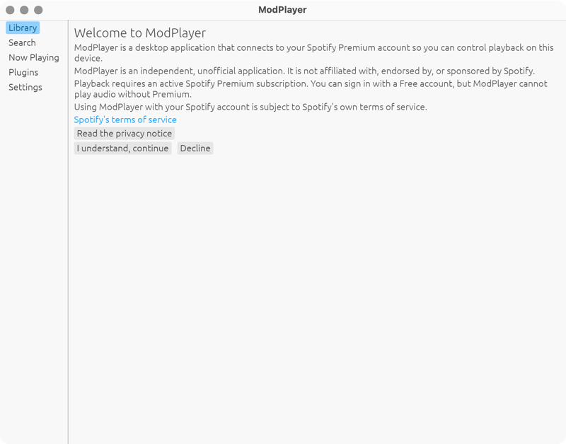 |
| 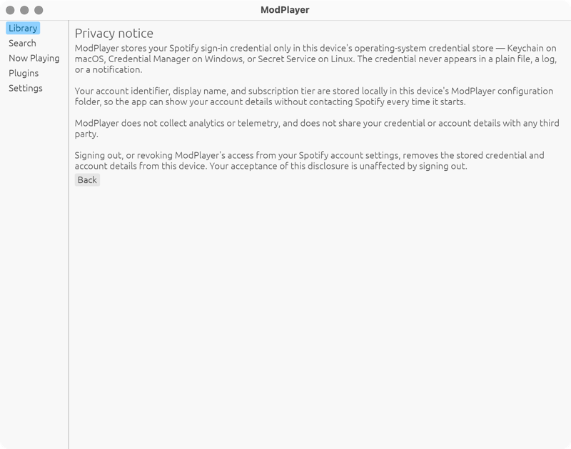 |
| 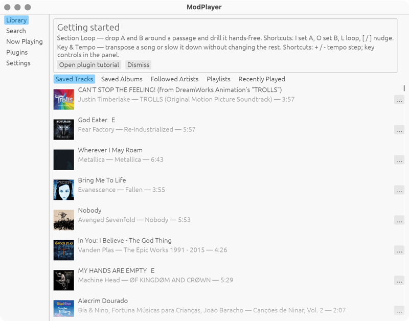 |

Works: the disclosure is honest and complete, the Decline path is real
(`03-decline.png`), and the Getting-started card names the actual shortcuts.

- **`UX-06` (P1) The nav rail is live during onboarding.** Library / Search /
  Now Playing / Plugins / Settings are drawn and clickable behind every launch
  gate, but clicking them does nothing — the gate re-renders. During a
  first launch the user sees five dead controls before they see one live one.
- **`UX-07` (P2) Welcome is a wall of four equal-weight paragraphs** with no
  heading hierarchy and no illustration; the "Spotify's terms of service"
  link, the "Read the privacy notice" button and the two decision buttons all
  compete at the same visual level. The primary action ("I understand,
  continue") is not distinguished from "Decline".
- **`UX-08` (P2) The privacy notice ends in a bare "Back" button** with no
  acknowledgement of where it returns to, and its body text runs the full
  window width (~130 characters at 1280 px) — far past a comfortable measure.
- **`UX-09` (P1) Device check offers no way back.** The screen has Yes /
  "No, try another" / "Skip for now" but no return to the previous step, and
  the buffer-preset combo (`Balanced (~5.8 ms)`) appears with no label and no
  explanation at the moment the user has the least context.
- **`UX-10` (P2) The Getting-started card is text-only** — two dense
  sentences that inline six shortcuts as prose ("Shortcuts: I set A, O set B,
  L loop, [ / ] nudge"). It is the only place the host teaches its own core
  workflow, and it is dismissible forever with no way to bring it back.

### 3.2 Sign-in

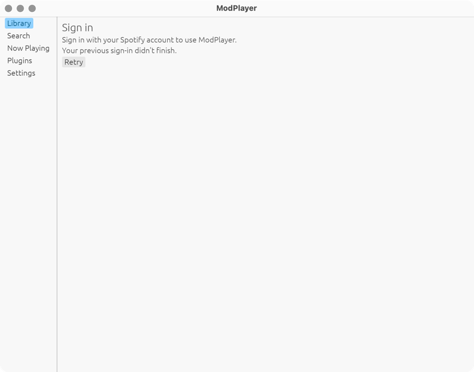
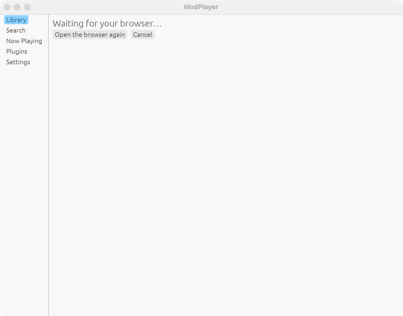

- **`UX-11` (P1) "Waiting for your browser…" is the entire screen.** No
  spinner, no elapsed time, no explanation of what should have opened, and the
  two buttons ("Open the browser again", "Cancel") sit at the same weight. A
  user whose browser did not focus sees a blank app.
- **`UX-12` (P2) The failure line is indistinguishable from the body copy.**
  "Your previous sign-in didn't finish." renders in the same colour and size
  as the instructions above it; nothing marks it as the reason the screen is
  showing.

### 3.3 Library

| Light | Dark |
|---|---|
| 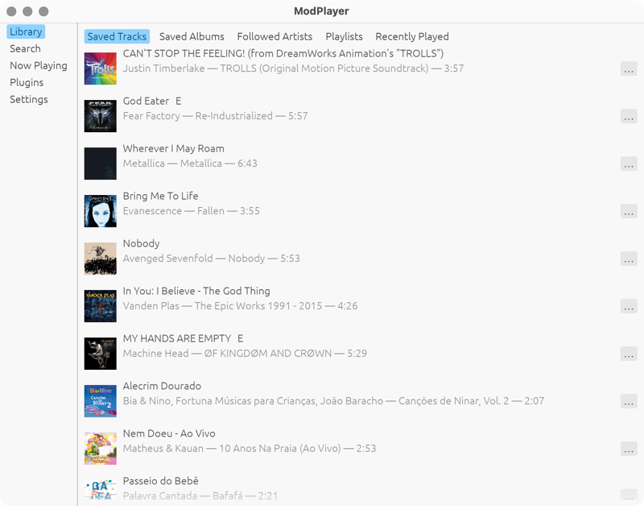 | 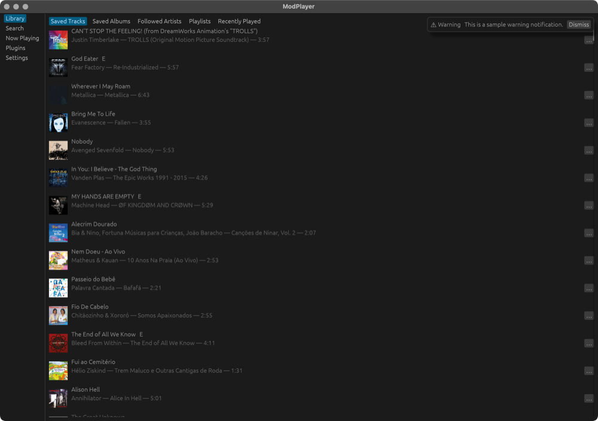 |

Works: artwork loads progressively with initials fallbacks, the five tabs are
honest about empty states ("Your saved albums are empty — search to add
music" with a Search button), and rows are virtualized.

- **`UX-13` (P1) Rows have no structure.** Title, artist, album and duration
  are concatenated into one wrapped string —
  `Justin Timberlake — TROLLS (Original Motion Picture Soundtrack) — 3:57` —
  so nothing is scannable and the duration, the one right-aligned datum in
  every music client, is buried mid-sentence. There is no column alignment and
  no rhythm: 56 px rows carry 2 lines of 14 px text with ~20 px of unused
  vertical space.
- **`UX-14` (P2) The "…" actions button is 700 px from its row's title** and
  is the only affordance on the row; rows give no hover state, so there is no
  feedback that a row is interactive at all.
- **`UX-15` (P1) Opening an album/playlist/artist requires a double-click**
  (`crates/modplayer-ui/src/rows.rs:534`) with nothing indicating it — single
  clicks are silently discarded. The keyboard equivalent (Enter on a focused
  row) is not surfaced anywhere.
- **`UX-16` (P2) The tab strip is five plain `selectable_label`s** with no
  underline, count badges or grouping; the selected tab is a filled blue
  rounded rect that reads as a button, not a tab.
- **`UX-17` (P3) Detail view has no artwork, no play-all action and no
  back-affordance beyond a small "Back" button** at the top-left; the header
  is three stacked lines of identical weight ("Progressive Metal",
  "Owner: spotify", "150 tracks").

### 3.4 Search

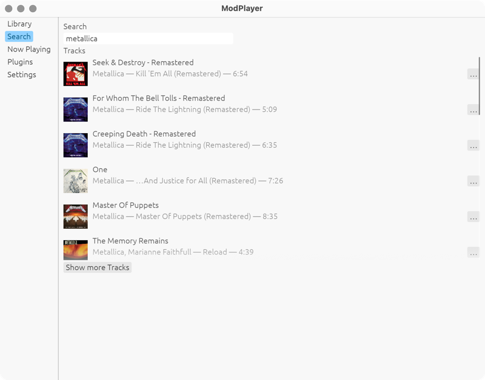
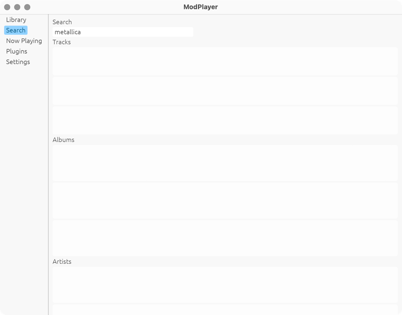

Works: per-group skeletons while loading, stale results kept visible when
rate-limited, per-group "Show more".

- **`UX-18` (P1) The four groups fight for the window.** Each group's list has
  its own capped scroll area inside the page's scroll area
  (`crates/modplayer-ui/src/search_view.rs:29`), so at 800 px the user sees
  Tracks only and must scroll a nested container to discover Albums, Artists
  and Playlists exist. Group headers are plain 14 px labels, so they do not
  read as section boundaries.
- **`UX-19` (P2) The search box has no submit affordance, no clear button, no
  result count and no loading indicator** — during a query the only feedback
  is skeleton rows below the fold.
- **`UX-20` (P2) The field label is the word "Search" above a field whose
  placeholder is also "Search"**, inside a section whose nav item is "Search".

### 3.5 Now Playing

| 1280 × 900 | 800 × 628 (default) |
|---|---|
| 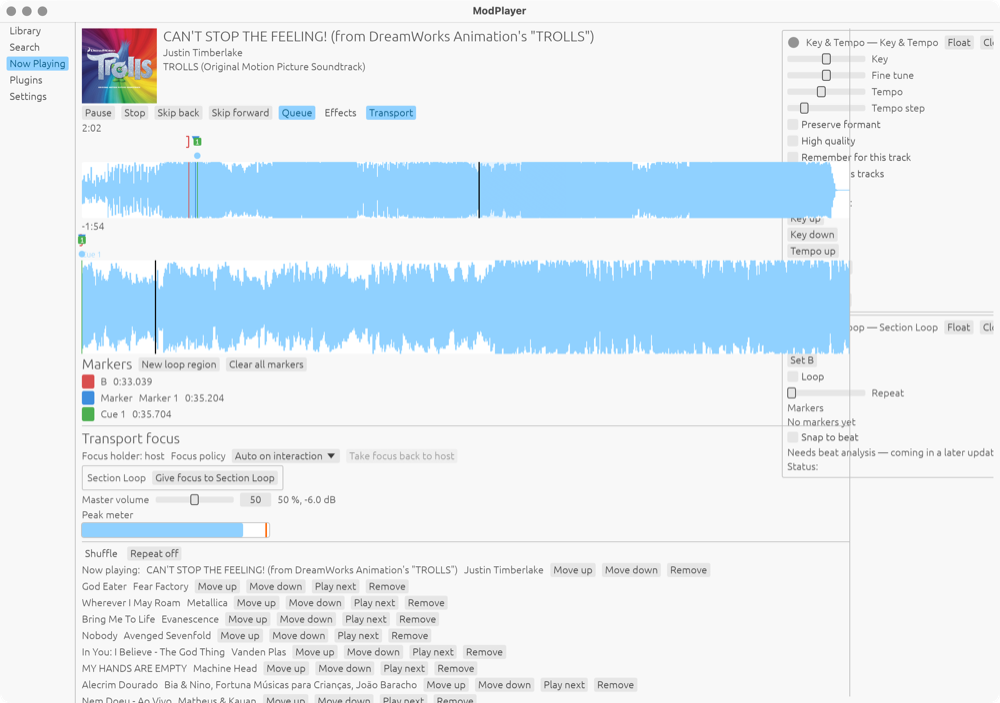 | 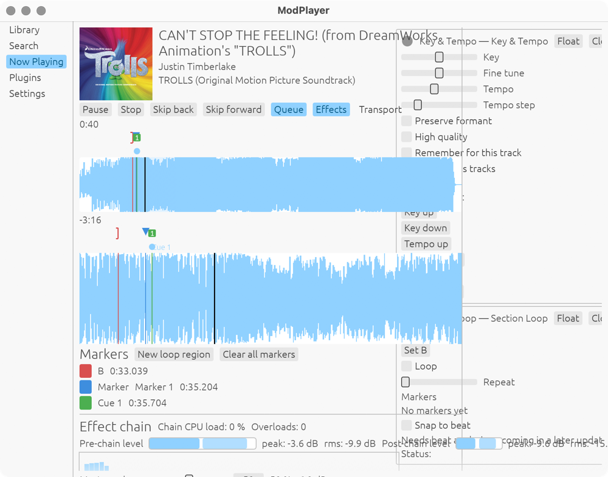 |

Works: the waveform overview + detail pair with elapsed/remaining labels, the
marker lane with coloured glyphs, per-marker rows with exact timestamps, live
peak/RMS meters, transport focus disclosure.

- **`UX-01` (P0) Fixed 280 px dock vs. no minimum window size.** At the
  default 800 px the dock takes 35 % of the window and clips its own header
  buttons and status text; the host column's own controls ("Transport" toggle)
  collide with it. See the right-hand capture above and
  `screenshots/dark/21-nowplaying-800-clipping.png`.
- **`UX-21` (P1) Now Playing is a single 14-control column with no grouping.**
  Heading → transport row → 3 panel toggles → waveform → marker lane → markers
  panel → effect chain → transport focus → master volume → peak meter → queue,
  each separated by an identical hairline. The transport — the control a
  musician uses every few seconds — is the same size and weight as
  "New loop region".
- **`UX-22` (P1) The panel toggles are invisible toggles.** Queue / Effects /
  Transport are `selectable_label`s that look exactly like the Play/Stop/Skip
  buttons beside them, and their panels open far below the fold, so pressing
  one appears to do nothing at 800 px.
- **`UX-23` (P2) Waveform colour carries no meaning and heights are fixed.**
  One flat fill (72 px overview / 120 px detail, `waveform/mod.rs:24`,
  `:97`), no loop-region shading in the waveform itself, no hover scrub
  position, no peak/RMS distinction; the playhead is a 1 px black line that is
  nearly invisible against the dark-theme fill.
- **`UX-24` (P2) The markers panel is a flat list of `● name 0:35.204`
  rows** with no grouping by kind (loop A/B vs. point vs. cue), no ordering
  affordance, no edit-in-place, and a destructive "Clear all markers" button
  styled exactly like "New loop region" next to it.
- **`UX-25` (P2) The effect chain rows are a run-on of controls** —
  `☐ 1. Pitch shift plugin Bypass CPU 0 % ☐ 0.0 st Semitones Formant Mode
  Performance ▾ Remove` — with no separation between identity, state,
  parameters and actions, and a spectrum widget with no axis labels or scale.
- **`UX-26` (P3) The queue is an unstyled list of text rows with four inline
  text buttons each** (Move up / Move down / Play next / Remove); "Now
  playing:" is prefixed as text rather than marked on the row.

### 3.6 Plugins

| Bundled (light) | 17 fixtures (dark) |
|---|---|
| 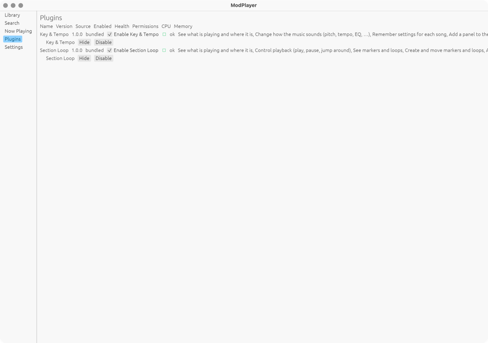 | 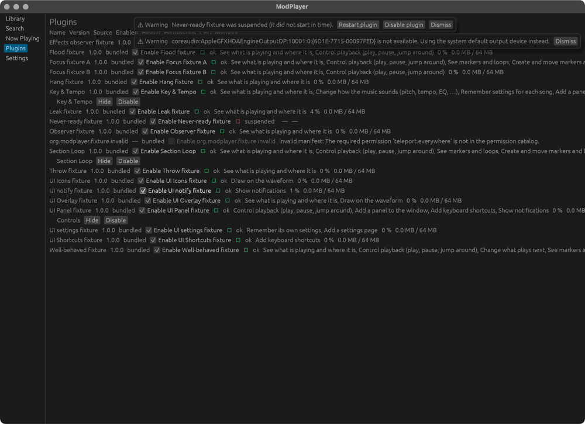 |

- **`UX-27` (P1) The plugins "table" is not a table.** Headers (Name, Version,
  Source, Enabled, Health, Permissions, CPU, Memory) are a single row of
  labels that do not align with anything below them, and the Permissions cell
  is a comma-joined sentence that runs off the right edge of a 1280 px window
  ("See what is playing and where it is, Change how the music sounds (pitch,
  tempo, EQ, …), Remember settings for each song, Add a panel to the…").
  With the 17 fixture plugins loaded the screen is unreadable.
- **`UX-28` (P2) Health is a coloured dot plus the word "ok"** in 14 px text —
  correct per NFR-6.4, but the dot colours are hard-coded outside the theme
  (`plugins_view.rs:195-201`), and "ok" is not a state name a user recognises.
- **`UX-29` (P2) Permissions are listed but not manageable** — no per-
  permission grant/revoke, no grouping, no "why this plugin asks". The
  per-plugin Show/Hide + Enable/Disable controls sit on a second, indented
  line that belongs to no column.
- Plugin panels (`screenshots/dark/44-plugin-dock-three-panels.png`,
  `screenshots/light/24-plugin-floated.png`) repeat their own name twice in
  the header ("Key & Tempo — Key & Tempo"), and the floated window carries
  both its egui title bar and the same header row underneath.

### 3.7 Settings

| Light | Dark |
|---|---|
| 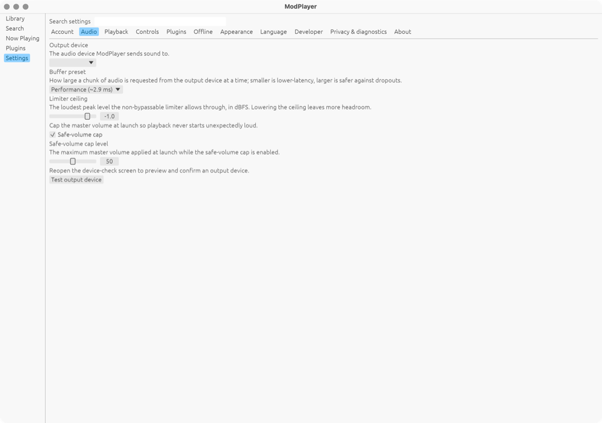 | 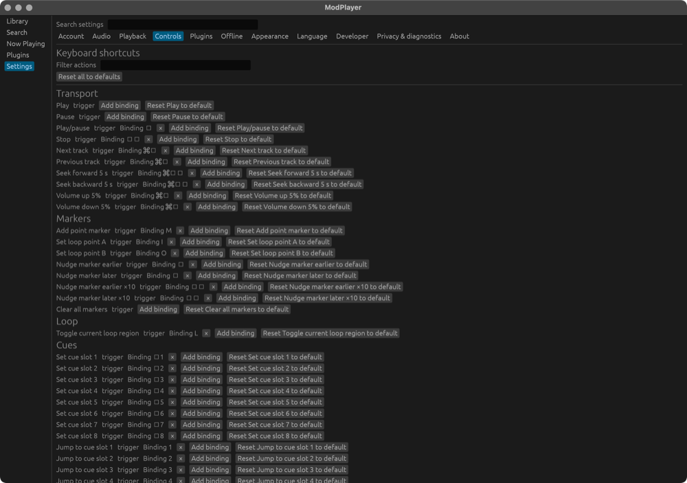 |

Works: settings search with "Category › Title" results, per-field help text,
a real confirmation modal for sign-out, live theme switching.

- **`UX-31` (P1) Eleven category chips in one wrapping row.** At 800 px they
  wrap to two rows (`screenshots/dark/42-settings-800-chips-wrap.png`) and the
  wrap point changes with translation length — NFR-7.4 requires 40 % text
  expansion without truncation. They also read as buttons, not navigation.
- **`UX-32` (P1) The Controls tab is the de-facto keyboard reference and it is
  a 60-row wall.** Every action is `name trigger Binding ⌘□ × Add binding
  Reset <name> to default` on one line; the `□` glyphs are unrendered key
  symbols, so the actual shortcut is unreadable for Space, digits and arrows.
  There is no printable/overview mode, and no shortcut help exists anywhere
  else in the app.
- **`UX-33` (P2) Two categories are shipped placeholders** — Offline and
  Privacy & diagnostics both render "This category has no settings yet in this
  update." — and they sit between fully-featured ones with no visual marker.
- **`UX-34` (P2) Field layout is label-over-help-over-control with no
  indentation, no grouping and no column**, so Audio's five settings read as
  ten equal lines. Sliders show a numeric box with no unit inside it
  (`-1.0` for dBFS, `50` for volume %).
- **`UX-35` (P3) Account shows "Signed in as" with no name**, "Subscription
  tier: Unknown" and "Never checked online" as three equal lines — the account
  state that matters most is the least legible.
- **`UX-36` (P2) The sign-out modal truncates its own consequence list**
  ("This deletes the following from this device:" followed by nothing at
  800 px) and colours the destructive action red while leaving Cancel as the
  focused default — the right default, but the modal is 200 px wide and easy
  to miss.

### 3.8 Notifications

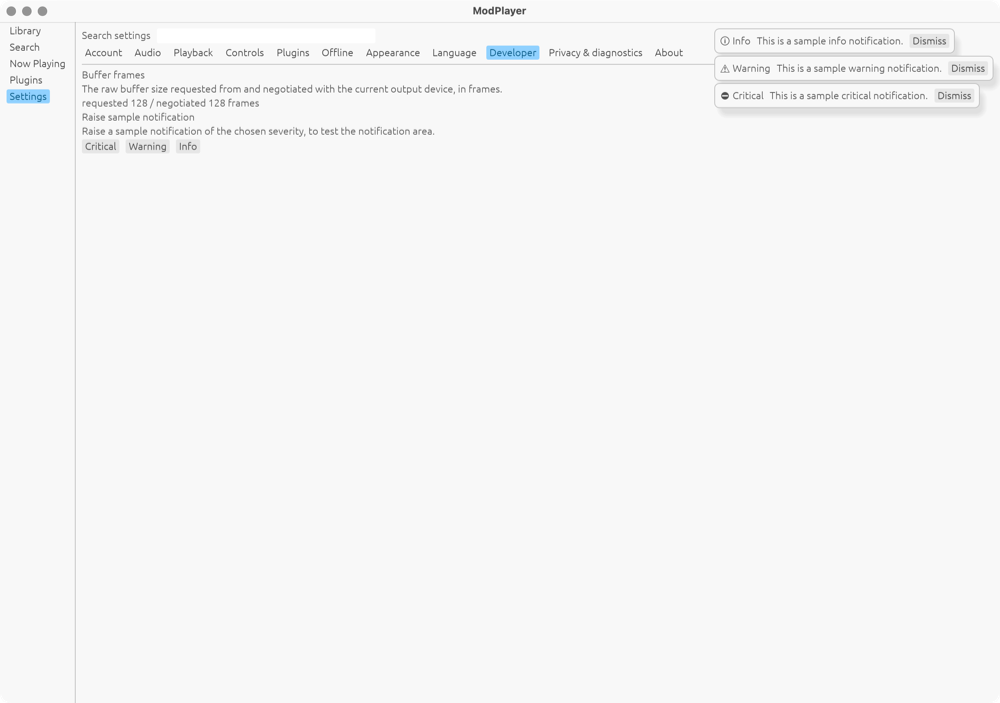

- **`UX-05` (P0) The stack occludes the top-right of whatever is behind it** —
  Library tabs, Settings chips, plugin table headers
  (`screenshots/dark/45-notifications-occlude-tabs.png`).
- **`UX-37` (P2) Severity is a small glyph plus the words "Info"/"Warning"/
  "Critical"** on an identical grey card; a critical plugin failure and a
  routine info message are the same object at a glance.
- **`UX-38` (P2) Messages are raw system strings.** The device notification
  reads `coreaudio:AppleGFXHDAEngineOutputDP:10001:0:{6D1E-7715-00097FED} is
  not available. Using the system default output device instead.` — 120
  characters of device id shown to a musician mid-practice.

### 3.9 Cross-theme

Light and dark are the same layout with egui's default palettes; nothing is
theme-specific in the app beyond `MARKER_PALETTE`. Dark generally reads better
(see `UX-02`); light's near-white `#f9f9f9` panel background against white
scroll areas gives almost no surface separation.

### 3.10 States reviewed from source (not captured)

- Rate-limited search keeps stale rows and shows a view-level "Refreshing…"
  (`search_view.rs:143`) — good behaviour, but the status is a plain label
  identical to every other label (`UX-19`).
- `SignInScreen::show_store_unavailable` / `show_store_unreadable`
  (`sign_in.rs:137`, `:158`) and `TierResult::Free` (`:218`) each render as
  a paragraph plus buttons, with the same lack of error styling as `UX-12`.
- Suspended plugins render a placeholder with a Restart button
  (`plugin_panels.rs:290`); the dock keeps the panel's slot, which is right.

---

## 4. Cross-cutting findings

### 4.1 No design tokens

`theme.rs` sets a theme *preference* and nothing else. Consequences visible in
every screenshot: one font size for everything, egui's default 8/4 px spacing
everywhere, no radius scale, no elevation, and colour literals leaking into
views (`plugins_view.rs:195-201` health dots, `widgets/peak_meter.rs:38`
over-ceiling red, `Color32::WHITE` in `markers.rs:256,273,282` and
`plugin_overlays.rs:177`) — which the project's own rule already forbids
("no colour literal outside `theme.rs`", `contracts/ui-panels.md` A4).
Ad-hoc font sizes exist too (`markers.rs:281` 9.0 monospace,
`initials.rs:76`, `waveform/paint.rs:116`).

### 4.2 Measured contrast (WCAG 2.x, sampled from the captures)

| Sample | Light | Dark | AA (4.5:1) |
|---|---|---|---|
| Row title | `#505050` on `#f9f9f9` → **7.66:1** | `#c0deff` on `#1b1b1b` → **12.41:1** | pass / pass |
| Row secondary line (artist · album · duration) | `#929292` on `#f9f9f9` → **2.96:1** | `#8c8c8c` on `#1b1b1b` → **5.12:1** | **fail** / pass |
| Nav rail selected | `#00527d` on `#90d1ff` → **5.09:1** | — | pass |
| Disabled button label | `#3c3c3c` on `#e6e6e6` → **8.84:1** | — | pass (arguably too strong for a disabled state) |

Reproduce with `target/manual-walk/contrast.py <shot> x0 y0 x1 y1`.
NFR-6.5 also requires a high-contrast option, which does not exist
(`UX-39`, P2).

### 4.3 Layout and responsiveness

No initial size, no minimum size, no breakpoint logic. The plugin dock
(280 px), waveform heights (72/120 px), marker lane (14/16 px) and skeleton
rows (56/72 px) are all constants. The app is usable at 1280 px and broken at
its own default 800 px (`UX-01`, `UX-22`, `UX-31`, `UX-36`).

### 4.4 Typography and text

One size, one weight, one family throughout. Body copy is unmeasured (full
window width). Numbers that should be tabular (timestamps `0:35.204`, dB, CPU
%, durations) are proportional. Some strings are raw system output (`UX-38`)
or repeat their own context ("Key & Tempo — Key & Tempo", "Search" ×3).

### 4.5 Feedback and affordance

No hover states on rows, no focus ring distinct from selection, no pressed
state beyond egui's default, no progress/spinner anywhere, no toast for
completed actions (adding to queue, saving to library), no empty-state
illustration or primary action except in the Library tabs.

### 4.6 Accessibility versus the spec

| Requirement | State |
|---|---|
| NFR-6.1 keyboard operable | Met — full action catalog with bindings |
| NFR-6.2 accessible names/roles | Met — AccessKit is on and asserted in tests |
| NFR-6.4 colour never alone | Met — health, markers and severities all carry text |
| NFR-6.5 contrast in both themes | **Failed in light** (`UX-02`); no high-contrast option (`UX-39`) |
| NFR-6.6 text scales to 200 % | **Untestable today** — no text-scale setting and no reflow; at fixed dock/waveform sizes it will clip (`UX-40`, P2) |
| NFR-7.4 40 % text expansion | **At risk** — chips (`UX-31`), plugin table (`UX-27`), dock headers (`UX-01`) already truncate in English |

### 4.7 Stability found during the walk (not cosmetic)

- **`UX-30` (P0, bug not design).** Two reproducible crashes, identical
  signature: `EXC_BAD_INSTRUCTION` from an AppKit `NSTouchBarFinderObservation`
  KVO teardown while a `TextEdit` had focus — triggered here by `Cmd+A` in the
  Search field and by a Settings-tab switch immediately after typing. Reports:
  `~/Library/Logs/DiagnosticReports/modplayer-2026-09-22-0749*.ips`. Likely a
  winit/AppKit Touch Bar interaction; worth an upstream check before the
  visual work lands, because it takes the whole app down mid-practice.

---

## 5. Design system proposal

All of this belongs in `crates/modplayer-ui/src/theme.rs`, applied once per
frame through `egui::Style`/`Visuals`, so views keep calling plain egui
widgets and no view ever names a colour or a size again.

### 5.1 Type scale (single family, platform default; `TextStyle` overrides)

| Token | Size / weight | Use |
|---|---|---|
| `display` | 22 / semibold | Now Playing track title, Welcome heading |
| `title` | 17 / semibold | Screen headings, detail headers |
| `section` | 13 / semibold, +0.04 em, uppercase | "Markers", "Effect chain", search group headers, settings groups |
| `body` | 14 / regular | Row titles, field labels, paragraphs |
| `secondary` | 13 / regular, muted | Artist · album, help text, meta |
| `mono` | 13 / tabular | Timestamps, dB, %, durations, CPU/memory |

Body copy gets a max measure of ~72 characters (`UX-08`).

### 5.2 Spacing and radius

4 px base: `xs 4 · sm 8 · md 12 · lg 16 · xl 24 · xxl 32`. Panels get `lg`
padding and `xl` separation from each other (replacing most `ui.separator()`
calls); rows get `sm` vertical padding and a 1 px divider at 8 % foreground.
Radius: `sm 4` (inputs, chips), `md 8` (cards, panels), `full` (badges).

### 5.3 Semantic colour (both themes, contrast verified)

| Token | Light | Dark | Min contrast on its surface |
|---|---|---|---|
| `text.primary` | `#1c1c1e` | `#f2f2f7` | 13:1 |
| `text.secondary` | `#5b5b60` | `#a8a8b0` | **4.6:1** (fixes `UX-02`) |
| `text.disabled` | `#8e8e93` | `#6c6c72` | 3:1 (non-text) |
| `surface.base` | `#ffffff` | `#141417` | — |
| `surface.raised` | `#f5f5f7` | `#1e1e22` | ≥1.2:1 vs base |
| `accent` | `#0a63c9` | `#5aa9ff` | 4.5:1 on base |
| `positive` | `#1f7a44` | `#4caf50` | 4.5:1 |
| `warning` | `#8a5a00` | `#e0a92a` | 4.5:1 |
| `danger` | `#b3261e` | `#ff6b5e` | 4.5:1 |

`positive`/`warning`/`danger` replace the literals in `plugins_view.rs` and
`peak_meter.rs`; `MARKER_PALETTE` stays theme-independent by design (a marker
keeps its colour across a theme switch) but gains a documented minimum 3:1
against both `surface.base` values. A `high-contrast` variant (NFR-6.5)
overrides `text.secondary` → `text.primary` and raises all borders to 3:1.

### 5.4 Component rules

- **Buttons**: `primary` (filled accent, one per view), `default`, `subtle`
  (text-only, for row-level actions), `danger` (outlined, `danger` text).
  Destructive actions never sit adjacent to their non-destructive neighbour
  without a spacer (`UX-24`).
- **List row**: fixed 3-column grid — artwork 40 px | title over secondary |
  right-aligned `mono` duration + "…" menu; full-row hover fill at 4 %
  foreground, focus ring = 2 px `accent`; single click selects, double click
  or Enter opens, with the hint shown in the row's tooltip (`UX-13`, `UX-15`).
- **Tabs vs. chips**: Library tabs become underlined tabs with counts;
  Settings categories become a left sidebar list inside the Settings screen
  (fixes the wrap in `UX-31` and gives translations room).
- **Panels**: a card on `surface.raised` with a `section` header, `lg` padding,
  `md` radius; collapsible with state persisted per panel.
- **Notifications**: bottom-right stack, max 3 visible + "N more", severity
  carried by an accent bar + icon + label, message truncated to two lines with
  "Details" expanding the raw string (`UX-05`, `UX-37`, `UX-38`).
- **Meters**: `positive` → `warning` → `danger` gradient with a scale mark at
  −6 and 0 dB, `mono` numerals.

### 5.5 Layout rules

- Initial window 1200 × 820; minimum 960 × 640 (`ViewportBuilder::with_inner_size`
  / `with_min_inner_size` in `crates/modplayer/src/main.rs`).
- Plugin dock: 280 px preferred, 240 px minimum, hidden below 1024 px window
  width with a "Panels" toggle in the transport bar; resizable by drag.
- Now Playing: a fixed transport bar at the top (artwork, title, transport,
  panel toggles), the waveform as the flexible middle, and panels as cards
  below — so the transport never scrolls away.
- Waveform heights become proportional (overview 8 % of content height,
  min 64 px; detail 22 %, min 120 px).

---

## 6. Prioritized recommendations

P0 = broken at the default window or fails a stated NFR · P1 = blocks a core
task · P2 = quality · P3 = polish.

| id | P | Screen | Change | Acceptance | Effort | Files |
|---|---|---|---|---|---|---|
| UX-01 | P0 | Now Playing | Initial + min window size; dock min width, collapse below 1024 px | At 960 px no dock control or label is clipped | M | `modplayer/src/main.rs`, `plugin_panels.rs` |
| UX-02 | P0 | All | Token-based `text.secondary` at ≥4.5:1 in both themes | `contrast.py` on a fresh light capture ≥4.5:1 | S | `theme.rs` |
| UX-05 | P0 | All | Move notification stack to bottom-right, cap at 3 + "N more" | Tabs/chips/table headers never occluded | S | `app.rs`, `notifications.rs` |
| UX-30 | P0 | — | Investigate the AppKit Touch Bar KVO crash (upstream winit) | No crash on `Cmd+A` in a text field, 20 repeats | M | dependency bump / issue |
| UX-03 | P1 | All | Type scale + spacing tokens applied via `Style` | Headings, body, meta visibly distinct on every screen | M | `theme.rs`, all views |
| UX-04 | P1 | All | Button variants (primary/default/subtle/danger) | Each screen has exactly one primary; destructive is `danger` | M | `theme.rs`, `widgets/` |
| UX-13 | P1 | Library/Search | Three-column row grid with right-aligned `mono` duration | Duration right-aligned in every list; titles truncate with ellipsis | M | `rows.rs` |
| UX-15 | P1 | Library | Single click opens (or a visible "Open" affordance) + hover state | Single click opens a playlist; hover is visible | S | `rows.rs`, `library_view.rs` |
| UX-18 | P1 | Search | Drop nested scroll areas; page-level scroll with sticky group headers | All four group headers reachable by one scroll at 800 px | M | `search_view.rs` |
| UX-21 | P1 | Now Playing | Sticky transport bar + panels as cards | Transport visible at any scroll position | L | `now_playing.rs` |
| UX-22 | P1 | Now Playing | Toggles styled as toggles, with their panel scrolled into view | Pressing Queue shows the queue without manual scrolling | S | `now_playing.rs` |
| UX-27 | P1 | Plugins | Real column layout; permissions as count + expander | No horizontal overflow with 17 fixtures at 1280 px | M | `plugins_view.rs` |
| UX-31 | P1 | Settings | Categories become a left sidebar list | No wrap at 960 px with 40 % longer labels | M | `settings/mod.rs` |
| UX-32 | P1 | Settings › Controls | Grouped, two-column shortcut reference + real key glyphs | Space/digits/arrows render as names, not `□` | M | `settings/controls.rs` |
| UX-06 | P1 | Onboarding | Hide or disable the nav rail behind launch gates | Nav rail absent until `LaunchStep::Main` | S | `app.rs` |
| UX-09 | P1 | Device check | Back action + labelled buffer preset with help | Both present; Back returns to sign-in | S | `device_check.rs` |
| UX-11 | P1 | Sign-in | Progress indicator + elapsed hint + primary/secondary buttons | Spinner visible while authorizing | S | `sign_in.rs` |
| UX-23 | P2 | Waveform | Loop shading, hover scrub, visible playhead in both themes | Playhead ≥3:1 against fill in dark | M | `waveform/paint.rs`, `theme.rs` |
| UX-24 | P2 | Markers | Group by kind, rename in place, separate destructive action | "Clear all" not adjacent to "New loop region" | M | `markers.rs` |
| UX-25 | P2 | Effects | Row = identity / state / params / actions groups; labelled spectrum | Each node row has 4 visual groups | M | `effects_view.rs` |
| UX-28 | P2 | Plugins | Health colours from tokens; state words ("Healthy"/"Degraded"/"Suspended") | No colour literal outside `theme.rs` (grep) | S | `plugins_view.rs`, `theme.rs` |
| UX-33 | P2 | Settings | Mark or hide placeholder categories | Offline/Privacy either populated or marked "Coming soon" | S | `settings/mod.rs` |
| UX-34 | P2 | Settings | Field groups, units inside numeric boxes | dB and % units visible on every slider | S | `settings/*.rs` |
| UX-36 | P2 | Settings › Account | Widen modal; show the actual consequence list | List visible at 960 px | S | `settings/account.rs` |
| UX-37/38 | P2 | Notifications | Severity accent bar; humanised device message + "Details" | Device message ≤2 lines, raw string behind Details | S | `notifications.rs`, `locales/` |
| UX-39 | P2 | Settings › Appearance | High-contrast option (NFR-6.5) | Setting exists and raises all pairs to 7:1 | M | `theme.rs`, `settings/appearance.rs` |
| UX-40 | P2 | All | Text-scale setting (NFR-6.6) honoured by proportional layout | 200 % scale loses no function at 1200 px | L | `theme.rs`, layout constants |
| UX-07/08/10/12 | P2 | Onboarding | Hierarchy, measure, shortcut table, error styling | — | M | `welcome.rs`, `privacy_notice.rs`, `getting_started.rs` |
| UX-14/16/17/19/20/26/29/35 | P3 | Various | Hover/affordance, tabs with counts, detail header, search feedback, queue rows, permission management, account summary | — | M | various |

### Suggested feature cuts (for `/speckit.specify`)

1. **014 — Design tokens and theming.** `UX-02`, `UX-03`, `UX-04`, `UX-28`,
   `UX-39`, plus removing every colour/size literal from views. Everything
   else builds on it.
2. **015 — Window, shell and navigation.** `UX-01`, `UX-05`, `UX-06`,
   `UX-31`, `UX-16`, `UX-40` (layout half).
3. **016 — Lists, search and Now Playing layout.** `UX-13`, `UX-15`, `UX-18`,
   `UX-21`, `UX-22`, `UX-23`, `UX-24`, `UX-25`.
4. **017 — Plugins, settings and onboarding polish.** `UX-27`, `UX-29`,
   `UX-32`, `UX-33`, `UX-34`, `UX-36`, `UX-37`, `UX-38`, `UX-07`–`UX-12`.

`UX-30` is a stability bug, not part of the design work — file it separately.

---

## 7. Appendix

### Screenshot index

| # | Screen | Light | Dark |
|---|---|---|---|
| 01 | Welcome / disclosure | [light](screenshots/light/01-welcome.png) | — |
| 02 | Privacy notice | [light](screenshots/light/02-privacy-notice.png) | — |
| 03 | Decline view | [light](screenshots/light/03-decline.png) | — |
| 04 | Device check (first launch) | [light](screenshots/light/04-device-check.png) | — |
| 05 | Getting-started card | [light](screenshots/light/05-getting-started.png) | — |
| 06 | Sign-in — previous attempt unfinished | [light](screenshots/light/06-signin-incomplete.png) | — |
| 07 | Sign-in — waiting for browser | [light](screenshots/light/07-signin-waiting-browser.png) | — |
| 08 | Library — Saved Tracks | [light](screenshots/light/08-library-saved-tracks.png) | [dark](screenshots/dark/08-library-saved-tracks.png) |
| 09 | Library — Saved Albums (empty) | [light](screenshots/light/09-library-albums-empty.png) | — |
| 10 | Library — Playlists | [light](screenshots/light/10-library-playlists.png) | [dark](screenshots/dark/10-library-playlists.png) |
| 11 | Row "…" actions menu | [light](screenshots/light/11-row-actions-menu.png) | [dark](screenshots/dark/11-row-actions-menu.png) |
| 12 | Playlist detail — skeletons | [light](screenshots/light/12-detail-loading.png) | — |
| 13 | Playlist detail — loaded | [light](screenshots/light/13-detail-loaded.png) | — |
| 14 | Search — empty | [light](screenshots/light/14-search-empty.png) | — |
| 15 | Search — results | [light](screenshots/light/15-search-results.png) | [dark](screenshots/dark/15-search-results.png) |
| 16 | Search — four groups loading | [light](screenshots/light/16-search-skeletons.png) | — |
| 17 | Search — unrelated query | [light](screenshots/light/17-search-stale-query.png) | — |
| 18 | Now Playing — no track | [light](screenshots/light/18-nowplaying-empty.png) | — |
| 19 | Now Playing — playing | [light](screenshots/light/19-nowplaying-playing.png) | [dark](screenshots/dark/19-nowplaying-playing.png) |
| 20 | Markers, loop region and cue | [light](screenshots/light/20-markers-loop.png) | — |
| 21 | Now Playing at 800 px — dock clipping | [light](screenshots/light/21-nowplaying-800-clipping.png) | [dark](screenshots/dark/21-nowplaying-800-clipping.png) |
| 22 | Now Playing at 1280 px | [light](screenshots/light/22-nowplaying-1280.png) | — |
| 23 | Effect chain panel | [light](screenshots/light/23-effect-chain-1280.png) | — |
| 24 | Floated plugin window | [light](screenshots/light/24-plugin-floated.png) | — |
| 25 | Plugins list (bundled) | [light](screenshots/light/25-plugins-list.png) | [dark](screenshots/dark/25-plugins-list.png) |
| 26 | Settings › Account | [light](screenshots/light/26-settings-account.png) | [dark](screenshots/dark/26-settings-account.png) |
| 27 | Sign-out confirmation modal | [light](screenshots/light/27-settings-signout-modal.png) | — |
| 28 | Settings › Audio | [light](screenshots/light/28-settings-audio.png) | [dark](screenshots/dark/28-settings-audio.png) |
| 29 | Settings › Playback | [light](screenshots/light/29-settings-playback.png) | — |
| 30 | Settings › Controls | [light](screenshots/light/30-settings-controls.png) | [dark](screenshots/dark/30-settings-controls.png) |
| 31 | Settings › Plugins (no plugin pages) | [light](screenshots/light/31-settings-plugins-empty.png) | — |
| 31 | Settings › Plugins (fixture page listed) | — | [dark](screenshots/dark/31-settings-plugins-list.png) |
| 32 | Settings › Offline (placeholder) | [light](screenshots/light/32-settings-offline-placeholder.png) | — |
| 33 | Settings › Appearance | [light](screenshots/light/33-settings-appearance.png) | [dark](screenshots/dark/33-settings-appearance.png) |
| 34 | Settings › Language | [light](screenshots/light/34-settings-language.png) | — |
| 35 | Settings › Developer | [light](screenshots/light/35-settings-developer.png) | — |
| 36 | Settings › Privacy & diagnostics (placeholder) | [light](screenshots/light/36-settings-privacy-placeholder.png) | — |
| 37 | Settings › About | [light](screenshots/light/37-settings-about.png) | [dark](screenshots/dark/37-settings-about.png) |
| 38 | Notification stack (Info / Warning / Critical) | [light](screenshots/light/38-notifications.png) | [dark](screenshots/dark/38-notifications.png) |
| 39 | Device-check overlay from Settings › Audio | [light](screenshots/light/39-device-check-overlay.png) | — |
| 40 | Settings search results | [light](screenshots/light/40-settings-search.png) | — |
| 41 | Library at 800 px | — | [dark](screenshots/dark/41-library-800.png) |
| 42 | Settings chips wrapping at 800 px | — | [dark](screenshots/dark/42-settings-800-chips-wrap.png) |
| 43 | Plugins list with 17 fixture plugins | — | [dark](screenshots/dark/43-plugins-list-17-fixtures.png) |
| 44 | Plugin dock with three panels | — | [dark](screenshots/dark/44-plugin-dock-three-panels.png) |
| 45 | Notifications occluding the tab strip | — | [dark](screenshots/dark/45-notifications-occlude-tabs.png) |
| 46 | Plugin settings sub-page | — | [dark](screenshots/dark/46-settings-plugin-subpage.png) |

### Open questions for the maintainer

1. Is a custom font in scope, or should the type scale stay on the platform
   default family?
2. Should the plugin dock be user-resizable (drag) or fixed at two widths?
3. Should Settings categories become a sidebar (§5.4) or stay chips with a
   scroll/overflow menu?
4. Is a text-scale setting (`UX-40`) wanted before the 200 % platform-scaling
   requirement is tested on Windows/Linux?

### How to reproduce this walk

```sh
RUSTUP_TOOLCHAIN=1.95.0 cargo build --release -p modplayer
scripts/bundle-macos.sh && open target/release/ModPlayer.app
python3 target/manual-walk/walk.py info            # window id + bounds
python3 target/manual-walk/walk.py seq "click 31 39; sleep 1; shot light 08-library"
python3 target/manual-walk/contrast.py shots/light/08-library.png 306 158 1000 180 "secondary text"
```

`target/manual-walk/` is gitignored; `walk.py` (Quartz driver),
`contrast.py` (WCAG sampler) and `curate.py` (publish to this folder) live
there.
